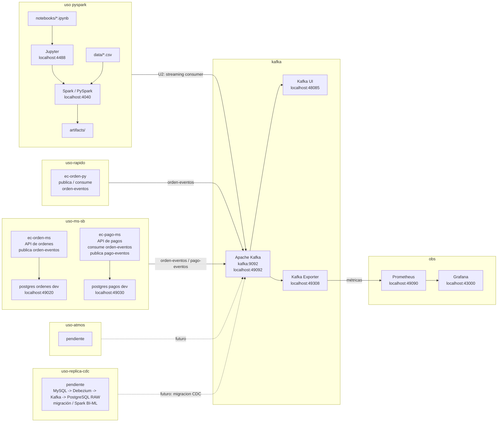

# Big Data 2026-2

Curso teórico-práctico de Big Data: arquitecturas Lambda/Kappa, procesamiento batch y streaming, observabilidad, analítica/ML distribuida y visualización BI.

[`lambda26`](https://github.com/262bigdata/lambda26) es un entorno integrado de procesamiento distribuido en batch y streaming con Spark y Kafka, con laboratorios reproducibles basados en Docker. El curso construye pipelines de datos, gestiona almacenamiento analítico en Parquet, aplica observabilidad y desarrolla soluciones BI/ML distribuidas.

## Producto del curso

Producto del curso = Producto U3:

```text
Sistema Big Data distribuido end-to-end para procesamiento batch y streaming,
analítica/ML, observabilidad y visualización BI para la toma de decisiones.
```

Resultado esperado del curso:

Al finalizar el curso, el estudiante implementa, integra y sustenta una solución Big Data end-to-end que combina pipelines batch distribuidos, ingesta y procesamiento de eventos en tiempo real, analítica/ML a escala, observabilidad técnica y una capa de visualización BI, demostrando valor para la toma de decisiones. El producto se presenta en equipo, pero cada estudiante evidencia y defiende su aporte individual.

## Contenido

### U1: Arquitecturas Big Data y ETL batch distribuido

Producto U1: pipeline batch de ETL distribuido con salidas analíticas en Parquet listas para BI/ML.

Resultado esperado U1: el estudiante construye un pipeline batch reproducible con procesamiento distribuido, aplica transformaciones sobre datos a escala, valida la calidad básica de los datos, organiza salidas en formatos analíticos como Parquet y deja un dataset preparado para consumo BI/ML.

| Sesión | Tema (sílabo) | Módulo LambdaLab | Trabajo principal |
|---|---|---|---|
| [S1](sesiones/S01_Arquitectura_Big_Data_Lambda_Kappa.md) | Arquitectura Big Data: arquitecturas Lambda y Kappa, batch vs. streaming. | `uso-pyspark` | Arquitectura Big Data seleccionada y justificada (Lambda o Kappa) para un caso de negocio propio. |
| S2 | Fundamentos PySpark: extracción, transformaciones, funciones, agrupaciones, agregaciones, RDD y evaluación perezosa (lazy evaluation). | `uso-pyspark` | Transformaciones distribuidas documentadas, con evidencia del plan de ejecución (`explain()`). |
| S3 | Procesamiento distribuido y carga de datos particionada en HDFS y formatos analíticos, con validación de calidad de datos. | `uso-pyspark` | Salida analítica particionada en formato columnar, con controles de calidad (esquema, nulos, duplicados). |
| S4 | ML distribuido con Spark MLlib (Regresión). | `uso-pyspark` | Modelo de regresión distribuida entrenado, con métricas iniciales documentadas. |
| S5 | Integración del procesamiento batch distribuido: arquitectura, PySpark, HDFS, formatos analíticos, particionamiento y ML distribuido. | — | **Producto U1:** pipeline batch de ETL distribuido con salidas analíticas en Parquet listas para BI/ML. |

### U2: Sistema Big Data en tiempo real: ingesta, streaming, observabilidad y BI/ML

Producto U2: pipeline en tiempo real con ingesta de eventos empresariales e IoT/sensores, procesamiento streaming con Spark, observabilidad/costos y salidas BI/ML distribuidas.

Resultado esperado U2: el estudiante implementa un pipeline Big Data en tiempo real que integra ingesta de eventos mediante Kafka, procesamiento distribuido con Spark Structured Streaming, observabilidad con Grafana y estimación de costos operacionales, y prepara salidas BI/ML distribuidas con series de tiempo e inferencia.

| Sesión | Tema (sílabo) | Módulo LambdaLab | Trabajo principal |
|---|---|---|---|
| S6 | Ingesta de eventos empresariales en tiempo real. | `uso-rapido` / `uso-ms-sb` + `kafka` | Publicación y consumo de eventos empresariales por Kafka, con contrato de evento documentado. |
| S7 | Ingesta de eventos IoT/sensores en tiempo real. | `uso-atmos` + `kafka` | Simulación de eventos de sensores integrada al pipeline de Kafka. |
| S8 | Procesamiento en streaming con Spark: ventanas, watermarking y semántica de entrega. | `uso-pyspark` (consumidor) + `kafka` | Pipeline streaming con ventanas, watermarking y checkpointing. |
| S9 | Observabilidad con Grafana y costos. | `obs` | Tablero de observabilidad con métricas, umbrales y estimación de costos. |
| S10 | Series de tiempo e inferencia en streaming. | `uso-pyspark` | Modelo o inferencia de series de tiempo aplicado sobre datos batch y/o streaming. |
| S11 | BI/ML distribuido con Spark: KPIs del BI y visualización de la predicción de series de tiempo. | `uso-pyspark` + `obs` | KPIs del flujo de eventos y predicción de series de tiempo visualizados en el BI. |
| S12 | Integración del procesamiento en tiempo real: Kafka, eventos empresariales e IoT, Spark Structured Streaming, observabilidad, costos y salidas BI/ML. | — | **Producto U2:** pipeline en tiempo real con ingesta, streaming, observabilidad/costos y salidas BI/ML distribuidas. |

### U3: Integración, DataOps y despliegue del sistema final

Producto U3 / producto del curso: sistema Big Data distribuido end-to-end para procesamiento batch y streaming, analítica/ML, observabilidad y visualización BI para la toma de decisiones.

Resultado esperado U3: el estudiante integra los componentes desarrollados en las unidades anteriores, despliega o empaqueta el sistema mediante prácticas de DataOps/DevOps, prepara una demo end-to-end, documenta la operación del sistema, valida resultados técnicos y analíticos, y sustenta una solución final orientada a la toma de decisiones.

| Sesión | Tema (sílabo) | Módulo LambdaLab | Trabajo principal |
|---|---|---|---|
| S13 | Integración del sistema, DataOps y BI. | todos | Demo end-to-end de batch, streaming, observabilidad y BI/ML integrados. |
| S14 | Revisión técnica final y hardening. | todos | Checklist de hardening, guion de demostración y documentación operativa. |
| S15 | Integración del sistema Big Data end-to-end: procesamiento batch y streaming, DataOps, observabilidad, BI/ML, documentación y despliegue. | — | **Producto final:** sistema Big Data distribuido end-to-end, defendido técnicamente. |
| S16 | Integración de sistemas Big Data: evaluación final. | — | Evaluación final individual: demostración y preguntas técnicas pendientes. |

## Arquitectura Lambda26 v2026-1



- `uso-pyspark` es el módulo base (U1): notebooks, Jupyter y Spark local, con datos en `data/` y salidas en `artifacts/`.
- `uso-rapido` y `uso-ms-sb` publican y consumen eventos de negocio (`orden-eventos`, `pago-eventos`) contra Kafka — se activan desde S6.
- `uso-atmos` (eventos IoT/sensores) y `uso-replica-cdc` (migración CDC) quedan pendientes como extensiones del laboratorio; se retoman según el alcance de cada equipo.
- `kafka` es la columna vertebral de ingesta y `obs` (Prometheus/Grafana) da observabilidad sobre el Kafka Exporter — ambos se integran desde U2.

## Flujo de trabajo

1. El equipo decide la arquitectura Big Data (Lambda o Kappa) para su propio caso de negocio, apoyándose en el módulo `uso-pyspark` para reconocer el ecosistema (S1).
2. El procesamiento batch se construye con PySpark sobre `uso-pyspark`: extracción, transformaciones, particionamiento, formatos analíticos y un primer modelo ML distribuido (S2-S5).
3. La ingesta en tiempo real se activa sobre `kafka`, primero con eventos de negocio (`uso-rapido`/`uso-ms-sb`, S6) y luego con eventos IoT/sensores (`uso-atmos`, S7).
4. El procesamiento streaming con Spark Structured Streaming, la observabilidad (`obs`) y las salidas BI/ML distribuidas se integran en U2 (S8-S12).
5. El sistema completo se integra, se estabiliza con prácticas DataOps/DevOps y se defiende técnicamente en U3 (S13-S16).

## Enlaces

- [Sílabo 2026-2](silabo_bigdata_2026_2.md)
- [S1 - Arquitectura Big Data: Lambda y Kappa, batch vs. streaming](sesiones/S01_Arquitectura_Big_Data_Lambda_Kappa.md)
- [Guía de Proyecto Sello](proyecto-sello/index.md)
