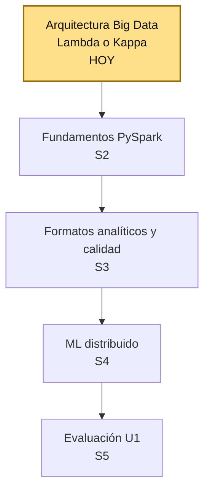
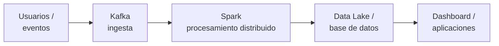

# S1 - Arquitectura Big Data: Lambda y Kappa, batch vs. streaming

## 1. Introducción

Tiempo: 20 min.

### 1.1 Contexto

Big Data no empieza eligiendo Spark o Kafka. Empieza decidiendo qué arquitectura resuelve el problema real: ¿el caso necesita solo el pasado (batch), solo el presente (streaming), o ambos? Esta sesión construye esa primera decisión arquitectónica para el laboratorio `lambda26`.

### 1.2 Índice

1. Ecosistema y arquitectura Big Data.
2. Batch vs. Streaming.
3. Arquitectura Lambda.
4. Arquitectura Kappa.

### 1.3 Propósito de aprendizaje

Al concluir la clase, estarás en condiciones de:

- **Identificar** los componentes del ecosistema Big Data y **decidir** qué arquitectura (Lambda o Kappa) conviene aplicar a un problema real de negocio, justificando la elección entre procesamiento batch y streaming.

### 1.4 Producto de sesión

Diagrama de arquitectura Big Data (Lambda o Kappa) para un caso de negocio, con decisiones técnicas, tecnologías propuestas, supuestos y riesgos.

### 1.5 Metodología

| Fase | Actividades | Orientaciones | Material |
|---|---|---|---|
| Revisión previa individual | Leer el sílabo de la Unidad 1 y el caso de la plataforma de streaming de video (ver 1.6). | Trabajo individual, antes de clase; sin instalación previa requerida para esta sesión. | Sílabo Big Data U1. |
| Clase presencial | Construcción guiada de la decisión arquitectónica: ecosistema, batch vs. streaming, regla de decisión, tecnologías y diagrama de flujo. | Trabajo individual, siguiendo al docente paso a paso; consulta inmediata ante dudas sobre Lambda, Kappa o el ecosistema. | Pasos 3.1 a 3.5 de esta guía. |
| Evaluación formativa | Revisión en clase de la arquitectura seleccionada y su justificación. | La evidencia se completa y sustenta de forma individual, fuera del aula, según los criterios mínimos de la sección 4.2. | Plantilla de evidencia individual (4.1), rúbrica de evaluación (5.4). |

### 1.6 Motivación de la sesión

#### 1.6.1 Caso: plataforma de streaming de video

Una plataforma similar a Netflix recibe miles de eventos por segundo: reproducciones, búsquedas, clics en recomendaciones y errores de reproducción. La empresa necesita analizar datos históricos y eventos en tiempo real para mejorar su servicio.

Pregunta guía:

```text
¿Qué arquitectura Big Data debería utilizar esta plataforma: Lambda o Kappa?
```

Preguntas para los estudiantes:

1. ¿Qué problemas tendría esta plataforma si solo analizara datos históricos (batch)?
2. ¿Qué problemas tendría si solo procesara eventos en tiempo real (streaming), sin histórico?
3. ¿Qué arquitectura elegirías tú para este caso y por qué?

### 1.7 Ubicación en el curso

- Unidad: U1 - Arquitecturas Big Data y ETL batch distribuido.
- Producto de unidad: pipeline batch de ETL distribuido con salidas analíticas en Parquet listas para BI/ML.
- Producto del curso: Proyecto Sello: sistema Big Data distribuido end-to-end para procesamiento batch y streaming, analítica/ML, observabilidad y visualización BI para la toma de decisiones.
- Avance del producto en esta sesión: arquitectura Big Data seleccionada y justificada (Lambda o Kappa) para un caso de negocio.

Roadmap del producto de unidad:



Hoy se decide el primer componente real de la U1: la arquitectura Big Data. En las siguientes sesiones se construye el pipeline batch con PySpark, se cargan formatos analíticos en HDFS y se entrena un primer modelo distribuido. La evaluación U1 valida el pipeline batch completo construido sobre esa arquitectura.

## 2. Explica

Tiempo: 25 min.

### 2.1 Ecosistema y arquitectura Big Data

Big Data se refiere al procesamiento de grandes volúmenes de datos que no pueden manejarse eficientemente con herramientas tradicionales. Se resume con las **5V**:

| V | Significa |
|---|---|
| Volumen | Cantidad de datos generados. |
| Variedad | Diversidad de formatos y fuentes. |
| Velocidad | Rapidez con la que se generan y deben procesarse. |
| Veracidad | Confiabilidad y calidad del dato. |
| Valor | Utilidad real que aporta a una decisión. |

Una solución Big Data es un flujo de trabajo con 5 etapas:

```text
Fuente de datos -> Ingesta / extracción -> Almacenamiento -> Procesamiento -> Visualización / consumo
```

En `lambda26`, ese flujo se implementa con esta secuencia de tecnologías:



### 2.2 Batch vs. Streaming

| Enfoque | Cómo trabaja | Ejemplos |
|---|---|---|
| Batch | Trabaja con datos acumulados y se procesa periódicamente. | Reportes diarios, logs históricos, entrenamiento de modelos. |
| Streaming | Procesa los datos conforme llegan al sistema. | Detección de fraude, recomendaciones en tiempo real, monitoreo. |

Esta distinción es la base de la decisión arquitectónica de la sesión: no se elige Lambda o Kappa por preferencia técnica, sino según si el problema necesita batch, streaming o ambos.

### 2.3 Arquitectura Lambda

Lambda combina tres capas:

- **Batch layer**: procesamiento histórico.
- **Speed layer**: procesamiento en tiempo real.
- **Serving layer**: consulta de resultados combinados.

**Ventaja:** alta precisión al combinar histórico y tiempo real.

**Desventaja:** mayor complejidad (tres capas que mantener).

### 2.4 Arquitectura Kappa

Kappa procesa todo como streaming, incluido el reprocesamiento histórico (reproduciendo el stream desde el origen).

**Ventaja:** arquitectura más simple, una sola capa.

**Desventaja:** menos optimizada para consultas puramente históricas.

#### 2.4.1 Regla de decisión y comparación

Regla de decisión:

- Si el caso necesita histórico + tiempo real -> **Lambda**.
- Si todo el caso son eventos en tiempo real -> **Kappa**.

| Aspecto | Lambda | Kappa |
|---|---|---|
| Histórico | Sí (batch layer) | No como capa separada |
| Tiempo real | Sí (speed layer) | Sí |
| Complejidad | Alta | Menor |
| Capas | Batch + Speed + Serving | Solo streaming |
| Reprocesamiento | Desde la capa batch | Reproduciendo el stream |

## 3. Aplica: actividad práctica guiada

Tiempo: 2h.

El docente guía el análisis del caso de la plataforma de streaming y los estudiantes construyen la primera propuesta de arquitectura Big Data.

Hoja de ruta de la sesión práctica:

- 3.1 Reconocer el ecosistema de `lambda26`.
- 3.2 Analizar el caso guiado y clasificar batch/streaming.
- 3.3 Aplicar la regla de decisión.
- 3.4 Proponer tecnologías y diagrama de flujo.
- 3.5 Completar la plantilla de propuesta.

### 3.1 Reconocer el ecosistema de `lambda26`

**Producto del paso:** mapa del flujo tecnológico del laboratorio.

Registra el flujo base del ecosistema:

```text
Usuarios -> Kafka -> Spark Processing -> Data Lake / Base de datos -> Dashboard / Aplicaciones
```

Responde:

1. ¿Dónde nacen los eventos?
2. ¿Qué componente ingesta los eventos?
3. ¿Qué componente procesa los datos a escala?
4. ¿Dónde se consumen los resultados?

### 3.2 Analizar el caso guiado y clasificar batch/streaming

**Producto del paso:** clasificación justificada del caso.

Retoma el caso de 1.6.1 (plataforma de streaming de video), que necesita:

- Datos históricos.
- Eventos en tiempo real.
- Recomendaciones y monitoreo.

Responde: ¿el caso requiere batch, streaming o ambos? Justifica con al menos dos razones tomadas del caso.

### 3.3 Aplicar la regla de decisión

**Producto del paso:** arquitectura seleccionada y justificada.

Aplicando la regla de decisión de 2.4.1 al caso de 3.2, selecciona Lambda o Kappa y justifica tu elección en 2-3 líneas.

### 3.4 Proponer tecnologías y diagrama de flujo

**Producto del paso:** lista de tecnologías y diagrama de flujo simple.

Propón tecnologías del ecosistema (Kafka, Spark Streaming, Spark Batch, Data Lake, Dashboard/Power BI, etc.) y construye el diagrama:

```text
Usuarios -> Kafka -> Spark Streaming + Batch -> Data Lake / DW -> Dashboard
```

### 3.5 Completar la plantilla de propuesta

**Producto del paso:** ficha de propuesta arquitectónica completa.

Completa:

```text
Caso analizado:
Tipo de procesamiento:
Arquitectura seleccionada:
Justificación:
Tecnologías propuestas:
Diagrama simple:
```

## 4. Crea: actividad autónoma

Tiempo: 2h fuera del aula.

### 4.1 Plantilla de evidencia individual

Entrega un PDF con el siguiente nombre:

```text
S01_Equipo##_ApellidoNombre.pdf
```

El PDF debe usar esta estructura. La primera sección define el trabajo autónomo; completa las demás con tus evidencias.

#### 4.1.1 Datos del estudiante

- Nombre:
- Equipo:
- Sesión: S01 - Arquitectura Big Data: Lambda y Kappa, batch vs. streaming
- Rol o aporte realizado:
- Link del repositorio:

#### 4.1.2 Trabajo autónomo realizado

Elige uno de estos casos, distinto al trabajado en clase:

- Comercio electrónico.
- Sensores IoT.
- Red social.
- Transporte inteligente.

Luego define:

1. Qué datos genera.
2. Si necesita batch, streaming o ambos.
3. Si conviene Lambda o Kappa.
4. Qué tecnologías propones.
5. Qué riesgos o supuestos observas.

#### 4.1.3 Evidencia técnica

Incluye capturas o extractos con una breve explicación debajo de cada uno:

- Clasificación batch/streaming del caso elegido, con justificación (equivalente a 3.2).
- Arquitectura seleccionada y regla de decisión aplicada (equivalente a 3.3).
- Tecnologías propuestas y diagrama de flujo simple (equivalente a 3.4).
- Plantilla de propuesta completa (equivalente a 3.5).

#### 4.1.4 Error o hallazgo

Describe al menos un riesgo o supuesto que identificaste al analizar tu caso:

- Qué ocurrió o qué limitación encontraste.
- Cómo lo identificaste.
- Cómo lo documentaste o qué supuesto tomaste.

#### 4.1.5 Reflexión técnica breve

Responde en 5 a 8 líneas:

```text
¿Qué arquitectura usarías para un sistema de sensores IoT y por qué?
```

### 4.2 Criterios mínimos de aceptación

La evidencia individual se considera completa si:

- El caso elegido está delimitado y es distinto al trabajado en clase.
- La clasificación batch/streaming está justificada con datos del caso.
- La arquitectura seleccionada aplica correctamente la regla de decisión.
- Las tecnologías propuestas son coherentes con la arquitectura elegida.
- La evidencia identifica un aporte individual verificable.

## 5. Cierre evaluativo

Tiempo: 20 min.

Esta sección conecta el resultado de aprendizaje de la sesión con el producto que debe evidenciar cada estudiante.

### 5.1 Resultados esperados

Al finalizar la sesión, el estudiante debe demostrar que:

- Explica el ecosistema Big Data (5V y flujo de trabajo).
- Distingue batch de streaming con ejemplos.
- Explica las arquitecturas Lambda y Kappa (capas, ventajas, desventajas).
- Aplica la regla de decisión a un caso real.
- Propone tecnologías coherentes con la arquitectura elegida.

### 5.2 Evidencia del producto de sesión

Cada estudiante entrega un PDF individual siguiendo la plantilla de la sección 4.1.

Nombre del archivo:

```text
S01_Equipo##_ApellidoNombre.pdf
```

La evidencia debe demostrar:

- Arquitectura Big Data seleccionada y justificada.
- Aporte individual verificable.
- Tecnologías propuestas y diagrama de flujo.
- Reflexión técnica breve.

La revisión se realiza con los criterios mínimos de aceptación de la sección 4.2 y la rúbrica de la sección 5.4.

### 5.3 Preguntas de defensa y reflexión

1. ¿En qué casos una empresa necesitaría procesamiento en tiempo real?
2. ¿Qué ventajas tiene combinar batch y streaming?
3. ¿Qué arquitectura usarías para un sistema de sensores IoT y por qué?
4. ¿Qué desventaja tiene Lambda frente a Kappa?
5. ¿Qué tecnología usarías para la ingesta de eventos y por qué?

### 5.4 Rúbrica de evaluación

| Dimensión | Peso | 3 - Logro destacado | 2 - Logro | 1 - Proceso | 0 - Inicio | Puntuación obtenida |
|---|---:|---|---|---|---|---:|
| 1. Ecosistema Big Data | 2 | Explica con precisión las 5V y el flujo de trabajo completo. | Explica el flujo de trabajo de forma correcta. | Explicación parcial del ecosistema. | No explica el ecosistema. | |
| 2. Clasificación batch/streaming | 2 | Clasifica el caso con justificación clara y basada en el caso. | Clasifica el caso correctamente. | Clasificación imprecisa o sin justificar. | No clasifica el caso. | |
| 3. Arquitectura Lambda y Kappa | 2 | Explica capas, ventajas y desventajas de ambas arquitecturas. | Explica correctamente ambas arquitecturas. | Explicación parcial de una arquitectura. | No explica las arquitecturas. | |
| 4. Aplicación de la regla de decisión | 2 | Aplica la regla correctamente y justifica con solidez técnica. | Aplica la regla correctamente. | Aplica la regla con justificación débil. | No aplica la regla de decisión. | |
| 5. Aporte individual | 1 | Aporte verificable y bien documentado. | Aporte identificable. | Aporte mencionado de forma general. | Sin aporte individual. | |
| 6. Orden y reflexión | 1 | Evidencia clara, ordenada y reflexión técnica precisa. | Evidencia comprensible. | Evidencia desordenada o superficial. | Sin evidencia suficiente. | |

Puntuación acumulada = suma de (`Peso` * `Puntuación obtenida`) = ____.

Nota final = (`Puntuación acumulada` / 30) * 20 = ____.

Para usar la rúbrica con IA, solicita:

```text
Evalúa el PDF usando la rúbrica de la sesión.
Para cada dimensión selecciona la puntuación obtenida usando la escala Inicio=0, Proceso=1, Logro=2, Logro destacado=3.
Justifica brevemente cada puntuación.
Calcula la puntuación acumulada con la fórmula: suma de (Peso * Puntuación obtenida).
Calcula la nota final sobre 20 con la fórmula: (Puntuación acumulada / 30) * 20.
Indica 2 fortalezas y 2 recomendaciones.
```
