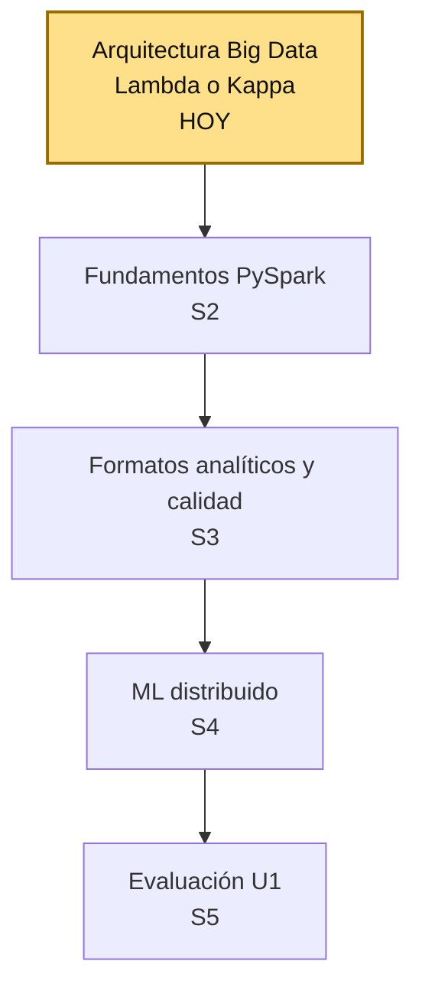

# S1 - Arquitectura Big Data: Lambda y Kappa, batch vs. streaming

## 1. Introducción

Tiempo: 20 min.

### 1.1 Contexto

Big Data no empieza eligiendo Spark o Kafka. Empieza decidiendo qué arquitectura resuelve el problema real: ¿el caso necesita solo el pasado (batch), solo el presente (streaming), o ambos? Esta sesión construye esa primera decisión arquitectónica para el laboratorio `lambda26`.

### 1.2 Índice

1. Ecosistema y arquitectura Big Data.
2. Batch vs. Streaming.
3. Arquitectura Lambda.
4. Arquitectura Kappa.

### 1.3 Propósito de aprendizaje

Al concluir la clase, estarás en condiciones de:

- **Identificar** los componentes del ecosistema Big Data y **decidir** qué arquitectura (Lambda o Kappa) conviene aplicar a un problema real de negocio, justificando la elección entre procesamiento batch y streaming.

### 1.4 Producto de sesión

Diagrama de arquitectura Big Data (Lambda o Kappa) para un caso de negocio, con decisiones técnicas, tecnologías propuestas, supuestos y riesgos.

### 1.5 Metodología

**Tabla 1. Metodología de la sesión**

| Actividades a Realizar en el Periodo | Orientaciones generales (Orientaciones Metodológicas) | Material de estudio recomendado |
|---|---|---|
| Revisión previa individual | Leer el sílabo de la Unidad 1 y el caso de la plataforma de streaming de video (ver 1.6). Trabajo individual, antes de clase; sin instalación previa requerida para esta sesión. | Sílabo Big Data U1. |
| Clase presencial | Construcción guiada de la decisión arquitectónica: ecosistema, batch vs. streaming, regla de decisión, tecnologías y diagrama de flujo. Trabajo individual, siguiendo al docente paso a paso; consulta inmediata ante dudas sobre Lambda, Kappa o el ecosistema. | Pasos 3.1 a 3.5 de esta guía. |
| Evaluación formativa | Revisión en clase de la arquitectura seleccionada y su justificación. La evidencia se completa y sustenta de forma individual, fuera del aula, según los criterios mínimos de la sección 4.4. | Indicaciones de entrega (4.3), rúbrica de evaluación (4.6). |

### 1.6 Motivación de la sesión

#### 1.6.1 Caso: plataforma de streaming de video

Una plataforma similar a Netflix recibe miles de eventos por segundo: reproducciones, búsquedas, clics en recomendaciones y errores de reproducción. La empresa necesita analizar datos históricos y eventos en tiempo real para mejorar su servicio.

Pregunta guía:

```text
¿Qué arquitectura Big Data debería utilizar esta plataforma: Lambda o Kappa?
```

**Preguntas de análisis**

**Activación de conocimientos previos**

1. ¿Qué problemas tendría esta plataforma si solo analizara datos históricos (batch)?
2. ¿Qué problemas tendría si solo procesara eventos en tiempo real (streaming), sin histórico?

**Comprensión de arquitecturas Big Data**

1. ¿Qué arquitectura elegirías tú para este caso y por qué?

### 1.7 Ubicación en el curso

- Unidad: U1 - Arquitecturas Big Data y ETL batch distribuido.
- Producto de unidad: pipeline batch de ETL distribuido con salidas analíticas en Parquet listas para BI/ML.
- Producto del curso: Proyecto Sello: sistema Big Data distribuido end-to-end para procesamiento batch y streaming, analítica/ML, observabilidad y visualización BI para la toma de decisiones.
- Avance del producto en esta sesión: arquitectura Big Data seleccionada y justificada (Lambda o Kappa) para un caso de negocio.

Roadmap del producto de unidad:

**Figura 1. Roadmap del producto de la unidad U1**



Hoy se decide el primer componente real de la U1: la arquitectura Big Data. En las siguientes sesiones se construye el pipeline batch con PySpark, se cargan formatos analíticos en HDFS y se entrena un primer modelo distribuido. La evaluación U1 valida el pipeline batch completo construido sobre esa arquitectura.

## 2. Explica

Tiempo: 25 min.

### 2.1 Ecosistema y arquitectura Big Data

Big Data se refiere al procesamiento de grandes volúmenes de datos que no pueden manejarse eficientemente con herramientas tradicionales. Se resume con las **5V**:

**Tabla 2. Las 5V del Big Data**

| V | Significa |
|---|---|
| Volumen | Cantidad de datos generados. |
| Variedad | Diversidad de formatos y fuentes. |
| Velocidad | Rapidez con la que se generan y deben procesarse. |
| Veracidad | Confiabilidad y calidad del dato. |
| Valor | Utilidad real que aporta a una decisión. |

Una solución Big Data es un flujo de trabajo con 5 etapas:

```text
Fuente de datos -> Ingesta / extracción -> Almacenamiento -> Procesamiento -> Visualización / consumo
```

En `lambda26`, ese flujo se implementa con esta secuencia de tecnologías:

**Figura 2. Ecosistema tecnológico de lambda26, de los eventos de usuario al dashboard**


### 2.2 Batch vs. Streaming

**Tabla 3. Batch vs. streaming**

| Enfoque | Cómo trabaja | Ejemplos |
|---|---|---|
| Batch | Trabaja con datos acumulados y se procesa periódicamente. | Reportes diarios, logs históricos, entrenamiento de modelos. |
| Streaming | Procesa los datos conforme llegan al sistema. | Detección de fraude, recomendaciones en tiempo real, monitoreo. |

Esta distinción es la base de la decisión arquitectónica de la sesión: no se elige Lambda o Kappa por preferencia técnica, sino según si el problema necesita batch, streaming o ambos.

### 2.3 Arquitectura Lambda

Lambda combina tres capas:

- **Batch layer**: procesamiento histórico.
- **Speed layer**: procesamiento en tiempo real.
- **Serving layer**: consulta de resultados combinados.

**Ventaja:** alta precisión al combinar histórico y tiempo real.

**Desventaja:** mayor complejidad (tres capas que mantener).

### 2.4 Arquitectura Kappa

Kappa procesa todo como streaming, incluido el reprocesamiento histórico (reproduciendo el stream desde el origen).

**Ventaja:** arquitectura más simple, una sola capa.

**Desventaja:** menos optimizada para consultas puramente históricas.

#### 2.4.1 Regla de decisión y comparación

Regla de decisión:

- Si el caso necesita histórico + tiempo real -> **Lambda**.
- Si todo el caso son eventos en tiempo real -> **Kappa**.

**Tabla 4. Comparación entre arquitectura Lambda y Kappa**

| Aspecto | Lambda | Kappa |
|---|---|---|
| Histórico | Sí (batch layer) | No como capa separada |
| Tiempo real | Sí (speed layer) | Sí |
| Complejidad | Alta | Menor |
| Capas | Batch + Speed + Serving | Solo streaming |
| Reprocesamiento | Desde la capa batch | Reproduciendo el stream |

## 3. Aplica: actividad práctica guiada

Tiempo: 2h.

**Actividad:** propuesta guiada de arquitectura Big Data (Lambda o Kappa) para el caso de la plataforma de streaming de video.

**Propósito de la actividad:** aplicar la regla de decisión batch/streaming al caso de la plataforma de streaming de video para seleccionar y justificar una arquitectura Big Data, y proponer las tecnologías coherentes con esa elección.

**Orientaciones metodológicas:** en clase, el docente guía el análisis del caso de la plataforma de streaming y la aplicación de la regla de decisión paso a paso frente a la clase; los estudiantes replican cada paso sobre el mismo caso, verificando su clasificación batch/streaming y su elección de arquitectura antes de proponer tecnologías y el diagrama de flujo.

**Actividades para realizar:**

- **3.1** Reconocer el ecosistema de `lambda26`.
- **3.2** Analizar el caso guiado y clasificar batch/streaming.
- **3.3** Aplicar la regla de decisión.
- **3.4** Proponer tecnologías y diagrama de flujo.
- **3.5** Completar la plantilla de propuesta.

### 3.1 Reconocer el ecosistema de `lambda26`

**Producto del paso:** mapa del flujo tecnológico del laboratorio.

Registra el flujo base del ecosistema:

```text
Usuarios -> Kafka -> Spark Processing -> Data Lake / Base de datos -> Dashboard / Aplicaciones
```

Responde:

1. ¿Dónde nacen los eventos?
2. ¿Qué componente ingesta los eventos?
3. ¿Qué componente procesa los datos a escala?
4. ¿Dónde se consumen los resultados?

### 3.2 Analizar el caso guiado y clasificar batch/streaming

**Producto del paso:** clasificación justificada del caso.

Retoma el caso de 1.6.1 (plataforma de streaming de video), que necesita:

- Datos históricos.
- Eventos en tiempo real.
- Recomendaciones y monitoreo.

Responde: ¿el caso requiere batch, streaming o ambos? Justifica con al menos dos razones tomadas del caso.

### 3.3 Aplicar la regla de decisión

**Producto del paso:** arquitectura seleccionada y justificada.

Aplicando la regla de decisión de 2.4.1 al caso de 3.2, selecciona Lambda o Kappa y justifica tu elección en 2-3 líneas.

### 3.4 Proponer tecnologías y diagrama de flujo

**Producto del paso:** lista de tecnologías y diagrama de flujo simple.

Propón tecnologías del ecosistema (Kafka, Spark Streaming, Spark Batch, Data Lake, Dashboard/Power BI, etc.) y construye el diagrama:

```text
Usuarios -> Kafka -> Spark Streaming + Batch -> Data Lake / DW -> Dashboard
```

### 3.5 Completar la plantilla de propuesta

**Producto del paso:** ficha de propuesta arquitectónica completa.

Completa:

```text
Caso analizado:
Tipo de procesamiento:
Arquitectura seleccionada:
Justificación:
Tecnologías propuestas:
Diagrama simple:
```

## 4. Crea: actividad autónoma

Tiempo: 2h fuera del aula.

### 4.1 Actividad

Replicación autónoma de la decisión arquitectónica Big Data (clasificación batch/streaming, regla de decisión, arquitectura Lambda o Kappa) sobre un caso de negocio propio, documentada en evidencia individual.

Completa y evidencia estas tareas:

1. Elegir un caso de negocio distinto al trabajado en clase (por ejemplo: comercio electrónico, sensores IoT, red social o transporte inteligente).
2. Describir qué datos genera el caso elegido y clasificarlo como batch, streaming o ambos, con justificación (equivalente a 3.2).
3. Aplicar la regla de decisión y seleccionar la arquitectura (Lambda o Kappa), justificando la elección (equivalente a 3.3).
4. Proponer tecnologías coherentes con la arquitectura elegida y construir el diagrama de flujo (equivalente a 3.4).
5. Completar la plantilla de propuesta arquitectónica, incluyendo riesgos y supuestos observados (equivalente a 3.5).

### 4.2 Propósito

Que cada estudiante demuestre, de forma individual y fuera del aula, que puede reproducir el patrón de decisión arquitectónica construido en clase sin el acompañamiento del docente.

Cada estudiante aplica la clasificación batch/streaming y la regla de decisión Lambda/Kappa a un caso de negocio propio, distinto al trabajado en clase.

### 4.3 Indicaciones

Entrega un PDF con el siguiente nombre:

```text
S01_Equipo##_ApellidoNombre.pdf
```

Cada captura de pantalla del informe debe mostrar, sin recortar, el reloj del sistema (fecha y hora) y tu usuario o foto de perfil (Windows, VS Code o navegador) visibles en pantalla — es lo que permite verificar que la evidencia es tuya y que corresponde al momento real de tu trabajo.

#### 4.3.1 Estructura del informe

**Datos del estudiante**

- Nombre:
- Equipo:
- Sesión: S01 - Arquitectura Big Data: Lambda y Kappa, batch vs. streaming
- Rol o aporte realizado:
- Link de GitHub:

**Evidencia técnica**

Incluye capturas o extractos con una breve explicación debajo de cada uno, organizados en los mismos 4 bloques de la rúbrica (4.6) — así queda claro qué evidencia corresponde a cada criterio evaluado:

1. *Clasificación batch/streaming*
    - Clasificación batch/streaming del caso elegido, con justificación (equivalente a 3.2).
2. *Arquitectura seleccionada y regla de decisión aplicada*
    - Arquitectura seleccionada (Lambda o Kappa) y regla de decisión aplicada, con justificación (equivalente a 3.3).
3. *Tecnologías propuestas y diagrama de flujo*
    - Tecnologías propuestas y diagrama de flujo simple (equivalente a 3.4).
4. *Plantilla de propuesta completa*
    - Plantilla de propuesta arquitectónica completa, incluyendo riesgos y supuestos (equivalente a 3.5).

**Error o hallazgo**

Describe al menos un riesgo o supuesto que identificaste al analizar tu caso:

- Qué ocurrió o qué limitación encontraste.
- Cómo lo identificaste.
- Cómo lo documentaste o qué supuesto tomaste.

**Reflexión técnica breve**

Responde en 5 a 8 líneas:

```text
¿Qué arquitectura usarías para un sistema de sensores IoT y por qué?
```

### 4.4 Criterios mínimos de aceptación

La evidencia individual se considera completa si:

- El caso elegido está delimitado y es distinto al trabajado en clase.
- La clasificación batch/streaming está justificada con datos del caso.
- La arquitectura seleccionada aplica correctamente la regla de decisión.
- Las tecnologías propuestas son coherentes con la arquitectura elegida.
- Cada captura de la evidencia técnica muestra el reloj del sistema y el usuario/perfil visible, sin recortar.
- Las fechas y horas de las capturas son coherentes con el historial de commits de su repositorio en GitHub.
- Incluye un error o hallazgo técnico diagnosticado.
- Incluye la reflexión técnica breve solicitada.

### 4.5 Preguntas de defensa

1. ¿En qué casos una empresa necesitaría procesamiento en tiempo real?
2. ¿Qué ventajas tiene combinar batch y streaming?
3. ¿Qué arquitectura usarías para un sistema de sensores IoT y por qué?
4. ¿Qué desventaja tiene Lambda frente a Kappa?
5. ¿Qué tecnología usarías para la ingesta de eventos y por qué?

### 4.6 Rúbrica de evaluación

**Tabla 5. Rúbrica de evaluación**

| Criterio | Peso (%) | A (20 pts) | B (15 pts) | C (10 pts) | D (5 pts) | Nivel obtenido |
|---|---:|---|---|---|---|---:|
| 1. Clasificación batch/streaming* | 25 | Clasifica el caso propio (batch, streaming o ambos) con justificación clara y basada en los datos reales que genera. | Clasifica correctamente el caso propio, con justificación breve. | Clasificación imprecisa o sin justificar. | No clasifica el caso propio. | |
| 2. Arquitectura seleccionada y regla de decisión aplicada* | 25 | Aplica la regla de decisión con solidez técnica y selecciona y justifica Lambda o Kappa para el caso propio. | Aplica la regla de decisión correctamente y selecciona una arquitectura para el caso propio. | Aplica la regla de decisión con justificación débil. | No aplica la regla de decisión ni selecciona arquitectura. | |
| 3. Tecnologías propuestas y diagrama de flujo* | 25 | Propone tecnologías coherentes con la arquitectura elegida y un diagrama de flujo claro y completo del caso propio. | Propone tecnologías coherentes y un diagrama de flujo comprensible. | Tecnologías o diagrama incompletos o poco coherentes. | No propone tecnologías ni diagrama. | |
| 4. Plantilla de propuesta completa* | 25 | Completa todos los campos de la plantilla (caso, tipo de procesamiento, arquitectura, justificación, tecnologías, diagrama, riesgos y supuestos), coherentes entre sí. | Completa la plantilla con campos suficientes, con detalles menores pendientes. | Plantilla incompleta o con campos relevantes vacíos. | No presenta la plantilla. | |

\* Agregado manual.

Nota final = suma de (`Peso` / 100 × `Puntos del nivel obtenido`) = ____ / 20.

Para usar la rúbrica con IA, solicita:

```text
Evalúa el PDF usando la rúbrica de la sesión.
Para cada criterio selecciona el nivel obtenido usando la escala A=20, B=15, C=10, D=5 puntos.
Justifica brevemente cada nivel asignado.
Verifica que cada captura muestre reloj del sistema y usuario/perfil visible, y que las fechas sean coherentes con el historial de commits de GitHub. Si falta esta evidencia o hay inconsistencias, indícalo explícitamente antes de calificar.
Calcula la nota final con la fórmula: suma de (Peso/100 × Puntos del nivel obtenido), directamente sobre 20.
Indica 2 fortalezas y 2 recomendaciones.
```

## 5. Cierre

Tiempo: 5 min.

**Resumen breve:** hoy se construyó la primera decisión arquitectónica real del laboratorio `lambda26`: clasificación batch/streaming del caso de la plataforma de streaming de video, aplicación de la regla de decisión, selección justificada de Lambda o Kappa, tecnologías propuestas y diagrama de flujo.

**Dinámica participativa:** en una ronda rápida (o con una herramienta digital tipo formulario o encuesta en vivo), cada estudiante comparte en una frase qué arquitectura (Lambda o Kappa) eligió para el caso guiado y por qué.

**Metacognición:** cada estudiante responde en voz alta o por escrito: ¿qué parte de la sesión te costó más entender, y cómo la resolviste?

**Proyección:** la arquitectura seleccionada hoy se retoma en S2, cuando se construye el pipeline batch con PySpark sobre esa decisión, y aplica en cualquier proyecto profesional donde primero hay que decidir qué arquitectura resuelve el problema real antes de elegir herramientas.

## Bibliografía

1. Marz, N., & Warren, J. (2015). *Big Data: Principles and best practices of scalable real-time data systems*. Manning Publications.
2. Kreps, J. (2014, July 2). *Questioning the Lambda architecture*. O'Reilly Radar. https://www.oreilly.com/radar/questioning-the-lambda-architecture/
3. Apache Software Foundation. (2024). *Apache Kafka documentation*. https://kafka.apache.org/documentation/
4. Apache Software Foundation. (2024). *Apache Spark documentation*. https://spark.apache.org/docs/latest/
