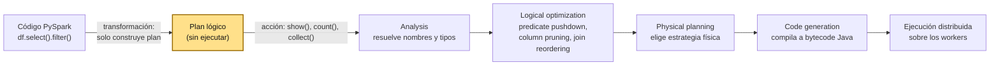
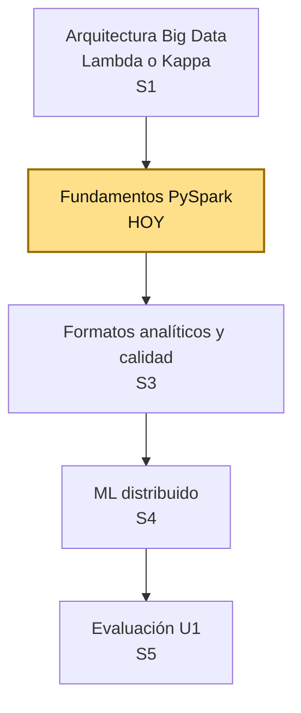
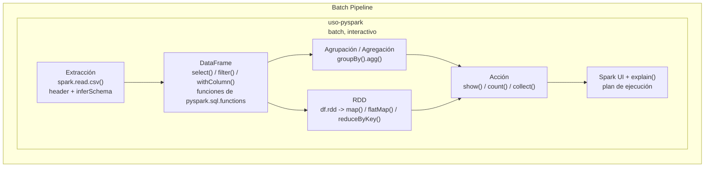

# S2 - Fundamentos PySpark: transformaciones, funciones, agrupaciones y evaluación perezosa

*Por: Angel Sullon Macalupu @asullom - 2026*

## 1. Introducción

Tiempo: 20 min.

### 1.1 Presentación de la sesión

En S1 se decidió la arquitectura Big Data (Lambda o Kappa) del Proyecto Sello y se verificó que el entorno `lambda26` (`uso-pyspark`) funciona de punta a punta. Esta sesión entra a fondo en la primera etapa real del pipeline batch: extracción, transformaciones, funciones, agrupaciones/agregaciones y el modelo RDD, todo bajo el concepto que explica por qué Spark procesa datos a esa escala sin colapsar — la evaluación perezosa (*lazy evaluation*). El porqué se desarrolla en 1.6, a partir de cómo Spark SQL optimiza tu código antes de ejecutarlo; esta sesión no llega todavía a particionar ni guardar en formatos analíticos (eso es S3).

### 1.2 Índice

1. DataFrames: extracción y estructura.
2. Transformaciones, acciones y evaluación perezosa.
3. Funciones, agrupaciones y agregaciones.
4. RDD: el modelo debajo de los DataFrames.

### 1.3 Propósito de aprendizaje

Al concluir la clase, estarás en condiciones de:

- **Ejecutar** transformaciones distribuidas con PySpark sobre DataFrames y RDD, **identificar** el momento exacto en que Spark ejecuta realmente el cálculo, y **aplicar** funciones, agrupaciones y agregaciones para resumir datos a escala.

### 1.4 Producto de sesión

Notebook `02_fundamentos_practica.ipynb` con transformaciones y funciones documentadas, agrupaciones/agregaciones aplicadas, procesamiento RDD y evidencia del plan de ejecución (`explain()`).

### 1.5 Metodología

**Tabla 1. Metodología de la sesión**

| Actividades a Realizar en el Periodo | Orientaciones generales (Orientaciones Metodológicas) | Material de estudio recomendado |
|---|---|---|
| Revisión previa individual | Repasar el notebook de verificación de S1 (entorno `lambda26` ya debe estar funcionando) y leer el caso de Catalyst Optimizer (ver 1.6). Trabajo individual, antes de clase. | Sílabo Big Data U1, guía S1. |
| Clase presencial | Construcción guiada del notebook `02_fundamentos_practica.ipynb`: extracción, transformaciones, evaluación perezosa, funciones, agrupaciones/agregaciones y RDD. Trabajo individual, siguiendo al docente paso a paso; consulta inmediata ante dudas. | Pasos 3.1 a 3.8 de esta guía. |
| Evaluación formativa | Revisión en clase de las transformaciones documentadas y la evidencia del plan de ejecución. La evidencia se completa y sustenta de forma individual, fuera del aula, según los criterios mínimos de la sección 4.4. | Indicaciones de entrega (4.3), rúbrica de evaluación (4.6). |

### 1.6 Motivación de la sesión

#### 1.6.1 Caso: por qué Spark no ejecuta tu código de inmediato — el optimizador Catalyst

Cuando escribes `df.select(...).filter(...)` en PySpark, Spark **no ejecuta nada todavía**: solo construye un plan. Recién cuando llamas a una acción (`show()`, `count()`, `collect()`), el motor **Catalyst** de Spark SQL toma ese plan y lo optimiza antes de tocar un solo byte de datos, en cuatro fases: *Analysis* (resuelve nombres de columnas y tipos), *Logical optimization* (aplica reglas como *predicate pushdown*, *column pruning* y reordenamiento de joins), *Physical planning* (elige la estrategia física de ejecución) y *Code generation* (compila partes del plan a bytecode de Java). Catalyst se diseñó explícitamente con dos objetivos: que el equipo de Spark pudiera agregar nuevas técnicas de optimización con facilidad, y que desarrolladores externos pudieran extender el optimizador. Esa es la razón técnica de fondo por la que este notebook trabaja con DataFrames (`select()`, `filter()`, `groupBy()`) en vez de un bucle manual: le da a Spark la libertad de reordenar, podar columnas y elegir el plan más barato antes de ejecutar — algo que un bucle secuencial no le permite.

**Figura 1. De la transformación a la ejecución: las 4 fases de Catalyst**



*Nota.* Adaptado de *What is a Catalyst Optimizer?*, por Databricks, 2024, Databricks Blog (<https://www.databricks.com/blog/what-is-catalyst-optimizer>).

**Preguntas de análisis**

**Activación de conocimientos previos**

1. En Python normal (sin Spark), cuando escribes `resultado = filtrar(datos); resultado2 = seleccionar(resultado)`, ¿en qué momento se ejecuta cada línea? ¿En qué se diferencia eso de lo que hace Spark con `df.filter(...).select(...)`?
2. ¿Qué ventaja tendría para Spark "esperar" a ver todas las transformaciones encadenadas antes de decidir cómo ejecutarlas, en vez de ejecutar cada una apenas se escribe?

**Comprensión de evaluación perezosa**

1. Según el caso, ¿qué ocurre exactamente cuando llamas a una acción como `show()` o `count()`? Nombra las 4 fases que atraviesa el plan.
2. ¿Por qué sería más difícil para el equipo de Spark agregar nuevas reglas de optimización (como *predicate pushdown*) si Spark ejecutara cada transformación de inmediato, apenas se escribe?

### 1.7 Ubicación en el curso

- Unidad: U1 - Arquitecturas Big Data y ETL batch distribuido.
- Producto del curso: Proyecto Sello: sistema Big Data distribuido end-to-end para procesamiento batch y streaming, analítica/ML, observabilidad y visualización BI para la toma de decisiones.
- Producto de unidad: pipeline batch de ETL distribuido con salidas analíticas en Parquet listas para BI/ML.
- Avance del producto en esta sesión: transformaciones distribuidas documentadas sobre datos del Proyecto Sello, con evidencia del plan de ejecución.

Roadmap del producto de unidad:

**Figura 2. Roadmap del producto de la unidad U1**



Hoy se construye la base técnica que usa el resto de la unidad: sin dominar transformaciones, funciones, agrupaciones y evaluación perezosa, S3 (carga particionada y calidad de datos) y S4 (ML distribuido) no tienen sobre qué apoyarse. La evaluación U1 valida el pipeline batch completo construido sobre esta base.

## 2. Explica

Tiempo: 25 min.

### 2.1 Arquitectura de la sesión

**Figura 3. Arquitectura de la sesión: extracción, DataFrame, RDD y evaluación perezosa sobre `uso-pyspark`**



A diferencia de S1, donde solo verificabas que el ciclo completo funcionara de punta a punta con un caso mínimo, hoy trabajas a fondo dentro de la etapa de transformación: extracción con control de esquema, transformaciones y funciones sobre DataFrame, agrupaciones/agregaciones, y el modelo RDD que corre por debajo. La visualización sigue siendo `show()` + Spark UI; la persistencia en formatos analíticos particionados (Parquet) recién se construye en S3 — hoy el resultado vive solo en memoria distribuida, dentro de la sesión de Spark.

### 2.2 Extracción y estructura de un DataFrame

`spark.read.csv()` acepta parámetros que cambian cómo Spark interpreta el archivo:

**Tabla 2. Parámetros usados en esta sesión para `spark.read.csv()`**

| Parámetro | Qué hace | Costo/riesgo |
|---|---|---|
| `header=True` | Usa la primera fila del archivo como nombres de columna. | Si el header real no calza con el orden de columnas del schema inferido, Spark emite una advertencia en vez de fallar — hay que revisarla, no ignorarla (ver recuadro abajo). |
| `inferSchema=True` | Spark lee el archivo una vez completa para deducir el tipo de cada columna (`int`, `string`, `date`, etc.). | Cuesta una pasada extra sobre los datos antes de la real; en un archivo de producción grande, se reemplaza por un `StructType` explícito para evitar ese costo y cualquier ambigüedad de tipos. |

**Error frecuente:** al leer `biblia_ntv_.csv` con `header=True` e `inferSchema=True`, Spark muestra esta advertencia real:

```text
WARN CSVHeaderChecker: CSV header does not conform to the schema.
 Header: , libro, capitulo, verso, texto
 Schema: _c0, libro, capitulo, verso, texto
 Expected: _c0 but found:
```

No es un error que detenga la ejecución — Spark sigue leyendo el archivo — pero indica que la primera columna del CSV no tiene nombre en el header (columna de índice sin etiquetar) y Spark la nombró `_c0` por defecto. Repórtalo como hallazgo en tu evidencia (4.3.1) si te aparece: es exactamente el tipo de inconsistencia de esquema que un `StructType` explícito habría evitado.

Ese `StructType` explícito se ve así — declara cada columna con su nombre, tipo y si acepta nulos, sin que Spark tenga que inferir nada:

```python
from pyspark.sql.types import StructType, StructField, IntegerType, StringType

schema = StructType([
    StructField("_c0", IntegerType(), nullable=True),
    StructField("libro", StringType(), nullable=True),
    StructField("capitulo", IntegerType(), nullable=True),
    StructField("verso", IntegerType(), nullable=True),
    StructField("texto", StringType(), nullable=True),
])

df = spark.read.csv("/opt/data/biblia_ntv_.csv", header=True, schema=schema)
```

Con `schema=schema` explícito, Spark ya no necesita `inferSchema=True` (se ahorra la pasada extra de lectura) y la advertencia de header de arriba deja de tener margen de ambigüedad: cada columna tiene el tipo que tú declaraste, no el que Spark dedujo.

### 2.3 Transformaciones, acciones y evaluación perezosa

Toda operación sobre un DataFrame es una **transformación** o una **acción**:

**Tabla 3. Transformaciones comunes vs. acciones comunes**

| Tipo | Qué hace | Ejemplos |
|---|---|---|
| Transformación | Construye un nuevo plan lógico; no ejecuta nada todavía. | `select()`, `filter()`, `withColumn()`, `groupBy()`, `join()` |
| Acción | Dispara la ejecución real (las 4 fases de Catalyst, ver 1.6) y devuelve un resultado. | `show()`, `count()`, `collect()`, `take()`, `write()` |

`explain(True)` expone las 4 fases de Catalyst como planes concretos:

**Tabla 4. Fases del plan de ejecución mostradas por `explain(True)`**

| Fase (Catalyst) | Nombre en `explain(True)` | Qué muestra |
|---|---|---|
| Analysis | *Analyzed Logical Plan* | Nombres y tipos ya resueltos. |
| Logical optimization | *Optimized Logical Plan* | El plan después de aplicar reglas como *predicate pushdown* (el `filter()` bajó antes que el `select()`, aunque en el código estuviera después). |
| Physical planning | *Physical Plan* | La estrategia física real: qué archivo lee (`FileScan csv`), qué filtros empuja al propio lector (`PushedFilters`). |
| Code generation | (no se imprime como texto; ya es bytecode) | No aparece en `explain()`, pero es el paso final antes de ejecutar en los workers. |

Ejemplo real, capturado al correr `explain(True)` sobre un `filter()` encadenado con `select()`:

```text
== Parsed Logical Plan ==
'Filter 'or('or('contains(texto#21, amor), 'contains(texto#21, fe)), 'contains(texto#21, Dios))
+- Project [libro#18, capitulo#19, verso#20, texto#21]
   +- Relation [_c0#17,libro#18,capitulo#19,verso#20,texto#21] csv

== Optimized Logical Plan ==
Project [libro#18, capitulo#19, verso#20, texto#21]
+- Filter ((Contains(texto#21, amor) OR Contains(texto#21, fe)) OR Contains(texto#21, Dios))
   +- Relation [_c0#17,libro#18,capitulo#19,verso#20,texto#21] csv
```

Compara el *Parsed* con el *Optimized*: en el código, el `select()` se escribió antes que el `filter()`; en el plan optimizado, Catalyst puso el `Filter` **antes** del `Project` — porque filtrar primero reduce cuántas filas hay que proyectar después. Eso es *predicate pushdown* en acción, no una casualidad del optimizador.

Esa misma evaluación perezosa tiene un costo oculto: si llamas a dos acciones distintas (`show()` y después `count()`) sobre el mismo DataFrame transformado, Spark **recalcula todo el plan dos veces** — la evaluación perezosa no guarda el resultado, solo el plan. `cache()` rompe ese recálculo, guardando el resultado en memoria la primera vez que una acción lo dispara:

```python
df_transformado = df_transformado.cache()

df_transformado.count()  # primera acción: ejecuta el plan completo y lo guarda en memoria
df_transformado.show(5)  # segunda acción: reutiliza el resultado cacheado, no vuelve a leer el CSV
```

Úsalo solo si vas a reutilizar el mismo DataFrame en más de una acción — cachear algo que se usa una sola vez solo gasta memoria sin ahorrar nada. Libera la memoria con `df_transformado.unpersist()` cuando ya no lo necesites.

### 2.4 Funciones de `pyspark.sql.functions`

Las transformaciones simples (`select()`, `filter()` con `.contains()`) alcanzan para casos básicos, pero la mayoría de transformaciones reales necesitan funciones de columna explícitas, importadas de `pyspark.sql.functions`. `withColumn()` es la forma de crear o reemplazar una columna aplicando una de esas funciones:

```python
from pyspark.sql.functions import col, when, lit, current_date

df.filter(col("monto") > 0)

df = df.withColumn(
    "categoria",
    when(col("monto") < 150, "bajo")
    .when(col("monto") <= 250, "medio")
    .otherwise("alto")
)

df = df.withColumn("moneda", lit("PEN"))          # columna constante
df = df.withColumn("monto", col("monto").cast("double"))  # cambia el tipo de una columna existente
df = df.withColumn("fecha_procesado", current_date())     # columna calculada por Spark, no por ti
```

`col("monto")` referencia la columna de forma explícita (necesario para comparaciones y expresiones compuestas); `when()/otherwise()` es el equivalente de un `if/elif/else` a nivel de columna, evaluado en cada fila de forma distribuida; `lit()` inyecta un valor literal como columna (útil para banderas o constantes); `.cast()` cambia el tipo de una columna sin releer el archivo; `current_date()` es una función de Spark, no de Python — se evalúa en cada worker al momento de la acción, no una sola vez al escribir el código. Como `withColumn()` es una transformación, ninguna de estas líneas ejecuta nada todavía — el plan solo se dispara con la acción que sigue.

### 2.5 Agrupaciones y agregaciones

`groupBy()` agrupa filas por una o más columnas; solo tiene sentido combinado con una función de agregación en `.agg()` — sin eso, el grupo no produce ningún resumen.

**Tabla 5. Funciones de agregación comunes**

| Función | Qué calcula |
|---|---|
| `count()` | Cantidad de filas por grupo. |
| `sum()` | Suma de una columna por grupo. |
| `avg()` | Promedio de una columna por grupo. |
| `min()` / `max()` | Valor mínimo/máximo por grupo. |
| `countDistinct()` | Cantidad de valores distintos por grupo. |

```python
from pyspark.sql.functions import sum, count, avg

ventas.groupBy("cliente_id").agg(
    sum("monto").alias("total"),
    count("id").alias("cantidad_compras"),
    avg("monto").alias("promedio")
).show()
```

Sobre `data/ventas.csv` (4 filas, 3 clientes), este resultado es verificable a mano:

```text
+----------+-----+----------------+--------+
|cliente_id|total|cantidad_compras|promedio|
+----------+-----+----------------+--------+
|       101|  300|               2|   150.0|
|       102|  150|               1|   150.0|
|       103|  300|               1|   300.0|
+----------+-----+----------------+--------+
```

`groupBy()` en sí mismo es una transformación (no ejecuta nada); `.agg(...)` sigue siendo parte del plan; recién `.show()` dispara la acción.

`countDistinct()` responde una pregunta distinta a `count()`: no cuántas filas hay, sino cuántos valores *distintos* aparecen. Agrupando `ventas.csv` por `fecha` en vez de por `cliente_id`:

```python
from pyspark.sql.functions import countDistinct

ventas.groupBy("fecha").agg(
    countDistinct("cliente_id").alias("clientes_unicos")
).show()
```

```text
+----------+----------------+
|     fecha|clientes_unicos|
+----------+----------------+
|2024-01-01|               2|
|2024-01-02|               1|
|2024-01-03|               1|
+----------+----------------+
```

El 1 de enero tiene 2 filas de compra, pero de 2 clientes distintos (101 y 102) — por eso `count("*")` daría 2 y `countDistinct("cliente_id")` también da 2 aquí; la diferencia se nota cuando un mismo cliente compra varias veces el mismo día (como el 101, que sí tiene 2 compras en fechas distintas). `groupBy()` también acepta más de una columna a la vez — por ejemplo, `ventas.groupBy("cliente_id", "fecha").agg(...)` agrupa por la combinación de ambas, no por cada una por separado.

### 2.6 RDD: el modelo debajo de los DataFrames

Un DataFrame se apoya, por debajo, en un RDD (*Resilient Distributed Dataset*) — la abstracción original de Spark: una colección distribuida e inmutable, tolerante a fallos, sobre la que se aplican operaciones funcionales (`map`, `filter`, `flatMap`, `reduceByKey`) en vez de operaciones relacionales (`select`, `groupBy`). Se accede al RDD subyacente con `df.rdd`.

**Tabla 6. DataFrame vs. RDD**

| Aspecto | DataFrame | RDD |
|---|---|---|
| Optimización | Pasa por Catalyst (predicate pushdown, column pruning, etc.). | Sin optimización automática: Spark ejecuta las operaciones tal como se escriben. |
| Tipado | Esquema con nombres y tipos de columna. | Colección de objetos Python sin esquema explícito. |
| Caso de uso típico | Datos estructurados/semi-estructurados (CSV, JSON, Parquet, SQL). | Procesamiento de texto libre, lógica funcional personalizada que no encaja en operaciones relacionales. |
| Ejemplo en esta sesión | `groupBy().agg()` sobre `ventas.csv`. | Conteo de palabras sobre `biblia_ntv_.csv`. |

Por eso, cuando el dato ya es estructurado (como `ventas.csv`), conviene quedarse en DataFrame y dejar que Catalyst optimice; RDD se reserva para el caso en que la transformación no encaja en operaciones relacionales — como el conteo de palabras de texto libre de esta práctica.

```python
rdd = df.select("texto").rdd.map(lambda x: x.texto)

palabras = rdd.flatMap(lambda linea: linea.lower().split())
pares = palabras.map(lambda palabra: (palabra, 1))
conteo = pares.reduceByKey(lambda a, b: a + b)

conteo.takeOrdered(10, key=lambda x: -x[1])
```

`flatMap` aplana el resultado (una línea produce varias palabras, no una lista de listas); `map` construye pares `(palabra, 1)`; `reduceByKey` suma los `1` de cada palabra repetida — el mismo patrón MapReduce que dio origen a Spark:

**Figura 4. El proceso MapReduce de conteo de palabras: Input, Splitting, Mapping, Shuffling, Reducing, Final result**


Mapea el diagrama contra el código: *Splitting* es el `flatMap` (cada línea de entrada se separa en palabras sueltas); *Mapping* es el `.map(lambda palabra: (palabra, 1))` (cada palabra se convierte en un par `(palabra, 1)`); *Shuffling* es el paso interno de Spark que agrupa todos los pares con la misma clave en el mismo nodo antes de reducir (no hay una línea de código explícita para esto — Spark lo hace por debajo, es la razón por la que `reduceByKey` es una operación costosa: mueve datos entre particiones); *Reducing* es el propio `reduceByKey(add)`, que suma los `1` de cada palabra repetida. Hadoop MapReduce (el origen de este patrón) implementa exactamente estos mismos pasos sobre disco; Spark los implementa en memoria, lo que evita escribir a disco entre cada etapa — esa es la razón técnica de fondo de por qué Spark es más rápido que Hadoop MapReduce para este tipo de carga de trabajo iterativa.

*Nota.* Adaptado de *¿Qué es MapReduce en Hadoop?*, por KeepCoding, 2022, KeepCoding Blog (<https://keepcoding.io/blog/mapreduce-hadoop/>).

Este ejemplo, corrido sobre el texto completo de `biblia_ntv_.csv` (31 102 versículos), produjo este resultado real:

```text
[('de', 40372), ('y', 27162), ('a', 22768), ('que', 22566), ('el', 22490),
 ('la', 19948), ('los', 17711), ('en', 13823), ('se', 8717), ('señor', 8006)]
```

## 3. Aplica: actividad práctica guiada

Tiempo: 2h.

**Actividad:** construir el notebook `02_fundamentos_practica.ipynb` sobre el entorno `lambda26` (`uso-pyspark`), aplicando extracción, transformaciones, funciones, agrupaciones/agregaciones, RDD y verificando en cada paso el efecto de la evaluación perezosa.

**Propósito de la actividad:** dejar evidencia ejecutable de que dominas el ciclo completo de transformación distribuida en PySpark — DataFrame y RDD sobre la misma `SparkSession` — antes de avanzar a formatos analíticos particionados (S3) y ML distribuido (S4).

**Orientaciones metodológicas:** en clase, el docente guía la construcción del notebook paso a paso, alternando explicación breve y ejecución; los estudiantes replican cada celda en su propio entorno, verificando el resultado (incluido el plan de `explain()`) antes de avanzar al siguiente paso.

**Actividades para realizar:**

- **3.1** Reanudar el entorno `lambda26` (`uso-pyspark`).
- **3.2** Crear el notebook y la `SparkSession`.
- **3.3** Cargar y explorar el DataFrame (`biblia_ntv_.csv`).
- **3.4** Aplicar transformaciones y verificar la evaluación perezosa.
- **3.5** Analizar el plan de ejecución con `explain()`.
- **3.6** Aplicar agrupaciones y agregaciones (`ventas.csv`).
- **3.7** Convertir a RDD y procesar con `map`/`flatMap`/`filter`/`reduceByKey`.
- **3.8** Documentar hallazgos y responder preguntas de reflexión.

### 3.1 Reanudar el entorno `lambda26` (`uso-pyspark`)

**Producto del paso:** entorno `lambda26` funcionando (Jupyter + Spark), continuación directa de S1.

Si el contenedor sigue corriendo desde S1, continúa directo en 3.2. Si lo detuviste, retómalo desde `lambda26/pyspark`:

```powershell
docker compose up -d
```

Verifica que responde:

```text
JupyterLab -> http://localhost:4488/lab?token=sintoken
```

### 3.2 Crear el notebook y la `SparkSession`

**Producto del paso:** notebook `02_fundamentos_practica.ipynb` con una `SparkSession` activa.

Desde JupyterLab, crea el notebook dentro de `notebooks/`:

```python
from pyspark.sql import SparkSession

spark = (
    SparkSession.builder
    .appName("sesion2-fundamentos-spark")
    .master("local[*]")
    .config("spark.ui.port", "4040")
    .config("spark.sql.shuffle.partitions", "8")
    .getOrCreate()
)

spark
```

`spark.sql.shuffle.partitions` se fija en 8 (en vez del valor por defecto, 200) porque los datasets de esta práctica son pequeños — con 200 particiones para unas pocas filas, el overhead de coordinar particiones vacías sería mayor que el propio cómputo.

### 3.3 Cargar y explorar el DataFrame (`biblia_ntv_.csv`)

**Producto del paso:** DataFrame cargado, esquema y primeras filas verificadas.

```python
df = spark.read.csv("/opt/data/biblia_ntv_.csv", header=True, inferSchema=True)

df.printSchema()
df.show(5, truncate=False)
```

Revisa si aparece la advertencia de `CSVHeaderChecker` (ver 2.2) — si aparece, es tu primer hallazgo real para 4.3.1.

### 3.4 Aplicar transformaciones y verificar la evaluación perezosa

**Producto del paso:** evidencia de que el plan se construye antes de ejecutarse.

```python
df_transformado = (
    df.select("libro", "capitulo", "verso", "texto")
      .filter(df.texto.contains("amor") | df.texto.contains("fe") | df.texto.contains("Dios"))
)

# Hasta aquí Spark solo construyó el plan: no hay salida, no hubo ejecución
df_transformado
```

```python
# Acción: aquí recién Spark ejecuta
df_transformado.show(10, truncate=False)
df_transformado.count()
```

Confirma que la celda anterior (transformación) no mostró ningún dato, y que esta celda (acción) sí — esa diferencia es la evaluación perezosa en la práctica, no solo en la teoría de 1.6.

### 3.5 Analizar el plan de ejecución con `explain()`

**Producto del paso:** plan de ejecución interpretado con al menos una optimización identificada.

```python
df_transformado.explain(True)
```

Identifica en tu propio resultado: ¿el `Filter` quedó antes o después del `Project` en el *Optimized Logical Plan*? Relaciónalo con la Tabla 4 y el ejemplo de 2.3.

### 3.6 Aplicar agrupaciones y agregaciones (`ventas.csv`)

**Producto del paso:** resumen agregado por cliente, verificado contra el cálculo manual.

```python
ventas = spark.read.csv("/opt/data/ventas.csv", header=True, inferSchema=True)

from pyspark.sql.functions import sum, count, avg

resumen = ventas.groupBy("cliente_id").agg(
    sum("monto").alias("total"),
    count("id").alias("cantidad_compras"),
    avg("monto").alias("promedio")
)

resumen.show()
```

Verifica tu resultado contra la tabla de 2.5 (cliente 101: total 300, 2 compras, promedio 150).

### 3.7 Convertir a RDD y procesar con `map`/`flatMap`/`filter`/`reduceByKey`

**Producto del paso:** conteo de palabras distribuido, con las 10 palabras más frecuentes.

```python
import re
from operator import add

rdd = df.select("texto").rdd.map(lambda x: x.texto)

palabras = rdd.flatMap(
    lambda linea: re.sub(r"[^\wáéíóúñüÁÉÍÓÚÑÜ]", " ", linea.lower()).split()
)

pares = palabras.filter(lambda p: p != "").map(lambda palabra: (palabra, 1))
conteo = pares.reduceByKey(add)

conteo.takeOrdered(10, key=lambda x: -x[1])
```

Compara tu resultado contra el capturado en 2.6. Adicionalmente, responde con código:

1. ¿Cuántas veces aparece la palabra `dios`? (`conteo.filter(lambda x: x[0] == "dios").collect()`)
2. Extrae 5 versículos donde aparezca `fe` (`rdd.filter(lambda x: "fe" in x.lower()).take(5)`).

### 3.8 Documentar hallazgos y responder preguntas de reflexión

**Producto del paso:** notebook documentado con celdas markdown explicando cada resultado.

Agrega celdas markdown breves debajo de cada bloque de código (3.3-3.7) explicando qué hiciste y qué observaste — es la base directa de la evidencia técnica que armarás en 4.3.1.

**Evidencia de aprendizaje:**

- Notebook `02_fundamentos_practica.ipynb` con extracción, transformaciones, funciones, agrupaciones/agregaciones y RDD ejecutados.
- Plan de ejecución (`explain()`) interpretado, con al menos una optimización de Catalyst identificada.
- Resultado de agrupación/agregación verificado contra el cálculo manual.
- Conteo de palabras (RDD) con las 10 más frecuentes documentado.

## 4. Crea: actividad autónoma

Tiempo: 2h fuera del aula.

### 4.1 Actividad

Replicación autónoma del flujo de transformación construido en clase (extracción, transformaciones, funciones, agrupaciones/agregaciones, RDD y evaluación perezosa) sobre datos del Proyecto Sello del equipo — reales si el equipo ya los tiene, o una muestra representativa del caso de negocio definido en S1 si todavía no hay datos reales disponibles.

Completa y evidencia estas tareas:

1. Cargar un dataset del Proyecto Sello como DataFrame, verificar esquema y primeras filas (equivalente a 3.3).
2. Aplicar al menos tres transformaciones y una acción, evidenciando que la transformación no ejecuta nada hasta que llega la acción (equivalente a 3.4).
3. Analizar el plan de ejecución con `explain()` e identificar al menos una optimización aplicada por Catalyst (equivalente a 3.5).
4. Aplicar una agrupación con al menos una función de agregación relevante al caso del equipo (equivalente a 3.6).
5. Convertir a RDD y aplicar al menos dos operaciones tipo `map`/`flatMap`/`filter`/`reduceByKey` (equivalente a 3.7).

### 4.2 Propósito

Que cada estudiante demuestre, de forma individual y fuera del aula, que puede reproducir el flujo de transformación PySpark construido en clase sin el acompañamiento del docente — aplicándolo al caso real del Proyecto Sello de su equipo, no a un dataset desconectado.

### 4.3 Indicaciones

Entrega un PDF con el siguiente nombre:

```text
S02_Equipo##_ApellidoNombre.pdf
```

Cada captura de pantalla del informe debe mostrar, sin recortar, el reloj del sistema (fecha y hora) y tu usuario o foto de perfil (Windows, VS Code o navegador) visibles en pantalla — es lo que permite verificar que la evidencia es tuya y que corresponde al momento real de tu trabajo.

#### 4.3.1 Estructura del informe

**Datos del estudiante**

- Nombre:
- Equipo:
- Sesión: S02 - Fundamentos PySpark: transformaciones, funciones, agrupaciones y evaluación perezosa
- Rol o aporte realizado:
- Link de GitHub:

**Evidencia técnica**

Incluye capturas o extractos con una breve explicación debajo de cada uno, organizados en los mismos 4 bloques de la rúbrica (4.6):

1. *Extracción y exploración del DataFrame*
    - Dataset del Proyecto Sello cargado, esquema y primeras filas (equivalente a 3.3).
2. *Transformaciones, acciones y evaluación perezosa*
    - Transformaciones aplicadas y evidencia de que la ejecución ocurre recién con la acción (equivalente a 3.4).
3. *Agrupaciones y agregaciones*
    - Resumen agregado relevante al caso del equipo (equivalente a 3.6).
4. *RDD y plan de ejecución*
    - Procesamiento RDD y plan de `explain()` interpretado (equivalente a 3.5 y 3.7).

**Error o hallazgo**

Describe al menos un error o comportamiento inesperado que encontraste al procesar tus propios datos:

- Qué ocurrió o qué limitación encontraste.
- Cómo lo identificaste.
- Cómo lo resolviste o qué decisión tomaste.

**Reflexión técnica breve**

Responde en 5 a 8 líneas:

```text
¿Por qué la evaluación perezosa es útil para procesar datos a escala, y qué
riesgo tendría si Spark ejecutara cada transformación de inmediato, apenas
se escribe?
```

### 4.4 Criterios mínimos de aceptación

La evidencia individual se considera completa si:

- El DataFrame del Proyecto Sello se carga y explora correctamente (esquema, primeras filas).
- Aplica al menos tres transformaciones y una acción, documentando el efecto de la evaluación perezosa.
- Aplica una agrupación con al menos una función de agregación relevante al caso.
- Convierte a RDD y aplica al menos dos operaciones tipo `map`/`flatMap`/`filter`/`reduceByKey`.
- Analiza el plan de ejecución con `explain()` y explica al menos una fase o una optimización.
- Cada captura de la evidencia técnica muestra el reloj del sistema y el usuario/perfil visible, sin recortar.
- Las fechas y horas de las capturas son coherentes con el historial de commits de su repositorio en GitHub.
- Incluye un error o hallazgo técnico diagnosticado.
- Incluye la reflexión técnica breve solicitada.

### 4.5 Preguntas de defensa

1. ¿Cuál es la diferencia entre una transformación y una acción en Spark? Da un ejemplo de cada una.
2. ¿Por qué Spark no ejecuta las transformaciones de inmediato? ¿Qué ventaja de rendimiento aporta eso?
3. ¿Qué información te da `explain()` sobre cómo Spark va a ejecutar tu código?
4. ¿Cuándo usarías RDD en vez de DataFrame, y por qué en la mayoría de los casos conviene usar DataFrame?
5. ¿Qué diferencia hay entre `groupBy().count()` y `groupBy().agg(...)`?

### 4.6 Rúbrica de evaluación

**Tabla 7. Rúbrica de evaluación**

| Criterio | Peso (%) | A (20 pts) | B (15 pts) | C (10 pts) | D (5 pts) | Nivel obtenido |
|---|---:|---|---|---|---|---:|
| 1. Extracción y exploración del DataFrame* | 25 | Carga el dataset del Proyecto Sello, verifica esquema y datos, e identifica cualquier inconsistencia de forma explícita. | Carga el dataset y verifica esquema y datos correctamente. | Carga el dataset con verificación incompleta o imprecisa. | No carga o no explora el dataset. | |
| 2. Transformaciones, acciones y evaluación perezosa* | 25 | Aplica transformaciones y acciones con evidencia clara de la evaluación perezosa, relacionándola con Catalyst. | Aplica transformaciones y acciones correctamente, con evidencia de la evaluación perezosa. | Aplica transformaciones/acciones con evidencia débil o sin distinguirlas. | No aplica transformaciones ni acciones. | |
| 3. Agrupaciones y agregaciones* | 25 | Aplica agrupaciones/agregaciones relevantes al caso, con resultado verificado. | Aplica agrupaciones/agregaciones correctamente. | Agrupaciones/agregaciones incompletas o poco relevantes al caso. | No aplica agrupaciones ni agregaciones. | |
| 4. RDD y plan de ejecución* | 25 | Aplica operaciones RDD relevantes e interpreta `explain()` identificando al menos una optimización real. | Aplica operaciones RDD y analiza `explain()` correctamente. | RDD o `explain()` aplicado de forma superficial. | No aplica RDD ni analiza el plan de ejecución. | |

\* Agregado manual.

Nota final = suma de (`Peso` / 100 × `Puntos del nivel obtenido`) = ____ / 20.

Para usar la rúbrica con IA, solicita:

```text
Evalúa el PDF usando la rúbrica de la sesión.
Para cada criterio selecciona el nivel obtenido usando la escala A=20, B=15, C=10, D=5 puntos.
Justifica brevemente cada nivel asignado.
Verifica que cada captura muestre reloj del sistema y usuario/perfil visible, y que las fechas sean coherentes con el historial de commits de GitHub. Si falta esta evidencia o hay inconsistencias, indícalo explícitamente antes de calificar.
Calcula la nota final con la fórmula: suma de (Peso/100 × Puntos del nivel obtenido), directamente sobre 20.
Indica 2 fortalezas y 2 recomendaciones.
```

## 5. Cierre

Tiempo: 5 min.

**Resumen breve:** hoy se construyó el flujo de transformación distribuida en PySpark: extracción con control de esquema, transformaciones y funciones sobre DataFrame, evaluación perezosa verificada con `explain()`, agrupaciones/agregaciones y el modelo RDD por debajo — cada estudiante aplicó el mismo flujo a los datos del Proyecto Sello de su equipo.

**Dinámica participativa:** en una ronda rápida, cada estudiante comparte una optimización concreta que observó en su propio `explain()` (por ejemplo, un `Filter` que Catalyst movió antes que un `Project`).

**Metacognición:** cada estudiante responde en voz alta o por escrito: ¿qué parte de la sesión te costó más entender, y cómo la resolviste?

**Proyección:** las transformaciones construidas hoy son la entrada directa de S3, donde el resultado se carga particionado en formatos analíticos con validación de calidad de datos — y aplica en cualquier trabajo profesional con Spark, donde entender qué es transformación y qué es acción es la base para no ejecutar cálculos costosos antes de tiempo.

## Bibliografía

1. Databricks. (2024). *What is a Catalyst Optimizer?* Databricks Blog. https://www.databricks.com/blog/what-is-catalyst-optimizer
2. KeepCoding. (2022). *¿Qué es MapReduce en Hadoop?* KeepCoding Blog. https://keepcoding.io/blog/mapreduce-hadoop/
3. Zaharia, M., Chowdhury, M., Das, T., Dave, A., Ma, J., McCauly, M., Franklin, M. J., Shenker, S., & Stoica, I. (2012). *Resilient Distributed Datasets: A Fault-Tolerant Abstraction for In-Memory Cluster Computing*. 9th USENIX Symposium on Networked Systems Design and Implementation (NSDI 12).
4. Apache Software Foundation. (2024). *Apache Spark documentation*. https://spark.apache.org/docs/latest/
5. Apache Software Foundation. (2024). *PySpark API reference: pyspark.sql.functions*. https://spark.apache.org/docs/latest/api/python/reference/pyspark.sql/functions.html
