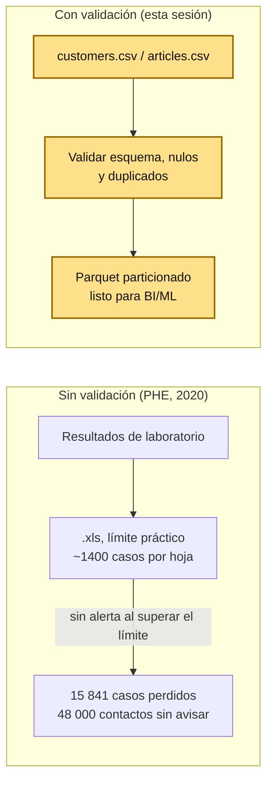
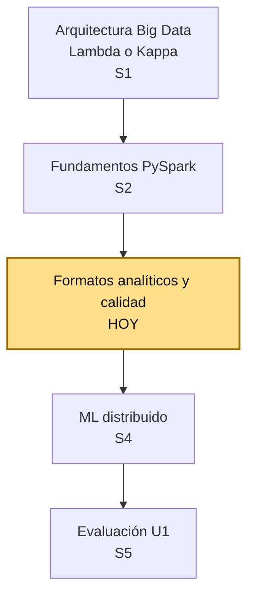
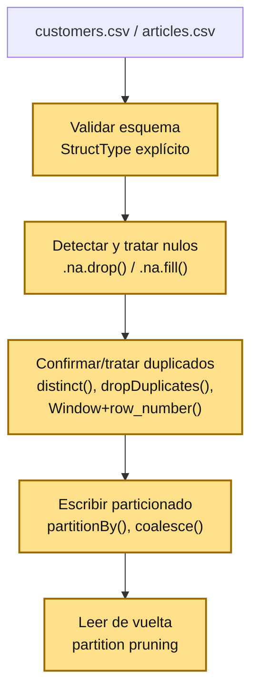

# S3 - Calidad de Datos y Formatos Analíticos Particionados

## 1. Introducción

### 1.1 Presentación de la sesión

S2 cerró con un hallazgo real sin resolver: al correr `df_customers.describe()` sobre `customers.csv`, la fila `count` mostró que `FN` y `Active` tenían cerca de dos tercios de sus valores en nulo — un problema de calidad de datos genuino, encontrado en el propio dataset del curso, no inventado para la sesión. Esta sesión existe para responder la pregunta que ese hallazgo dejó abierta: ¿qué hacés, en concreto, una vez que encontraste un problema así?

S3 formaliza tres controles de calidad — **esquema**, **nulos** y **duplicados** — como un paso explícito y repetible, no una revisión visual ocasional, antes de que cualquier dataset se considere listo para alimentar un pipeline de BI/ML. Y cierra la narrativa de ETL batch de la unidad: S1 diseñó la arquitectura, S2 construyó las transformaciones, S3 produce la salida analítica particionada real que esos dos pasos prometían — organizada en un formato (Parquet) y una estructura de carpetas pensados para volúmenes reales, no para una hoja de cálculo. Esta sesión no levanta un clúster HDFS real (queda fuera del alcance de un laboratorio en una sola máquina), pero reproduce exactamente la misma estructura de carpetas particionadas y el mismo razonamiento que un almacenamiento distribuido real exige.

### 1.2 Índice

1. Validación de esquema antes de cargar datos a un pipeline.
2. Nulos: detección, `.na.drop()` y `.na.fill()`.
3. Duplicados: `distinct()`, `dropDuplicates()` y deduplicación con `Window` + `row_number()`.
4. Escritura particionada en Parquet: `partitionBy()`, `coalesce()`/`repartition()`.
5. Lectura particionada y *partition pruning*.

### 1.3 Propósito de aprendizaje

Al concluir la clase, estarás en condiciones de:

- **Validar** el esquema y la calidad (nulos, duplicados) de un dataset real antes de cargarlo a un pipeline, **aplicar** el tratamiento apropiado según el tipo de problema encontrado, y **escribir/leer** una salida analítica particionada en Parquet lista para consumo BI/ML.

### 1.4 Producto de sesión

Notebook `03_calidad_datos_practica.ipynb` con validación de esquema, tratamiento de nulos y duplicados documentado, y una salida particionada en Parquet verificada (lectura de vuelta y plan de ejecución con *partition pruning*).

### 1.5 Metodología

**Tabla 1. Metodología de la sesión**

| Actividades a Realizar en el Periodo | Orientaciones generales (Orientaciones Metodológicas) | Material de estudio recomendado |
|---|---|---|
| Revisión previa individual | Repasar el notebook de S2 (entorno `lambda26` ya debe estar funcionando) y **copiar `customers.csv`/`articles.csv` a `s03-calidad-datos/data/`** (ver 3.1) — no hace falta descargar nada nuevo, ya los tienes de S2. | Guía S2, guía S3 — sección 3.1. |
| Clase presencial | Construcción guiada del notebook `03_calidad_datos_practica.ipynb`: validación de esquema, nulos, duplicados y escritura particionada, sobre datos reales H&M. Trabajo individual, siguiendo al docente paso a paso; consulta inmediata ante dudas. | Pasos 3.1 a 3.12 de esta guía. |
| Evaluación formativa | Revisión en clase de los controles de calidad aplicados y la salida particionada. La evidencia se completa y sustenta de forma individual, fuera del aula, según los criterios mínimos de la sección 4.4. | Indicaciones de entrega (4.3), rúbrica de evaluación (4.6). |

### 1.6 Motivación de la sesión

#### 1.6.1 Caso: las 15 841 pruebas de COVID-19 que Excel perdió sin avisar

En octubre de 2020, Public Health England (PHE) —la agencia de salud pública de Inglaterra— descubrió que **15 841 resultados positivos** de pruebas de COVID-19, registrados entre el 25 de septiembre y el 2 de octubre, habían desaparecido de sus reportes diarios sin que nadie lo notara durante días. La causa no fue un virus más agresivo de lo esperado: fue un archivo Excel. El sistema automatizado que centralizaba los resultados de laboratorios privados los guardaba en plantillas con el formato antiguo `.xls`, con un límite duro de 65 536 filas por hoja — pero como cada resultado ocupaba varias filas, la capacidad práctica real era de apenas ~1400 casos por plantilla. Cuando ese límite se superaba, los resultados adicionales simplemente **no se importaban** — sin error, sin advertencia, sin que el proceso se detuviera.

Los pacientes sí recibieron su resultado individual. Lo que se perdió fue la conexión de esos casos con el sistema de rastreo de contactos: unas **48 000 personas** que habían estado en contacto cercano con alguien contagiado nunca fueron notificadas ni se les pidió aislarse, durante una semana crítica de la pandemia. El gobierno calificó el problema como un tema de "tamaño de archivo" y lo resolvió dividiendo los datos en múltiples hojas más pequeñas.

Fuente: Karabus, J. (2020, 5 de octubre). [*What a Hancock-up: Excel spreadsheet blunder blamed after England under-reports 16,000 COVID-19 cases*](https://www.theregister.com/2020/10/05/excel_england_coronavirus_contact_error/). The Register.

No fue una falla de Excel ni de Spark: fue que nadie validó, antes de que los datos entraran al pipeline de reporte, si el volumen esperado cabía en el formato elegido, ni si el proceso podía fallar en silencio sin dejar rastro. Esta sesión formaliza justamente ese control: antes de que un dataset llegue a una salida analítica lista para BI/ML, se valida su esquema, se cuentan y tratan sus nulos de forma explícita, y se confirma si tiene duplicados — sin dar por sentado que "si cargó sin error, está bien". Y se escribe en un formato pensado para el volumen real de los datos, no en uno con un límite artificial de filas.

**Figura 1. Cargar datos sin validar vs. con validación explícita**



*Nota.* Adaptado de *What a Hancock-up: Excel spreadsheet blunder blamed after England under-reports 16,000 COVID-19 cases*, por J. Karabus, 2020, The Register (<https://www.theregister.com/2020/10/05/excel_england_coronavirus_contact_error/>).

**Preguntas de análisis**

**Activación de conocimientos previos**

1. Antes de leer la causa, ¿qué esperarías que pasara si un sistema deja de agregar filas nuevas a un archivo sin lanzar ningún error? ¿Cómo lo notarías, si nadie te avisa?
2. ¿Qué diferencia hay entre que un dato "no exista" (un nulo, que sí se ve en el dataset) y que un dato "exista pero nunca haya llegado a cargarse" (como los 15 841 casos de PHE, invisibles hasta que alguien los buscó)?

**Comprensión de validación de datos**

1. Según el caso, ¿qué control simple —aplicado *antes* de cargar los datos al pipeline de reporte— habría evitado que el límite de `.xls` causara una pérdida silenciosa? Relaciónalo con lo que vas a aplicar en 3.3-3.9.
2. ¿Por qué confirmar el conteo de filas antes y después de cada paso de limpieza (como harás en 3.5 y 3.8) es una práctica que un equipo de datos real necesita, según lo que le pasó a PHE?

### 1.7 Ubicación en el curso

- Unidad: U1 - Arquitecturas Big Data y ETL batch distribuido.
- Producto del curso: Proyecto Sello: sistema Big Data distribuido end-to-end para procesamiento batch y streaming, analítica/ML, observabilidad y visualización BI para la toma de decisiones.
- Producto de unidad: pipeline batch de ETL distribuido con salidas analíticas en Parquet listas para BI/ML.
- Avance del producto en esta sesión: salida analítica particionada en Parquet, con controles de calidad (esquema, nulos, duplicados) aplicados sobre datos del Proyecto Sello.

**Figura 2. Roadmap del producto de la unidad U1**



Hoy se cierra la base técnica que el resto de la unidad necesita: sin un dataset con esquema validado, nulos tratados y duplicados resueltos, S4 (ML distribuido) entrenaría un modelo sobre datos sin confiabilidad garantizada. La evaluación U1 (S5) valida el pipeline batch completo, desde la arquitectura hasta esta salida particionada.

## 2. Explica

Tiempo: 25 min.

### 2.1 Arquitectura de la sesión

**Figura 3. Arquitectura de la sesión: validación de calidad y escritura particionada sobre `uso-pyspark`**



Cada bloque de esta cadena es un control de calidad, no un paso decorativo: si uno se salta, el problema no desaparece — solo se descubre más tarde, más caro de corregir (como en el caso de 1.6).

### 2.2 Validación de esquema

En S2 (2.4) ya viste que `inferSchema=True` puede adivinar mal un tipo (un código postal con ceros iniciales convertido silenciosamente a número) y que un `StructType` explícito evita esa ambigüedad. En S3, esa misma técnica se usa con una intención distinta: no es solo "leer correcto", es la primera verificación formal de calidad — confirmar que el dato que llegó es el que esperabas, antes de construir nada sobre él.

**Tabla 2. Señales de un esquema roto, y qué revisar**

| Señal | Qué puede significar | Qué revisar |
|---|---|---|
| Una columna numérica llega como `string` (o viceversa) | El archivo real no calza con el esquema que esperabas, o tiene valores mezclados (texto en una columna numérica). | Compara `printSchema()` contra el esquema documentado; identifica la fila que rompe el tipo esperado. |
| `df.columns` trae menos o más columnas de las esperadas | El archivo cambió de estructura (una fuente externa actualizó su formato) o el separador/header se leyó mal. | Revisa `header=True` y el separador (`sep=","` por defecto); compara contra una versión anterior del archivo si existe. |
| Un valor "normal" a simple vista rompe un tipo (`"05001"` → `5001`) | `inferSchema=True` adivinó mal — el mismo caso del cero inicial de S2. | Usa `StructType` explícito con `StringType()` para esa columna. |

`printSchema()` y `df.columns` (ya vistos en S2) son las dos herramientas mínimas para esta verificación — la diferencia en S3 es que se hace *siempre*, como primer paso, antes de cualquier transformación, no como una curiosidad ocasional.

### 2.3 Nulos: detección y tratamiento

Un nulo no es automáticamente un error — puede ser un dato legítimamente ausente (una bandera que nunca se activó) o una falla real de captura. Antes de decidir qué hacer, hay que **contarlos**, columna por columna:

```python
from pyspark.sql.functions import col, count, when

df.select([
    count(when(col(c).isNull(), c)).alias(c) for c in df.columns
]).show(vertical=True, truncate=False)
```

`when(col(c).isNull(), c)` devuelve el nombre de la columna cuando el valor es nulo, y `None` cuando no lo es; `count()` sobre eso cuenta solo los casos nulos, columna por columna, en una sola pasada.

Con el conteo en mano, hay dos operaciones para tratar los nulos, y no son intercambiables:

**Tabla 3. `.na.drop()` vs. `.na.fill()`**

| Operación | Qué hace | Cuándo usarla |
|---|---|---|
| `.na.drop(subset=[...])` | Elimina las **filas** donde la(s) columna(s) indicada(s) son nulas. | Cuando el nulo hace que la fila sea inutilizable — por ejemplo, sin un identificador (`customer_id`), la fila no se puede vincular a nada. |
| `.na.fill({...})` | Reemplaza los nulos por un valor por defecto, columna por columna. | Cuando el nulo tiene un significado razonable (una bandera no activada, una categoría "sin dato") y la fila completa sigue siendo útil. |

Elegir mal entre ambas tiene costo real: usar `.na.drop()` en una columna con muchos nulos legítimos (como `FN`/`Active` en `customers.csv`, ~65% nulos según el hallazgo de S2) borraría la mayoría del dataset sin necesidad; usar `.na.fill()` en una columna donde el nulo de verdad invalida la fila (como `customer_id`) dejaría datos inutilizables disfrazados de completos.

### 2.4 Duplicados

"Duplicado" no tiene una única definición — depende de qué columnas comparás:

**Tabla 4. Tres formas de tratar duplicados**

| Técnica | Qué compara | Qué hace con las filas repetidas | Cuándo usarla |
|---|---|---|---|
| `df.distinct()` | **Todas** las columnas de la fila. | Colapsa filas idénticas en todas sus columnas a una sola. | Confirmar que no hay filas exactamente repetidas de punta a punta. |
| `df.dropDuplicates(["col"])` | Solo la(s) columna(s) indicada(s). | Se queda con **una** fila por cada valor único de esa columna — cuál exactamente no lo controlás. | Confirmar unicidad de una clave (por ejemplo, que `customer_id` no se repita). |
| `Window.partitionBy("col").orderBy(...)` + `row_number()` | Solo la(s) columna(s) de partición. | Igual que `dropDuplicates()`, pero **vos eliges** cuál fila del grupo conservar (la de menor/mayor valor de otra columna). | Cuando "duplicado" significa "mismo grupo lógico, distintas variantes" y una fila cualquiera del grupo no sirve — necesitás la correcta. |

El caso real de S2 ilustra por qué esta distinción importa: en `articles.csv`, muchos `article_id` distintos comparten la misma `detail_desc` (mismo producto, distinta variante de color/talla). Eso **no** es un duplicado de fila — `distinct()` y `dropDuplicates()` no deberían eliminar ninguna de esas filas, porque cada `article_id` es una fila legítimamente distinta. Si en cambio quisieras un solo representante por `product_code` (el producto base, sin variantes), ahí sí corresponde `Window` + `row_number()` — porque necesitás elegir cuál variante conservar, no simplemente borrar copias.

### 2.5 Escritura particionada en Parquet

`partitionBy()` no agrega una columna al archivo — crea una **subcarpeta por cada valor distinto** de la columna indicada:

```python
df.write.mode("overwrite").partitionBy("columna").parquet("ruta/salida")
```

```text
ruta/salida/
├── columna=valor_a/
│   └── part-00000-....parquet
├── columna=valor_b/
│   └── part-00000-....parquet
└── columna=valor_c/
    └── part-00000-....parquet
```

Esta es la estructura que hace que un formato particionado sea distinto de "guardar un CSV grande": una consulta que filtra por `columna = "valor_a"` puede ignorar por completo las carpetas `valor_b`/`valor_c`, sin siquiera abrirlas — el mismo principio que organiza datos en HDFS o en un data lake real, aunque acá corra sobre disco local.

`coalesce(N)`/`repartition(N)` (S2 ya usó `coalesce(1)` para forzar un solo archivo de salida) controlan cuántos archivos `part-0000X` caen **dentro de cada** carpeta de partición — sin fijarlo, se hereda el número de particiones del DataFrame en memoria (la misma sorpresa de las ~50 particiones que viste en S2 al guardar una muestra pequeña). `repartition(N)` siempre baraja los datos entre N particiones (más costoso, pero puede aumentar el número); `coalesce(N)` solo puede *reducir* particiones, combinando las existentes sin barajar todo — más barato cuando vas de más particiones a menos.

### 2.6 Lectura particionada y *partition pruning*

Al leer una salida particionada, Spark reconstruye la columna de partición a partir del **nombre de la carpeta**, no del contenido del archivo — `spark.read.parquet("ruta/salida")` te devuelve `columna` como si fuera una columna normal, aunque no esté guardada dentro de ningún `part-0000X.parquet`.

Si filtrás por esa columna, `explain(True)` muestra una optimización que no viste en S2: **`PartitionFilters`**, junto al ya conocido `PushedFilters`. La diferencia es real, no solo de nombre:

**Tabla 5. `PushedFilters` (S2) vs. `PartitionFilters` (S3)**

| | `PushedFilters` | `PartitionFilters` |
|---|---|---|
| Qué filtra | Filas, dentro de los archivos que igual se abren. | **Carpetas enteras**, antes de abrir ningún archivo. |
| Sobre qué actúa | El contenido de las columnas dentro del archivo. | El nombre de la carpeta de partición. |
| Costo evitado | Procesar filas que no cumplen el filtro. | Abrir y leer archivos que ni siquiera contienen el valor buscado. |

*Partition pruning* es más barato que *predicate pushdown*: uno evita procesar filas, el otro evita abrir archivos enteros.

## 3. Aplica: actividad práctica guiada

Tiempo: 2h.

**Actividad:** construir el notebook `03_calidad_datos_practica.ipynb` sobre el entorno `lambda26` (`uso-pyspark`), validando esquema, tratando nulos y duplicados, y escribiendo una salida analítica particionada en Parquet — sobre el mismo dataset real H&M usado en S2 (`customers.csv`, `articles.csv`).

**Propósito de la actividad:** dejar evidencia ejecutable de que dominas los controles de calidad de datos (esquema, nulos, duplicados) y el particionamiento de salidas analíticas, antes de avanzar a ML distribuido (S4).

**Orientaciones metodológicas:** en clase, el docente guía la construcción del notebook paso a paso, alternando explicación breve y ejecución; los estudiantes replican cada celda en su propio entorno, verificando el resultado (incluida la estructura de carpetas particionada) antes de avanzar al siguiente paso.

**Actividades para realizar:**

- **3.1** Preparar los datos de S3 y reanudar el entorno `lambda26`.
- **3.2** Crear el notebook y la `SparkSession`.
- **3.3** Cargar `customers.csv` y validar el esquema.
- **3.4** Explorar nulos por columna.
- **3.5** Tratar nulos con `.na.drop()` y `.na.fill()`.
- **3.6** Filtrar registros que no pasan validaciones (`filter()`/`where()`).
- **3.7** Ordenar resultados (`orderBy()`/`sort()`).
- **3.8** Duplicados: `dropDuplicates()` y `distinct()`.
- **3.9** Deduplicar con `Window` + `row_number()`.
- **3.10** Escritura particionada en Parquet.
- **3.11** Leer de vuelta y verificar el particionamiento.
- **3.12** Documentar hallazgos y responder preguntas de reflexión.

### 3.1 Preparar los datos de S3 y reanudar el entorno `lambda26`

**Producto del paso:** `customers.csv` y `articles.csv` disponibles en `pyspark/sesiones/s03-calidad-datos/data/`, entorno `lambda26` funcionando.

Ya descargaste estos dos archivos en S2 — no hace falta descargarlos de nuevo, solo cópialos a la carpeta de esta sesión (desde tu máquina, no dentro del notebook):

```bash
cp lambda26/pyspark/sesiones/s02-fundamentos/data/customers.csv lambda26/pyspark/sesiones/s03-calidad-datos/data/
cp lambda26/pyspark/sesiones/s02-fundamentos/data/articles.csv lambda26/pyspark/sesiones/s03-calidad-datos/data/
```

`customers.csv` pesa ~207 MB — la copia tarda unos segundos, no es instantánea. **Espera a que termine antes de abrir Jupyter y correr el notebook**: si lees el archivo mientras todavía se está copiando, Spark lee la foto parcial que existe en ese instante, sin ningún error — solo un conteo de filas mucho menor al real, silencioso. Confirma que la copia terminó comparando el número de líneas contra el original:

```bash
wc -l lambda26/pyspark/sesiones/s02-fundamentos/data/customers.csv
wc -l lambda26/pyspark/sesiones/s03-calidad-datos/data/customers.csv
```

Ambos deben coincidir exactamente antes de seguir a 3.2.

Esta sesión no necesita `transactions.parquet` — el foco es esquema, nulos y duplicados sobre datos tabulares, no sobre transacciones. Si el contenedor `lambda26` sigue corriendo desde S2, continúa directo en 3.2.

### 3.2 Crear el notebook y la `SparkSession`

**Producto del paso:** notebook `03_calidad_datos_practica.ipynb` con una `SparkSession` activa.

```python
from pyspark.sql import SparkSession

spark = (
    SparkSession.builder
    .appName("sesion3-calidad-datos")
    .master("local[*]")
    .config("spark.ui.port", "4040")
    .config("spark.sql.shuffle.partitions", "8")
    .config("spark.driver.memory", "4g")
    .getOrCreate()
)

spark
```

`spark.driver.memory` en `"4g"` desde el arranque — en S2 la JVM se cayó por quedarse en el default de 1g; acá se fija de una vez, no se espera al primer *crash*.

Declara las rutas del dataset y las salidas, una sola vez:

```python
ORIGEN_DATOS = "/opt/s03-calidad-datos/data"
ARTIFACTS = "/opt/s03-calidad-datos/artifacts"
```

### 3.3 Cargar `customers.csv` y validar el esquema

**Producto del paso:** `df_customers` cargado con esquema explícito, verificado contra lo esperado — control de calidad #1: esquema.

Mismo esquema explícito de S2 (2.2, 2.4):

```python
from pyspark.sql.types import StructType, StructField, StringType, DoubleType, IntegerType

schema_customers = StructType([
    StructField("customer_id", StringType(), nullable=True),
    StructField("FN", DoubleType(), nullable=True),
    StructField("Active", DoubleType(), nullable=True),
    StructField("club_member_status", StringType(), nullable=True),
    StructField("fashion_news_frequency", StringType(), nullable=True),
    StructField("age", IntegerType(), nullable=True),
    StructField("postal_code", StringType(), nullable=True),
])

df_customers = spark.read.csv(
    f"{ORIGEN_DATOS}/customers.csv",
    header=True,
    schema=schema_customers,
)

df_customers.printSchema()
```

Confirma que el esquema real coincide con el documentado — 7 columnas, en el mismo orden y tipo (Tabla 2):

```python
print(df_customers.columns)
df_customers.count()
```

### 3.4 Explorar nulos por columna

**Producto del paso:** conteo exacto de nulos por columna, con porcentaje sobre el total — control de calidad #2: nulos.

En S2, `.describe()` ya insinuó el problema (la fila `count` daba menos que el total en `FN`/`Active`). Acá lo cuantificas exacto, con la técnica de 2.3:

```python
from pyspark.sql.functions import col, count, when

total_filas = df_customers.count()

df_customers.select([
    count(when(col(c).isNull(), c)).alias(c) for c in df_customers.columns
]).show(vertical=True, truncate=False)
```

El mismo resultado, con porcentaje (más fácil de interpretar que el conteo crudo):

```python
nulos = df_customers.select([
    count(when(col(c).isNull(), c)).alias(c) for c in df_customers.columns
]).collect()[0].asDict()

for columna, cantidad in nulos.items():
    porcentaje = cantidad / total_filas * 100
    print(f"{columna}: {cantidad} nulos ({porcentaje:.1f}%)")
```

### 3.5 Tratar nulos con `.na.drop()` y `.na.fill()`

**Producto del paso:** `df_customers_limpio` con nulos tratados columna por columna, cada decisión con un criterio documentado (Tabla 3) — no "borrar todo lo que tenga un nulo" sin pensarlo.

`FN`/`Active` son columnas de tipo "bandera" (presente/ausente); un nulo ahí significa "la bandera no se activó", no un dato faltante que haya que adivinar — se rellenan con `0.0`, no con un promedio. `fashion_news_frequency` nulo se rellena con `"NONE"`, la misma categoría que el propio dataset ya usa explícitamente para ese caso:

```python
df_customers_limpio = df_customers.na.fill({
    "FN": 0.0,
    "Active": 0.0,
    "fashion_news_frequency": "NONE",
    "club_member_status": "UNKNOWN",
})
```

`age` **no** se rellena: inventar una edad sería fabricar un dato que no existe. Se documenta como limitación conocida, no se fuerza un valor.

`customer_id` es la columna crítica de este dataset — sin identificador, la fila no sirve para nada, así que corresponde `.na.drop()`, no `.na.fill()`. En este dataset probablemente no elimine ninguna fila, y ese es también un resultado válido: confirmar que la columna clave nunca falta:

```python
df_customers_valido = df_customers_limpio.na.drop(subset=["customer_id"])

print(f"Filas antes: {df_customers.count()}, después de na.drop(subset=['customer_id']): {df_customers_valido.count()}")
```

En una corrida real, ambos números dieron **1 371 980** — `customer_id` nunca llega nulo en este dataset, así que `na.drop()` no elimina ninguna fila. Es el resultado esperado: confirma que la columna clave está completa, no que el paso "no sirvió de nada".

`df_customers_valido` se reutiliza en casi todos los pasos que siguen (3.6-3.11), varios con su propio `.count()` — sin cachearlo, cada uno recalcularía la lectura completa de `customers.csv` más el `.na.fill()`/`.na.drop()` desde cero. `cache()` (2.5, ya usado en S2) guarda el resultado la primera vez que una acción lo dispara:

```python
df_customers_valido = df_customers_valido.cache()
```

### 3.6 Filtrar registros que no pasan validaciones (`filter()`/`where()`)

**Producto del paso:** filas fuera de rango identificadas (o confirmación de que no existen).

```python
df_edad_invalida = df_customers_valido.filter((col("age") < 0) | (col("age") > 100))
df_edad_invalida.count()
```

Si el conteo da 0, también es un control de calidad exitoso — no un resultado "vacío" sin valor.

### 3.7 Ordenar resultados (`orderBy()`/`sort()`)

**Producto del paso:** resultado ordenado por una columna real.

```python
df_customers_valido.orderBy(col("age").desc()).select("customer_id", "age", "club_member_status").show(10, truncate=False)
```

### 3.8 Duplicados: `dropDuplicates()` y `distinct()`

**Producto del paso:** confirmación (o eliminación) de filas duplicadas, con la definición correcta de qué cuenta como duplicado (Tabla 4) — control de calidad #3.

Si las tres cifras de abajo coinciden con el total, no hay duplicados reales en ninguna de las dos definiciones:

```python
total = df_customers_valido.count()
sin_duplicados_fila_completa = df_customers_valido.distinct().count()
sin_duplicados_por_id = df_customers_valido.dropDuplicates(["customer_id"]).count()

print(f"Total: {total}, sin duplicar (fila completa): {sin_duplicados_fila_completa}, sin duplicar (por customer_id): {sin_duplicados_por_id}")
```

En una corrida real, las tres cifras dieron **1 371 980** — cero duplicados, en ninguna de las dos definiciones. No es un resultado "vacío": es la confirmación real de que `customer_id` es una clave limpia en este dataset.

**Contraste real con `articles.csv`** (S2, 3.10): `rdd.take(5)` sobre `detail_desc` trajo descripciones idénticas repetidas. Eso **no** son duplicados de fila — cada `article_id` es distinto (variante de color/talla). Confirma cuántos `article_id` comparten la misma descripción, sin tratarlos como error:

```python
df_articles = spark.read.csv(f"{ORIGEN_DATOS}/articles.csv", header=True, inferSchema=True)

duplicados_por_descripcion = (
    df_articles.filter(col("detail_desc").isNotNull())
    .groupBy("detail_desc")
    .count()
    .filter(col("count") > 1)
    .orderBy(col("count").desc())
)
duplicados_por_descripcion.show(5, truncate=False)
```

`filter(col("detail_desc").isNotNull())` va **antes** del `groupBy()`: sin él, `groupBy()` agrupa todos los artículos sin descripción bajo un mismo grupo `NULL` — que en una corrida real salió como el "valor más repetido" (416 artículos), tapando los duplicados de contenido real que sí importan para este ejercicio. Un `NULL` que se repite no es un duplicado de descripción, es simplemente la ausencia del dato — ya lo trataste como tal en 3.4-3.5, no hace falta que reaparezca acá.

### 3.9 Deduplicar con `Window` + `row_number()`

**Producto del paso:** una fila representativa por `product_code`, cuando "duplicado" significa "mismo producto base, distintas variantes" (Tabla 4) — algo que `dropDuplicates()` no puede decidir por sí solo, porque no elige *cuál* fila conservar.

`article_id` identifica cada variante (color/talla); `product_code` identifica el producto base. Te quedas con un representante por producto (el de menor `article_id`):

```python
from pyspark.sql.window import Window
from pyspark.sql.functions import row_number

window_producto = Window.partitionBy("product_code").orderBy("article_id")

df_articles_un_por_producto = (
    df_articles
    .withColumn("fila", row_number().over(window_producto))
    .filter(col("fila") == 1)
    .drop("fila")
)

print(f"Filas originales: {df_articles.count()}, un representante por product_code: {df_articles_un_por_producto.count()}")
```

En una corrida real sobre este dataset, la reducción fue de **105 542 filas a 47 224 representantes** — más de la mitad de `articles.csv` son variantes de color/talla de un producto que ya está representado por otra fila. Es la diferencia real entre `dropDuplicates()` (que no puede hacer esta reducción, porque cada `article_id` es único) y `Window`+`row_number()` (que sí, porque agrupa por `product_code` en vez de por `article_id`).

### 3.10 Escritura particionada en Parquet

**Producto del paso:** salida analítica particionada por `club_member_status`, lista para BI/ML — el producto que pide el sílabo de esta sesión.

`repartition(4)` antes de escribir controla cuántos archivos caen dentro de **cada** carpeta de partición (2.5) — sin esto, se hereda el número de particiones de la lectura original, la misma sorpresa de las ~50 particiones que viste en S2 al guardar la muestra de `customers.csv`:

```python
(
    df_customers_valido
    .repartition(4)
    .write.mode("overwrite")
    .partitionBy("club_member_status")
    .parquet(f"{ARTIFACTS}/customers_particionado")
)
```

`partitionBy("club_member_status")` crea una subcarpeta por cada valor distinto de esa columna (`club_member_status=ACTIVE/`, `club_member_status=LEFT CLUB/`, ...), como en 2.5. Verifica la estructura real:

```python
import os

for carpeta in sorted(os.listdir(f"{ARTIFACTS}/customers_particionado")):
    print(carpeta)
```

### 3.11 Leer de vuelta y verificar el particionamiento

**Producto del paso:** confirmación de que la salida particionada se lee correctamente y que el particionamiento sí se aprovecha en consultas.

```python
df_verificacion = spark.read.parquet(f"{ARTIFACTS}/customers_particionado")
df_verificacion.printSchema()
df_verificacion.count()
```

`club_member_status` reaparece en el esquema aunque no está dentro de los archivos Parquet físicos — Spark lo reconstruye a partir del nombre de la carpeta (2.6, *partition discovery*).

Filtra por la columna particionada y revisa el plan — deberías ver `PartitionFilters` (Tabla 5), no solo `PushedFilters` (el que ya viste en S2, 3.6):

```python
df_verificacion.filter(col("club_member_status") == "ACTIVE").explain(True)
```

Ya terminaste de reutilizar `df_customers_valido` — libera la memoria que ocupaba cacheado:

```python
df_customers_valido.unpersist()
```

### 3.12 Documentar hallazgos y responder preguntas de reflexión

**Producto del paso:** notebook documentado con celdas markdown explicando cada resultado.

Agrega celdas markdown breves debajo de cada bloque de código (3.3-3.11) explicando qué hiciste y qué observaste — es la base directa de la evidencia técnica que armarás en 4.3.1.

**Reflexión técnica breve** (5 a 8 líneas): ¿qué columnas rellenaste con `.na.fill()` y cuáles no, y por qué? ¿Encontraste duplicados reales en `customers.csv`? ¿Qué diferencia notaste entre `PushedFilters` (S2) y `PartitionFilters` (S3) en el plan de ejecución?

**Evidencia de aprendizaje:**

- Notebook `03_calidad_datos_practica.ipynb` con esquema validado, nulos detectados y tratados, documentado.
- Confirmación (o eliminación) de duplicados, con ambas técnicas aplicadas (`distinct()`/`dropDuplicates()` y `Window`+`row_number()`).
- Salida particionada en Parquet (`partitionBy()`) verificada por lectura, con plan de ejecución mostrando `PartitionFilters`.
- Reflexión técnica documentada.

## 4. Crea: actividad autónoma

Tiempo: 2h fuera del aula.

### 4.1 Actividad

Replicación autónoma de los controles de calidad de datos construidos en clase (esquema, nulos, duplicados) y de la escritura particionada, sobre datos del Proyecto Sello del equipo — reales si el equipo ya los tiene, o una muestra representativa del caso de negocio definido en S1 si todavía no hay datos reales disponibles.

Completa y evidencia estas tareas:

1. Cargar un dataset del Proyecto Sello con esquema explícito y verificarlo contra lo esperado (equivalente a 3.3).
2. Detectar y tratar nulos con `.na.drop()`/`.na.fill()`, documentando el criterio de cada decisión (equivalente a 3.4-3.5).
3. Confirmar o tratar duplicados con al menos dos técnicas distintas (`distinct()`/`dropDuplicates()` y `Window`+`row_number()`), aplicando la definición de duplicado correcta al caso (equivalente a 3.8-3.9).
4. Escribir una salida particionada en Parquet por una columna categórica relevante al caso del equipo, controlando el número de archivos por partición (equivalente a 3.10).
5. Leer de vuelta la salida particionada y analizar el plan de ejecución, identificando `PartitionFilters` (equivalente a 3.11).

### 4.2 Propósito

Que cada estudiante demuestre, de forma individual y fuera del aula, que puede reproducir los controles de calidad de datos y el particionamiento construidos en clase sin el acompañamiento del docente — aplicándolos al caso real del Proyecto Sello de su equipo, no a un dataset desconectado.

### 4.3 Indicaciones

Entrega un PDF con el siguiente nombre:

```text
S03_Equipo##_ApellidoNombre.pdf
```

Cada captura de pantalla del informe debe mostrar, sin recortar, el reloj del sistema (fecha y hora) y tu usuario o foto de perfil (Windows, VS Code o navegador) visibles en pantalla — es lo que permite verificar que la evidencia es tuya y que corresponde al momento real de tu trabajo.

#### 4.3.1 Estructura del informe

**Datos del estudiante**

- Nombre:
- Equipo:
- Sesión: S03 - Calidad de Datos y Formatos Analíticos Particionados
- Rol o aporte realizado:
- Link de GitHub:

**Evidencia técnica**

Incluye capturas o extractos con una breve explicación debajo de cada uno, organizados en los mismos 4 bloques de la rúbrica (4.6):

1. *Esquema y nulos*
    - Dataset del Proyecto Sello cargado con esquema explícito, nulos detectados y tratados con criterio documentado (equivalente a 3.3-3.5).
2. *Filtrado, orden y duplicados*
    - Validaciones de rango aplicadas y duplicados confirmados/tratados con al menos dos técnicas (equivalente a 3.6-3.9).
3. *Escritura y lectura particionada*
    - Salida en Parquet particionada por una columna relevante, leída de vuelta y verificada (equivalente a 3.10-3.11).
4. *Plan de ejecución y reflexión*
    - `explain()` con `PartitionFilters` identificado, más la reflexión técnica (equivalente a 3.11-3.12).

**Error o hallazgo**

Describe al menos un error o comportamiento inesperado que encontraste al procesar tus propios datos:

- Qué ocurrió o qué limitación encontraste.
- Cómo lo identificaste.
- Cómo lo resolviste o qué decisión tomaste.

**Reflexión técnica breve**

Responde en 5 a 8 líneas:

```text
¿Por qué validar esquema, nulos y duplicados antes de escribir una salida
analítica es más barato que corregirlos después de que otro equipo (BI/ML)
ya empezó a consumirla?
```

### 4.4 Criterios mínimos de aceptación

La evidencia individual se considera completa si:

- El dataset del Proyecto Sello se carga con esquema explícito, verificado contra lo esperado.
- Detecta y trata los nulos con `.na.drop()`/`.na.fill()`, documentando el criterio de cada columna.
- Confirma o trata duplicados con al menos dos técnicas distintas, aplicando una definición de duplicado coherente con el caso.
- Escribe una salida particionada en Parquet, controlando el número de archivos por partición.
- Lee de vuelta la salida particionada y analiza el plan de ejecución, identificando `PartitionFilters`.
- Cada captura de la evidencia técnica muestra el reloj del sistema y el usuario/perfil visible, sin recortar.
- Las fechas y horas de las capturas son coherentes con el historial de commits de su repositorio en GitHub.
- Incluye un error o hallazgo técnico diagnosticado.
- Incluye la reflexión técnica breve solicitada.

### 4.5 Preguntas de defensa

1. ¿Qué diferencia hay entre `.na.drop()` y `.na.fill()`, y cómo decidiste cuál aplicar en cada columna de tu caso?
2. ¿Por qué `distinct()` y `dropDuplicates()` pueden dar resultados distintos sobre el mismo DataFrame?
3. ¿Cuándo usarías `Window`+`row_number()` en vez de `dropDuplicates()` para tratar duplicados?
4. ¿Qué es *partition pruning*, y en qué se diferencia de *predicate pushdown* (visto en S2)?
5. ¿Por qué `partitionBy()` crea carpetas en vez de agregar una columna al archivo Parquet?

### 4.6 Rúbrica de evaluación

**Tabla 6. Rúbrica de evaluación**

| Criterio | Peso (%) | A (20 pts) | B (15 pts) | C (10 pts) | D (5 pts) | Nivel obtenido |
|---|---:|---|---|---|---|---:|
| 1. Esquema y nulos* | 25 | Valida el esquema explícitamente, detecta y trata los nulos con criterio documentado y coherente por columna. | Valida esquema y trata nulos correctamente. | Validación de esquema o tratamiento de nulos incompleto o sin criterio claro. | No valida esquema ni trata nulos. | |
| 2. Filtrado, orden y duplicados* | 25 | Aplica validaciones de rango y trata duplicados con dos técnicas distintas, justificando la definición de duplicado usada. | Aplica filtrado/orden y trata duplicados correctamente. | Filtrado o tratamiento de duplicados incompleto o con una sola técnica. | No aplica filtrado ni trata duplicados. | |
| 3. Escritura y lectura particionada* | 25 | Escribe una salida particionada relevante al caso, controla el número de archivos por partición y verifica la lectura. | Escribe y lee la salida particionada correctamente. | Escritura particionada incompleta o sin verificación de lectura. | No escribe salida particionada. | |
| 4. Plan de ejecución y reflexión* | 25 | Identifica `PartitionFilters` en `explain()` y lo relaciona correctamente con *partition pruning*; reflexión técnica completa. | Identifica `PartitionFilters` y entrega reflexión técnica. | Análisis del plan superficial o reflexión incompleta. | No analiza el plan de ejecución ni entrega reflexión. | |

\* Agregado manual.

Nota final = suma de (`Peso` / 100 × `Puntos del nivel obtenido`) = ____ / 20.

Para usar la rúbrica con IA, solicita:

```text
Evalúa el PDF usando la rúbrica de la sesión.
Para cada criterio selecciona el nivel obtenido usando la escala A=20, B=15, C=10, D=5 puntos.
Justifica brevemente cada nivel asignado.
Verifica que cada captura muestre reloj del sistema y usuario/perfil visible, y que las fechas sean coherentes con el historial de commits de GitHub. Si falta esta evidencia o hay inconsistencias, indícalo explícitamente antes de calificar.
Calcula la nota final con la fórmula: suma de (Peso/100 × Puntos del nivel obtenido), directamente sobre 20.
Indica 2 fortalezas y 2 recomendaciones.
```

## 5. Cierre

Tiempo: 5 min.

**Resumen breve:** hoy se formalizaron tres controles de calidad de datos sobre el dataset real H&M — esquema (validado explícitamente), nulos (detectados y tratados con criterio, cerrando el hallazgo real de S2) y duplicados (confirmados con dos técnicas distintas, incluida deduplicación selectiva con `Window`+`row_number()`) — y se escribió una salida analítica particionada en Parquet, verificada por lectura y por *partition pruning* en el plan de ejecución.

**Dinámica participativa:** en una ronda rápida, cada estudiante comparte qué columna decidió tratar con `.na.fill()` y cuál con `.na.drop()`, y por qué.

**Metacognición:** cada estudiante responde en voz alta o por escrito: ¿qué parte de la sesión te costó más entender, y cómo la resolviste?

**Proyección:** la salida particionada de hoy es la entrada directa de S4 (ML distribuido), donde un modelo se entrena sobre datos cuya calidad ya está garantizada — y aplica en cualquier trabajo profesional con datos, donde cargar sin validar es la forma más común de que un problema pequeño se vuelva un incidente real, como el caso de PHE en 1.6.

## Bibliografía

1. Karabus, J. (2020, 5 de octubre). *What a Hancock-up: Excel spreadsheet blunder blamed after England under-reports 16,000 COVID-19 cases*. The Register. https://www.theregister.com/2020/10/05/excel_england_coronavirus_contact_error/
2. Apache Software Foundation. (2024). *Apache Spark documentation*. https://spark.apache.org/docs/latest/
3. Apache Software Foundation. (2024). *PySpark API reference: pyspark.sql.functions*. https://spark.apache.org/docs/latest/api/python/reference/pyspark.sql/functions.html
4. Apache Software Foundation. (2024). *Parquet files*. Spark SQL Guide. https://spark.apache.org/docs/latest/sql-data-sources-parquet.html
5. H&M Group. (2022). *H&M Personalized Fashion Recommendations* [Data set]. Kaggle. https://www.kaggle.com/competitions/h-and-m-personalized-fashion-recommendations/data
