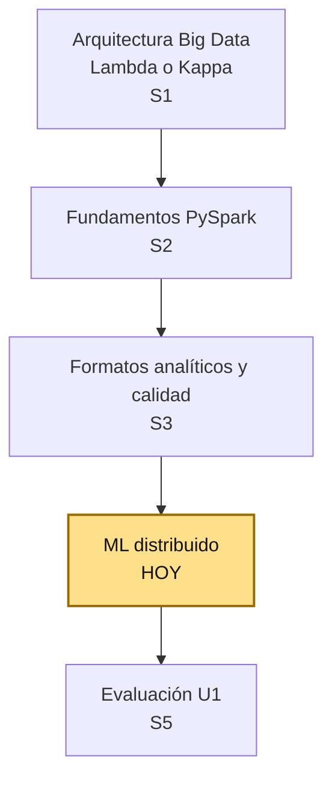

# S4 - ML Distribuido con Spark MLlib (Regresión)

## 1. Introducción

### 1.1 Presentación de la sesión

S3 cerró la base técnica del pipeline batch: una salida analítica particionada, con esquema validado, nulos tratados y duplicados resueltos. Hasta ahí, todo el trabajo transformaba y verificaba datos — ninguna sesión generaba todavía una predicción a partir de ellos. Esta sesión entrena el primer modelo de regresión distribuida con Spark sobre esa salida, y compara configuraciones básicas antes de reportar métricas.

El porqué de comparar configuraciones en vez de conformarse con entrenar un único modelo se desarrolla en 1.6, a partir de un caso real. Esta sesión no busca el mejor modelo posible — ajustar hiperparámetros a fondo excede el alcance de un primer contacto — ni construye pronósticos con historial temporal: eso es contenido de S10.

### 1.2 Índice

1. Preparación de datos para modelado distribuido.
2. Entrenamiento de un modelo de regresión distribuida.
3. Evaluación con métricas de regresión.
4. Comparación de configuraciones y algoritmos.

### 1.3 Propósito de aprendizaje

Al concluir la clase, estarás en condiciones de:

- **Entrenar y comparar** modelos de regresión distribuida sobre una salida analítica ya validada, reportando métricas iniciales que permitan decidir si un modelo mejora sobre otro, sin necesidad de ajustar hiperparámetros de forma exhaustiva.

### 1.4 Producto de sesión

Notebook de Jupyter con: vector de predictores ensamblado (`VectorAssembler`); modelo base de regresión lineal entrenado (`LinearRegression`) y evaluado (`RegressionEvaluator`: RMSE, R², MAE); comparación de al menos tres configuraciones de regularización (`regParam`, `elasticNetParam`); comparación con un segundo algoritmo (`RandomForestRegressor`); modelo seleccionado guardado (`model.write().overwrite().save(...)`).

### 1.5 Metodología

**Tabla 1. Metodología de la sesión**

| Actividades a Realizar en el Periodo | Orientaciones generales (Orientaciones Metodológicas) | Material de estudio recomendado |
|---|---|---|
| Revisión previa individual | Repasar la salida particionada de S3 (o S3b, según el dataset que uses) — confirmar que el entorno `lambda26` sigue funcionando y que esa salida está disponible sin errores. | Guía S3 (y S3b, si aplica). |
| Clase presencial | Construcción guiada del notebook `04_ml_distribuido_regresion_practica.ipynb`: preparación del vector de predictores, entrenamiento de un modelo base, evaluación con métricas de regresión, comparación de configuraciones y de un segundo algoritmo. Trabajo individual, siguiendo al docente paso a paso; consulta inmediata ante dudas. | Pasos 3.1 a 3.11 de esta guía. |
| Evaluación formativa | Revisión en clase del modelo entrenado y de la tabla comparativa de configuraciones. La evidencia se completa y sustenta de forma individual, fuera del aula, según los criterios mínimos de la sección 4.4. | Indicaciones de entrega (4.3), rúbrica de evaluación (4.6). |

### 1.6 Motivación de la sesión

#### 1.6.1 Caso: el algoritmo que le costó a Zillow 2000 empleos

El 2 de noviembre de 2021, Zillow —la plataforma inmobiliaria más grande de Estados Unidos— anunció el cierre total de Zillow Offers, su negocio de compra automatizada de casas (*iBuying*). El modelo de negocio dependía de una sola variable crítica: la capacidad de su algoritmo de precios (basado en el *Zestimate*) para predecir, con precisión de pocos puntos porcentuales, el valor de una casa entre 3 y 6 meses hacia adelante — el tiempo que Zillow tardaba en comprar, remodelar y revender cada propiedad.

El algoritmo sobreestimó sistemáticamente el valor de miles de casas. Zillow pagó por ellas más de lo que el mercado, ya desacelerándose, estaba dispuesto a pagar de vuelta. El resultado: un castigo contable de **304 millones de dólares** en inventario ese mismo trimestre, y el despido de aproximadamente el **25% de la plantilla de la empresa** (más de 2000 personas). Un modelo de regresión entrenado y desplegado a escala, sin margen para volatilidad de mercado ni un proceso que comparara su desempeño contra alternativas antes de comprometer capital real.

Fuente: incidentdatabase.ai. (2021). *Incident 149: Zillow Shut Down Zillow Offers Division Allegedly Due to Predictive Pricing Tool's Insufficient Accuracy*. https://incidentdatabase.ai/cite/149/

No fue que Zillow usara un modelo "malo" en un sentido técnico simple — fue que confió en un único modelo, entrenado sobre condiciones de mercado que ya habían cambiado, sin un proceso que lo comparara sistemáticamente contra configuraciones alternativas ni midiera qué tan lejos podía estar su error antes de arriesgar dinero real en cada predicción. Esta sesión formaliza justamente ese hábito: ningún modelo se reporta ni se guarda sin antes compararlo, con métricas explícitas, contra al menos otra configuración y otro algoritmo.

**Preguntas de análisis**

**Activación de conocimientos previos**

1. Antes de leer la causa, ¿qué riesgo ves en construir un negocio completo sobre una única predicción numérica, sin ningún mecanismo de comparación o corrección?

**Comprensión de la comparación de modelos**

1. Según el caso, ¿qué hubiera cambiado si Zillow hubiera comparado su modelo de precios contra configuraciones alternativas, y hubiera medido explícitamente su margen de error antes de comprar cada casa?
2. ¿Por qué reportar una sola métrica (por ejemplo, solo R²) puede ocultar un problema que sí aparece en otra métrica (por ejemplo, RMSE)? Relaciónalo con lo que vas a comparar en 3.7-3.9.

### 1.7 Ubicación en el curso

- Unidad: U1 - Arquitecturas Big Data y ETL batch distribuido.
- Producto del curso: Proyecto Sello: sistema Big Data distribuido end-to-end para procesamiento batch y streaming, analítica/ML, observabilidad y visualización BI para la toma de decisiones.
- Producto de unidad: pipeline batch de ETL distribuido con salidas analíticas en Parquet listas para BI/ML.
- Avance del producto en esta sesión: modelo de regresión distribuida entrenado y comparado sobre una salida analítica del Proyecto Sello, con métricas iniciales reportadas.

**Figura 1. Roadmap del producto de la unidad U1**



Hoy se cierra el último eslabón que la evaluación de unidad (S5) necesita: sin un modelo entrenado y comparado sobre la salida particionada de S3, S5 no tendría nada de "ML distribuido" que sustentar como parte del pipeline batch completo.

## 2. Explica

Tiempo: 25 min.

### 2.1 Arquitectura de la sesión

**Figura 2. De la salida particionada de S3 al modelo comparado**

```mermaid
flowchart LR
    Parquet["Salida particionada<br/>de S3 (Parquet)"] --> Vector["Ensamblar predictores<br/>VectorAssembler"]
    Vector --> Split["Dividir<br/>train / test"]
    Split --> Base["Entrenar modelo base<br/>LinearRegression"]
    Base --> Eval["Evaluar<br/>RMSE, R², MAE"]
    Eval --> Config["Comparar configuraciones<br/>regParam, elasticNetParam"]
    Config --> Alt["Comparar con otro algoritmo<br/>RandomForestRegressor"]
    Alt --> Guardar["Guardar el modelo<br/>seleccionado"]

    classDef today fill:#ffe08a,stroke:#9a6b00,stroke-width:2px,color:#111;
    class Vector,Split,Base,Eval,Config,Alt,Guardar today;
```



Cada bloque de esta cadena es un paso necesario, no opcional: sin `VectorAssembler` no hay entrada válida para MLlib; sin evaluación explícita no hay forma de saber si el modelo sirve; sin comparación no hay manera de distinguir un modelo confiable de uno que solo parece funcionar (el caso de 1.6).

### 2.2 Preparación de datos para modelado distribuido

A diferencia de librerías como scikit-learn, donde un modelo acepta directamente una matriz de columnas (`X`), Spark MLlib exige que todos los predictores estén combinados en una **sola columna vectorial**. `VectorAssembler` hace esa combinación:

```python
from pyspark.ml.feature import VectorAssembler

ensamblador = VectorAssembler(inputCols=PREDICTORES, outputCol="features")
df_ml = ensamblador.transform(df).select("features", "Valor_CE")
```

Esta diferencia no es una peculiaridad arbitraria de Spark: en un motor distribuido, cada fila se procesa de forma independiente en un nodo distinto — tener un único objeto `Vector` por fila simplifica cómo Spark distribuye y serializa esa fila entre nodos, en vez de coordinar N columnas sueltas por separado.

La columna objetivo (`label`, aquí `Valor_CE`) **no** entra al ensamblador — es lo que el modelo debe predecir, no un dato de entrada.

**Tabla 2. División de datos: por qué esta sesión no usa validación temporal**

| | Esta sesión (S4) | S10 (Series de tiempo) |
|---|---|---|
| Tipo de división | Aleatoria (`randomSplit`) | Cronológica (`TimeSeriesSplit`-equivalente) |
| Supuesto sobre las filas | Cada fila es una observación independiente | El orden temporal importa; una fila "sabe" del pasado |
| Riesgo si se usa el otro criterio | Ninguno — no hay fuga de información temporal que evitar | Un split aleatorio filtraría información del futuro al entrenamiento |

```python
df_train, df_test = df_ml.randomSplit([0.8, 0.2], seed=42)
```

`seed=42` fija la aleatoriedad — sin ella, cada corrida dividiría los datos distinto, y los resultados no serían comparables entre configuraciones (2.5).

### 2.3 Entrenamiento de un modelo de regresión distribuida

Todo estimador de Spark MLlib sigue el mismo patrón de dos pasos: `fit()` entrena sobre los datos de entrenamiento y devuelve un **modelo** (un `Transformer`); `transform()` aplica ese modelo entrenado sobre datos nuevos para producir predicciones. Es el mismo patrón que reaparecerá en cualquier otro algoritmo de MLlib, no solo en regresión.

```python
from pyspark.ml.regression import LinearRegression

lr_base = LinearRegression(featuresCol="features", labelCol="Valor_CE")
modelo_base = lr_base.fit(df_train)

predicciones_base = modelo_base.transform(df_test)
```

`modelo_base.coefficients` y `modelo_base.intercept` exponen la ecuación aprendida — útil para verificar rápido si un coeficiente tiene el signo físicamente esperado (por ejemplo, si más lluvia debería asociarse con un campo eléctrico más bajo o más alto, según lo que ya sabes del dominio).

### 2.4 Evaluación con métricas de regresión

Ninguna métrica sola cuenta toda la historia — el caso de 1.6 es, en el fondo, un caso de confiar en una sola señal de desempeño:

**Tabla 3. RMSE, R² y MAE**

| Métrica | Qué mide | Sensible a errores grandes | Unidad |
|---|---|---|---|
| RMSE (raíz del error cuadrático medio) | Qué tan lejos, en promedio, cae la predicción del valor real, penalizando fuerte los errores grandes. | Sí — un solo error enorme infla el RMSE mucho más que varios errores moderados. | La misma que la variable objetivo (`Valor_CE`). |
| MAE (error absoluto medio) | Qué tan lejos, en promedio, cae la predicción, sin penalizar extra los errores grandes. | No — cada error pesa lo mismo, grande o chico. | La misma que la variable objetivo. |
| R² (coeficiente de determinación) | Qué proporción de la variabilidad de `Valor_CE` explica el modelo, entre 0 y 1 (puede ser negativo si el modelo es peor que predecir siempre el promedio). | No aplica — es una proporción, no un error. | Sin unidad (proporción). |

```python
from pyspark.ml.evaluation import RegressionEvaluator

evaluador_rmse = RegressionEvaluator(labelCol="Valor_CE", predictionCol="prediction", metricName="rmse")
evaluador_r2 = RegressionEvaluator(labelCol="Valor_CE", predictionCol="prediction", metricName="r2")
evaluador_mae = RegressionEvaluator(labelCol="Valor_CE", predictionCol="prediction", metricName="mae")

print(f"RMSE={evaluador_rmse.evaluate(predicciones_base):.4f}")
print(f"R2={evaluador_r2.evaluate(predicciones_base):.4f}")
print(f"MAE={evaluador_mae.evaluate(predicciones_base):.4f}")
```

Que RMSE y MAE difieran bastante entre sí es, por sí solo, una señal: significa que hay al menos algunos errores grandes que MAE está "escondiendo" en el promedio.

### 2.5 Comparación de configuraciones y algoritmos

`regParam` controla cuánto se penaliza la magnitud de los coeficientes — un valor alto reduce el riesgo de que el modelo memorice ruido específico del conjunto de entrenamiento (*overfitting*), a costa de un ajuste menos preciso. `elasticNetParam` mezcla dos formas de esa penalización: `0.0` es Ridge (penalización L2, reduce coeficientes sin llevarlos nunca a cero), `1.0` es Lasso (penalización L1, puede llevar coeficientes irrelevantes exactamente a cero), y cualquier valor entre ambos es una mezcla (*Elastic Net*).

**Tabla 4. Tres configuraciones básicas, sin búsqueda exhaustiva**

| Configuración | `regParam` | `elasticNetParam` | Qué prueba |
|---|---:|---:|---|
| Sin regularización | 0.0 | 0.0 | La línea base, sin ningún ajuste. |
| Ridge (L2) | 0.1 | 0.0 | Si penalizar coeficientes grandes mejora la generalización. |
| Elastic Net (L1+L2) | 0.1 | 0.5 | Una mezcla de ambas penalizaciones. |

`LinearRegression` asume que la relación entre predictores y objetivo es, de fondo, lineal. `RandomForestRegressor` no necesita ese supuesto — construye muchos árboles de decisión sobre subconjuntos aleatorios de datos y variables, y promedia sus predicciones, capturando relaciones no lineales e interacciones que una ecuación lineal no puede representar:

```python
from pyspark.ml.regression import RandomForestRegressor

rf = RandomForestRegressor(featuresCol="features", labelCol="Valor_CE", numTrees=50, maxDepth=8, seed=42)
modelo_rf = rf.fit(df_train)
```

Comparar ambas familias (lineal vs. árboles) es la forma más básica de saber si, de entrada, la relación real es aproximadamente lineal — si `RandomForestRegressor` mejora mucho a `LinearRegression`, es una señal de que la relación no lo es.

## 3. Aplica: actividad práctica guiada

Tiempo: 2h.

**Actividad:** construir el notebook `04_ml_distribuido_regresion_practica.ipynb` sobre el entorno `lambda26` (`uso-pyspark`), entrenando y comparando modelos de regresión distribuida con Spark MLlib sobre la salida analítica de S3, y reportando métricas iniciales (RMSE, R², MAE).

**Propósito de la actividad:** dejar evidencia ejecutable de que dominas la preparación de datos para MLlib, el entrenamiento y evaluación de un modelo de regresión, y la comparación sistemática de configuraciones — antes de confiar en un único modelo, como en el caso de 1.6.

**Orientaciones metodológicas:** en clase, el docente guía la construcción del notebook paso a paso, alternando explicación breve y ejecución; los estudiantes replican cada celda en su propio entorno, verificando cada métrica antes de avanzar al siguiente paso.

**Actividades para realizar:**

- **3.1** Reanudar el entorno `lambda26` y confirmar la salida de S3.
- **3.2** Crear el notebook y la `SparkSession`.
- **3.3** Cargar la salida particionada y explorar las variables.
- **3.4** Ensamblar el vector de predictores (`VectorAssembler`).
- **3.5** Dividir en entrenamiento y prueba.
- **3.6** Entrenar un modelo base de regresión lineal.
- **3.7** Evaluar el modelo base (RMSE, R², MAE).
- **3.8** Comparar tres configuraciones básicas de regularización.
- **3.9** Comparar con un segundo algoritmo (Random Forest).
- **3.10** Guardar el modelo seleccionado.
- **3.11** Documentar hallazgos y responder preguntas de reflexión.

### 3.1 Reanudar el entorno `lambda26` y confirmar la salida de S3

**Producto del paso:** entorno `lambda26` funcionando, con la salida particionada de S3 (o S3b, si tu equipo usa ese dataset) disponible y verificada.

Si el contenedor `lambda26-pyspark` ya está corriendo desde una sesión anterior, continúa directo en 3.2. Si no:

```bash
cd pyspark
docker compose up -d
```

Confirma que la salida particionada de la sesión anterior sigue existiendo antes de avanzar — sin ella, no hay nada que cargar en 3.3.

### 3.2 Crear el notebook y la `SparkSession`

**Producto del paso:** notebook `04_ml_distribuido_regresion_practica.ipynb` con una `SparkSession` activa.

```python
from pyspark.sql import SparkSession

spark = (
    SparkSession.builder
    .appName("sesion4-ml-regresion")
    .master("local[*]")
    .config("spark.ui.port", "4040")
    .config("spark.sql.shuffle.partitions", "8")
    .config("spark.driver.memory", "4g")
    .getOrCreate()
)

spark
```

```python
ORIGEN_DATOS = "/opt/s03b-calidad-campo-electrico/artifacts/campo_electrico_particionado"
ARTIFACTS = "/opt/s04-ml-distribuido-regresion/artifacts"
```

### 3.3 Cargar la salida particionada y explorar las variables

**Producto del paso:** `df` cargado desde la salida particionada de S3, con su esquema y conteo confirmados.

Un Parquet particionado ya trae su propio esquema — no hace falta declararlo a mano como con un CSV (S3, 2.2.1). La columna de partición (`AnioMes` o `club_member_status`, según el dataset) reaparece en el esquema por *partition discovery* (S3, 2.5), aunque no está guardada dentro de ningún archivo físico:

```python
VARIABLES_9 = [
    "Valor_CE", "Valor_CM", "TempOut", "OutHum",
    "WindSpeed", "Bar", "Rain", "SolarRad.", "UVIndex",
]

df = spark.read.parquet(ORIGEN_DATOS)

df.printSchema()
print(f"Filas: {df.count():,}")
df.describe(VARIABLES_9).show()
```

En una corrida real sobre la salida de S3b, este conteo dio **184 538** filas — el mismo número que S3b reportó como salida final (S3b, sección 7).

### 3.4 Ensamblar el vector de predictores (`VectorAssembler`)

**Producto del paso:** `df_ml`, con una sola columna `features` (vector de 8 predictores) y la columna objetivo `Valor_CE` (2.2).

```python
from pyspark.ml.feature import VectorAssembler

PREDICTORES = [v for v in VARIABLES_9 if v != "Valor_CE"]
print(f"Predictores ({len(PREDICTORES)}): {PREDICTORES}")

ensamblador = VectorAssembler(inputCols=PREDICTORES, outputCol="features")
df_ml = ensamblador.transform(df).select("features", "Valor_CE")

df_ml.show(5, truncate=False)
```

### 3.5 Dividir en entrenamiento y prueba

**Producto del paso:** `df_train`/`df_test`, división aleatoria 80/20 (2.2, Tabla 2).

```python
df_train, df_test = df_ml.randomSplit([0.8, 0.2], seed=42)

print(f"Entrenamiento: {df_train.count():,} filas")
print(f"Prueba: {df_test.count():,} filas")
```

### 3.6 Entrenar un modelo base de regresión lineal

**Producto del paso:** `modelo_base` entrenado, con coeficientes e intercepto visibles (2.3).

```python
from pyspark.ml.regression import LinearRegression

lr_base = LinearRegression(featuresCol="features", labelCol="Valor_CE")
modelo_base = lr_base.fit(df_train)

print("Coeficientes:", modelo_base.coefficients)
print("Intercepto:", modelo_base.intercept)
```

### 3.7 Evaluar el modelo base (RMSE, R², MAE)

**Producto del paso:** las tres métricas del modelo base, sobre el conjunto de prueba — nunca sobre el de entrenamiento (2.4).

```python
from pyspark.ml.evaluation import RegressionEvaluator

predicciones_base = modelo_base.transform(df_test)
predicciones_base.select("Valor_CE", "prediction").show(5)

def evaluar(predicciones, nombre):
    resultados = {}
    for metrica in ["rmse", "r2", "mae"]:
        evaluador = RegressionEvaluator(labelCol="Valor_CE", predictionCol="prediction", metricName=metrica)
        resultados[metrica.upper()] = evaluador.evaluate(predicciones)
    print(f"{nombre}: RMSE={resultados['RMSE']:.4f}  R2={resultados['R2']:.4f}  MAE={resultados['MAE']:.4f}")
    return resultados

resultados_base = evaluar(predicciones_base, "LinearRegression base")
```

**Tabla 5. Resultado real del modelo base — completar con tu corrida**

| Métrica | Valor |
|---|---|
| RMSE | ____ |
| R² | ____ |
| MAE | ____ |

### 3.8 Comparar tres configuraciones básicas de regularización

**Producto del paso:** tabla comparativa de las tres configuraciones de la Tabla 4 (2.5).

```python
configuraciones = [
    {"nombre": "Sin regularizacion", "regParam": 0.0, "elasticNetParam": 0.0},
    {"nombre": "Ridge (L2)", "regParam": 0.1, "elasticNetParam": 0.0},
    {"nombre": "Elastic Net (L1+L2)", "regParam": 0.1, "elasticNetParam": 0.5},
]

comparacion_configs = []
for config in configuraciones:
    lr = LinearRegression(
        featuresCol="features", labelCol="Valor_CE",
        regParam=config["regParam"], elasticNetParam=config["elasticNetParam"],
    )
    modelo = lr.fit(df_train)
    predicciones = modelo.transform(df_test)
    resultado = evaluar(predicciones, config["nombre"])
    resultado["Configuracion"] = config["nombre"]
    comparacion_configs.append(resultado)

import pandas as pd
pd.DataFrame(comparacion_configs)[["Configuracion", "RMSE", "R2", "MAE"]]
```

### 3.9 Comparar con un segundo algoritmo (Random Forest)

**Producto del paso:** métricas de `RandomForestRegressor`, comparables directamente contra la Tabla 5 y el paso 3.8 (2.5).

```python
from pyspark.ml.regression import RandomForestRegressor

rf = RandomForestRegressor(featuresCol="features", labelCol="Valor_CE", numTrees=50, maxDepth=8, seed=42)
modelo_rf = rf.fit(df_train)
predicciones_rf = modelo_rf.transform(df_test)

resultados_rf = evaluar(predicciones_rf, "Random Forest")
```

**Tabla 6. Comparación final — completar con tu corrida real**

| Configuración | RMSE | R² | MAE |
|---|---|---|---|
| Sin regularización | ____ | ____ | ____ |
| Ridge (L2) | ____ | ____ | ____ |
| Elastic Net (L1+L2) | ____ | ____ | ____ |
| Random Forest | ____ | ____ | ____ |

### 3.10 Guardar el modelo seleccionado

**Producto del paso:** el modelo con mejor RMSE en la Tabla 6, guardado como artefacto reutilizable.

```python
modelo_ganador = modelo_rf  # ajusta esta linea segun tu resultado real (Tabla 6)

modelo_ganador.write().overwrite().save(f"{ARTIFACTS}/modelo_ce_regresion")
print(f"Modelo guardado en {ARTIFACTS}/modelo_ce_regresion")
```

**Error frecuente**: guardar el primer modelo entrenado (3.6) en vez del que realmente ganó la comparación de la Tabla 6. La sección 4.6 evalúa explícitamente que el modelo guardado coincida con el mejor resultado reportado — no con el más rápido de entrenar.

### 3.11 Documentar hallazgos y responder preguntas de reflexión

**Producto del paso:** notebook documentado con celdas markdown explicando cada resultado.

Agrega celdas markdown breves debajo de cada bloque de código (3.6-3.9) explicando qué hiciste y qué observaste — es la base directa de la evidencia técnica que armarás en 4.3.1.

**Reflexión técnica breve** (5 a 8 líneas): ¿qué configuración de la Tabla 6 tuvo el mejor RMSE, y por cuánto margen superó a la línea base sin regularización? ¿Random Forest mejoró sobre `LinearRegression`, y qué te dice eso sobre si la relación entre las variables es aproximadamente lineal? ¿Por qué `VectorAssembler` es un paso obligatorio en Spark MLlib y no en scikit-learn?

**Evidencia de aprendizaje:**

- Notebook `04_ml_distribuido_regresion_practica.ipynb` con vector de predictores, modelo base, evaluación y comparación documentados.
- Al menos tres configuraciones de regularización comparadas con las mismas métricas.
- Comparación con un segundo algoritmo (`RandomForestRegressor`).
- Modelo seleccionado guardado, coincidente con el mejor resultado de la comparación.
- Reflexión técnica documentada.

## 4. Crea: actividad autónoma

Tiempo: 3h fuera del aula.

### 4.1 Actividad

Replicación autónoma del entrenamiento y comparación de modelos de regresión construidos en clase, sobre una salida analítica del Proyecto Sello del equipo (la de S3, o una equivalente si el equipo todavía no tiene una salida particionada propia).

Completa y evidencia estas tareas:

1. Ensamblar el vector de predictores sobre una salida analítica del Proyecto Sello, con una variable objetivo numérica relevante al caso del equipo (equivalente a 3.4).
2. Entrenar un modelo base de regresión y evaluarlo con las tres métricas (RMSE, R², MAE) (equivalente a 3.6-3.7).
3. Comparar al menos tres configuraciones básicas de regularización, documentando el resultado de cada una (equivalente a 3.8).
4. Comparar con un segundo algoritmo de MLlib, distinto de `LinearRegression` (equivalente a 3.9).
5. Guardar el modelo con mejor desempeño, coincidente con la comparación (equivalente a 3.10).
6. Explicar, con tus propias palabras, por qué ninguna métrica sola basta para decidir cuál modelo es mejor.

### 4.2 Propósito

Que cada estudiante demuestre, de forma individual y fuera del aula, que puede entrenar, evaluar y comparar modelos de regresión distribuida sin el acompañamiento del docente — aplicándolo al caso real del Proyecto Sello de su equipo, no a un dataset desconectado.

### 4.3 Indicaciones

Entrega un PDF con el siguiente nombre:

```text
S04_Equipo##_ApellidoNombre.pdf
```

Cada captura de pantalla del informe debe mostrar, sin recortar, el reloj del sistema (fecha y hora) y tu usuario o foto de perfil (Windows, VS Code o navegador) visibles en pantalla — es lo que permite verificar que la evidencia es tuya y que corresponde al momento real de tu trabajo.

#### 4.3.1 Estructura del informe

**Datos del estudiante**

- Nombre:
- Equipo:
- Sesión: S04 - ML Distribuido con Spark MLlib (Regresión)
- Rol o aporte realizado:
- Link de GitHub:

**Evidencia técnica**

Incluye capturas o extractos con una breve explicación debajo de cada uno, organizados en los mismos 4 bloques de la rúbrica (4.6):

1. *Preparación y modelo base*
    - Vector de predictores ensamblado; modelo base entrenado y evaluado con las tres métricas (equivalente a 3.4, 3.6-3.7).
2. *Comparación de configuraciones*
    - Tabla comparativa de al menos tres configuraciones de regularización (equivalente a 3.8).
3. *Comparación con otro algoritmo*
    - Métricas de un segundo algoritmo, comparadas contra las anteriores (equivalente a 3.9).
4. *Modelo seleccionado y reflexión*
    - Modelo guardado, coincidente con la mejor comparación, más la reflexión técnica (equivalente a 3.10-3.11).

**Error o hallazgo**

Describe al menos un error o comportamiento inesperado que encontraste al entrenar o comparar tus propios modelos:

- Qué ocurrió o qué limitación encontraste.
- Cómo lo identificaste.
- Cómo lo resolviste o qué decisión tomaste.

**Reflexión técnica breve**

Responde en 5 a 8 líneas:

```text
¿Por qué confiar en un único modelo, sin comparar configuraciones ni
algoritmos alternativos, es una decisión de riesgo cuando ese modelo
va a usarse para tomar decisiones reales?
```

**Anexo: Feedback de la sesión**

Pega esta página como la última hoja del PDF, con tus respuestas.

1. ¿Cuál es el aprendizaje más importante que te llevas de la clase de hoy?
2. ¿Qué punto de la clase te resultó más confuso o te dejó con dudas?
3. ¿Tienes alguna pregunta que te gustaría que sea respondida la siguiente clase?
4. Sobre tu nivel de comprensión de la clase de hoy, marca una opción:
    - ¡Entendido! - Lo domino y podría explicarlo.
    - Más o menos. - Entendí la idea general, pero tengo dudas.
    - Necesito ayuda. - Me siento perdido/a con este tema.
5. ¿Cómo puedo ayudarte a comprender mejor el tema?
6. Pensando en tu participación y esfuerzo en la clase de hoy, ¿cómo te autoevaluarías? Marca una opción:
    - Muy Comprometido/a: Me esforcé al máximo.
    - Comprometido/a: Sé que podría haberme esforzado un poco más.
    - Poco Comprometido/a: Hoy no di mi mejor esfuerzo.
7. Mi satisfacción con la clase fue... (califica del 1 al 10, donde 1 es insatisfecho y 10 es muy satisfecho).

### 4.4 Criterios mínimos de aceptación

La evidencia individual se considera completa si:

- El archivo respeta el nombre solicitado.
- Un vector de predictores fue ensamblado sobre una salida analítica del Proyecto Sello.
- El modelo base fue entrenado y evaluado con RMSE, R² y MAE.
- Al menos tres configuraciones de regularización fueron comparadas con las mismas métricas.
- Un segundo algoritmo de MLlib fue comparado contra el modelo lineal.
- El modelo guardado coincide con el de mejor desempeño en la comparación.
- Cada captura de la evidencia técnica muestra el reloj del sistema y el usuario/perfil visible, sin recortar.
- Las fechas y horas de las capturas son coherentes con el historial de commits de su repositorio en GitHub.
- Incluye un error o hallazgo técnico diagnosticado.
- Incluye la reflexión técnica breve solicitada.
- Incluye el Anexo de feedback de la sesión respondido, como última página del PDF.

### 4.5 Preguntas de defensa

1. ¿Por qué `VectorAssembler` es un paso obligatorio en Spark MLlib, y qué pasaría si intentaras entrenar un modelo sin ese paso?
2. ¿Qué diferencia hay entre `regParam=0.0` y `regParam` con un valor alto, y qué riesgo controla cada extremo?
3. ¿Por qué RMSE penaliza más los errores grandes que MAE, y cuándo esa diferencia importa más para una decisión real?
4. ¿Por qué esta sesión usa una división aleatoria (`randomSplit`) en vez de una división cronológica?
5. Si `RandomForestRegressor` hubiera dado un RMSE mucho peor que `LinearRegression`, ¿qué te diría eso sobre la relación entre tus variables?

### 4.6 Rúbrica de evaluación

**Tabla 7. Rúbrica de evaluación**

| Criterio | Peso (%) | A (20 pts) | B (15 pts) | C (10 pts) | D (5 pts) | Nivel obtenido |
|---|---:|---|---|---|---|---:|
| 1. Preparación y modelo base* | 25 | Vector de predictores correcto, modelo base entrenado y evaluado con las tres métricas. | Preparación y modelo base correctos, con alguna métrica incompleta. | Preparación o modelo base incompletos. | No presenta un modelo entrenado ni evaluado. | |
| 2. Comparación de configuraciones* | 25 | Al menos tres configuraciones comparadas con las mismas métricas, con análisis claro de diferencias. | Tres configuraciones comparadas, con análisis superficial. | Comparación incompleta (menos de tres configuraciones). | No compara configuraciones. | |
| 3. Comparación con otro algoritmo* | 25 | Segundo algoritmo comparado correctamente, con conclusión clara sobre linealidad de la relación. | Segundo algoritmo comparado, sin conclusión clara. | Comparación incompleta o sin métricas comparables. | No compara con un segundo algoritmo. | |
| 4. Modelo guardado y comprensión* | 25 | Modelo guardado coincide con la mejor comparación; explicación clara de por qué ninguna métrica sola basta. | Modelo guardado correcto, explicación con detalles menores. | Modelo guardado no coincide con la mejor comparación, o explicación superficial. | No guarda modelo ni explica el criterio de selección. | |

\* Agregado manual.

Nota final = suma de (`Peso` / 100 × `Puntos del nivel obtenido`) = ____ / 20.

Para usar la rúbrica con IA, solicita:

```text
Evalúa el PDF usando la rúbrica de la sesión.
Para cada criterio selecciona el nivel obtenido usando la escala A=20, B=15, C=10, D=5 puntos.
Justifica brevemente cada nivel asignado.
Verifica que cada captura muestre reloj del sistema y usuario/perfil visible, y que las fechas sean coherentes con el historial de commits de GitHub. Si falta esta evidencia o hay inconsistencias, indícalo explícitamente antes de calificar.
Calcula la nota final con la fórmula: suma de (Peso/100 × Puntos del nivel obtenido), directamente sobre 20.
Indica 2 fortalezas y 2 recomendaciones.
```

## 5. Cierre

Tiempo: 5 min.

**Resumen breve:** hoy el pipeline batch ganó su primer modelo — un vector de predictores ensamblado con `VectorAssembler`, un modelo base de regresión lineal entrenado y evaluado con tres métricas distintas (RMSE, R², MAE), comparado sistemáticamente contra otras configuraciones de regularización y contra un segundo algoritmo (Random Forest), antes de guardar el que realmente tuvo mejor desempeño — no el primero que se entrenó.

**Dinámica participativa:** en una ronda rápida, cada estudiante comparte qué configuración de la Tabla 6 le dio el mejor RMSE, y si le sorprendió o no.

**Metacognición:** ¿qué parte de la sesión te costó más entender: por qué Spark MLlib necesita `VectorAssembler`, la diferencia entre RMSE y MAE, o por qué comparar contra Random Forest importa aunque el modelo lineal ya "funcione"?

**Proyección:** S5 evalúa el pipeline batch completo de la Unidad I — arquitectura, PySpark, calidad de datos, particionamiento y el modelo de regresión de hoy — como un sistema integrado. El componente de series de tiempo (con historial temporal e inferencia en streaming) queda para S10, sobre la misma familia de datos, una vez que exista la infraestructura de streaming (S6-S9).

## Bibliografía

1. incidentdatabase.ai. (2021). *Incident 149: Zillow Shut Down Zillow Offers Division Allegedly Due to Predictive Pricing Tool's Insufficient Accuracy*. https://incidentdatabase.ai/cite/149/
2. Apache Software Foundation. (2024). *Apache Spark documentation*. https://spark.apache.org/docs/latest/
3. Apache Software Foundation. (2024). *PySpark API reference: pyspark.ml*. https://spark.apache.org/docs/latest/api/python/reference/pyspark.ml.html
4. Apache Software Foundation. (2024). *ML Tuning: model selection and hyperparameter tuning*. Spark MLlib Guide. https://spark.apache.org/docs/latest/ml-tuning.html
