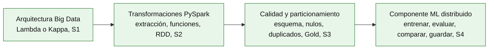

# S5 - Evaluación de la Unidad I

## 1. Propósito de la evaluación

Esta sesión no enseña contenido nuevo: cierra la Unidad I de **Big Data**. El sílabo (sesión 5) define dos actividades para esta evaluación:

1. Resolver la evaluación teórico-práctica de los temas de la Unidad I (sesiones 1 a 4).
2. Presentar y sustentar el Pipeline batch de ETL distribuido con salidas analíticas en Parquet listas para BI/ML.

## 2. Producto evaluado

Del sílabo, el producto de la Unidad I es:

> Pipeline batch de ETL distribuido con salidas analíticas en Parquet listas para BI/ML.

**Lo que sigue (2.1-2.4) usa los datasets reales que el docente trabajó en clase (H&M para calidad y particionamiento; campo eléctrico/magnético para el componente ML) — no es una plantilla obligatoria.** Tu [Brief técnico-analítico](../proyecto-sello/brief.md) (hito de S2) define el contenido real: cada equipo declara una **pregunta central de negocio**, y **cada integrante** aporta su propia **dimensión U1** de esa pregunta — descriptiva/diagnóstica y predictiva, sin inferencia en tiempo real (la dimensión U2, con inferencia en vivo sobre streaming, es contenido de Unidad II, evaluado en S12). Los integrantes de un mismo equipo suelen compartir el instrumento o fuente física (el mismo sensor, el mismo dataset base), pero cada uno construye y sustenta **su propio notebook y su propio modelo**, sobre su propia variable objetivo — no un pipeline único repartido entre el equipo.

El modelo predictivo de tu dimensión U1 puede ser de **regresión o de clasificación**, según lo que pida tu propia pregunta (el brief lo deja explícito) — S4 enseñó la técnica concreta con `LinearRegression`/`RandomForestRegressor`, pero la misma disciplina (entrenar, evaluar con varias métricas, comparar más de una configuración, guardar el ganador) aplica igual si tu dimensión necesita `LogisticRegression`/`RandomForestClassifier` en su lugar.

### Lo que acumulaste sesión por sesión

Este producto no se construye en S5: se ensambla con lo que cada sesión anterior ya te pidió sobre tu propia dimensión U1.

**Tabla 1. De la sesión a tu dimensión U1 evaluada**

| Sesión | Qué produjiste (tu propia dimensión, sobre el instrumento de tu Proyecto Sello) | Dónde queda en tu entregable evaluado |
|---|---|---|
| S1 | Diagrama de arquitectura Big Data (Lambda o Kappa) del equipo, con decisiones técnicas, tecnologías propuestas, supuestos y riesgos. | 2.1 Arquitectura Big Data seleccionada |
| S2 | Notebook con extracción, transformaciones, funciones, agrupaciones/agregaciones, RDD y evidencia del plan de ejecución (`explain()`) sobre el instrumento batch de tu dimensión. | 2.2 Transformaciones distribuidas con PySpark |
| S3 | Esquema explícito, duplicados y nulos tratados, salida particionada y verificada en Parquet, sobre tu propio histórico. | 2.3 Calidad de datos y particionamiento analítico |
| S4 | Modelo predictivo entrenado sobre tu variable objetivo (el indicador de tu dimensión), comparado y guardado, con métricas reportadas. | 2.4 Componente ML distribuido |
| S5 (esta sesión) | Ensamblas todo lo anterior en tu propio notebook end-to-end y lo sustentas individualmente. | Tu dimensión completa + sección 4 de esta guía |

Lo que sustentas en S5 es **tu propia dimensión U1**: el indicador y la pregunta predictiva que tú declaraste en el brief, sobre el instrumento de tu Proyecto Sello — no el dataset H&M ni el del campo eléctrico, y no necesariamente el mismo indicador que el resto de tu equipo. Las secciones 2.1-2.4 muestran cómo se ve una dimensión terminada usando los ejemplos reales de clase; tu entregable real tiene la misma estructura, pero con el contenido que tú construiste en S1-S4 sobre tu propia pregunta.

### 2.1 Arquitectura Big Data seleccionada

**Producto del paso:** el diagrama de arquitectura (Lambda o Kappa) de tu Proyecto Sello, con sus decisiones técnicas justificadas (S1).

Cada equipo decidió entre arquitectura Lambda (capas batch y velocidad separadas, unificadas en una capa de servicio) y Kappa (un único pipeline de streaming, el batch se trata como un caso particular de reprocesamiento) — la decisión depende de si el caso de negocio del equipo necesita resultados batch, en tiempo real, o ambos. Esta Unidad I construyó exclusivamente la ruta batch de esa arquitectura; la ruta de streaming es contenido de la Unidad II (S6-S9).

### 2.2 Transformaciones distribuidas con PySpark (ejemplo H&M)

**Producto del paso:** un notebook con extracción, transformaciones, funciones, agrupaciones/agregaciones y procesamiento RDD, con evidencia de que entiendes cuándo Spark ejecuta realmente el cálculo (S2).

```python
df = spark.read.csv(f"{ORIGEN_DATOS}/customers.csv", header=True, schema=schema)

df_transformado = (
    df
    .withColumn("es_activo", when(col("club_member_status") == "ACTIVE", lit(True)).otherwise(lit(False)))
    .filter(col("age").isNotNull())
)

df_transformado.explain(True)
```

Sobre tu propio dataset, esto significa: al menos una extracción con esquema explícito, una transformación con `withColumn()`/`filter()`, una agrupación con `groupBy().agg()`, y una verificación explícita del plan de ejecución que muestre en qué momento Spark deja de ser perezoso y ejecuta de verdad (2.6 de S2).

### 2.3 Calidad de datos y particionamiento analítico (ejemplo H&M)

**Producto del paso:** una salida particionada en Parquet, con calidad de datos aplicada (esquema, nulos, duplicados) y verificada de vuelta (S3).

**Tabla 2. Controles de calidad mínimos exigibles**

| Control | Qué verifica | Técnica de referencia (S3) |
|---|---|---|
| Esquema explícito | Tipos de datos correctos desde la lectura, sin dejar que Spark adivine. | `StructType` |
| Duplicados | Filas repetidas identificadas antes de eliminarlas, con criterio documentado. | `dropDuplicates()`, `Window`+`row_number()` |
| Nulos | Nulos (incluidas cadenas vacías) detectados y tratados con una decisión explícita. | `.na.fill()`/`.na.drop()` |
| Particionamiento | Salida escrita en Parquet, particionada por una columna de bajo cardinalidad usada en filtros. | `partitionBy()` |
| Verificación de ida y vuelta | Conteo de filas reconciliado tras leer de vuelta, `PartitionFilters` confirmado en el plan de ejecución. | `explain(True)` |

Sobre tu propia dimensión, esto significa una salida Gold real, particionada, con al menos un control de duplicados y uno de nulos aplicados y documentados — no solo mencionados.

### 2.4 Componente ML distribuido (ejemplo campo eléctrico)

**Producto del paso:** un modelo de regresión distribuida entrenado sobre tu propia salida Gold, evaluado con al menos tres métricas, comparado contra al menos una configuración alternativa, y guardado (S4).

**Tabla 3. Componentes mínimos exigibles del modelo**

| Componente | Qué verifica | Técnica de referencia (S4, caso regresión) |
|---|---|---|
| Vector de predictores | Los predictores están combinados en una sola columna vectorial, como exige Spark MLlib. | `VectorAssembler` |
| Modelo base entrenado y evaluado | El modelo aprende de `df_train` y se mide sobre `df_test`, nunca al revés. | `LinearRegression`, `RegressionEvaluator` (RMSE, R², MAE) |
| Comparación de configuraciones | Al menos una configuración alternativa (regularización, otro algoritmo) comparada con las mismas métricas. | `regParam`/`elasticNetParam`, o un segundo algoritmo |
| Modelo guardado | El modelo persistido es el que realmente ganó la comparación, no el primero que se entrenó. | `model.write().overwrite().save(...)` |

Sobre tu propia dimensión U1 (brief, sección 3), esto significa el indicador que tú declaraste — no necesariamente `CE`, y no necesariamente una regresión: si tu pregunta predictiva es de clasificación (por ejemplo, "¿qué tan probable es una tormenta?", como el ejemplo de sensores atmosféricos del brief), la Tabla 3 aplica igual cambiando `LinearRegression`/`RandomForestRegressor` por `LogisticRegression`/`RandomForestClassifier`, y RMSE/R²/MAE por las métricas de clasificación correspondientes (`areaUnderROC`, `f1`, etc.) — la disciplina es la misma: comparar antes de confiar en un único modelo (1.6 de S4).

**Figura 1. Pipeline batch completo, Unidad I (estructura general)**



A diferencia del roadmap de S4 (donde el componente ML era lo único nuevo del día), aquí los cuatro bloques están en verde: la Unidad I completa un pipeline donde los datos del Proyecto Sello entran crudos por un extremo y salen, del otro, como un Data Lake particionado con un primer modelo entrenado y comparado sobre él.

## 3. Evaluación teórico-práctica (S1-S4)

Cubre los cuatro temas dictados antes de esta sesión. El docente puede tomarla escrita, oral o mixta.

**Tabla 4. Temario de la evaluación teórico-práctica**

| Sesión | Tema | Qué puede evaluar el docente |
|---|---|---|
| S1 | Arquitectura Big Data: Lambda y Kappa, batch vs. streaming | Diferencia entre arquitectura Lambda y Kappa, criterios para elegir una u otra, y por qué un caso de negocio concreto necesita batch, streaming, o ambos. |
| S2 | Fundamentos PySpark: transformaciones, funciones, agrupaciones y evaluación perezosa | Extracción con esquema explícito, transformaciones (`withColumn()`, `filter()`), agrupaciones/agregaciones, procesamiento RDD, y en qué momento Spark ejecuta realmente el cálculo (*lazy evaluation*, Catalyst Optimizer). |
| S3 | Procesamiento y calidad de datos: filtrado, duplicados, nulos y particionamiento analítico | Detección y tratamiento de duplicados y nulos, deduplicación determinista con `Window`+`row_number()`, particionamiento en Parquet y verificación con `PartitionFilters`. |
| S4 | ML distribuido con Spark MLlib (Regresión) | `VectorAssembler`, patrón `fit()`/`transform()`, métricas de regresión (RMSE, R², MAE), regularización, comparación entre algoritmos e importancia de variables. |

Preguntas de referencia (el docente puede formular equivalentes):

1. ¿Por qué una arquitectura Kappa no necesita una capa batch separada, y qué se pierde o se gana frente a Lambda al tomar esa decisión?
2. ¿Qué diferencia hay entre una transformación y una acción en Spark, y por qué esa diferencia explica que `explain(True)` muestre un plan sin que nada se haya ejecutado todavía?
3. Si no resuelves los duplicados de una fuente antes de integrarla con otra, ¿qué error concreto se propaga al resultado final, y por qué no siempre es visible de inmediato?
4. ¿Por qué particionar una salida Parquet por una columna de alta cardinalidad (como un ID único) sería un error, y qué columna sí conviene usar?
5. ¿Por qué `VectorAssembler` es obligatorio en Spark MLlib y no en scikit-learn, y qué pasaría si tu modelo ganara la comparación pero guardaras el primero que entrenaste en vez de ese?

## 4. Sustentación de tu dimensión U1

Aunque el equipo comparte instrumento y pregunta central, la sustentación de U1 es **individual**: cada integrante presenta y defiende su propia dimensión (brief, sección 3) — el aporte individual es, además, un subaspecto explícito de la sustentación integral del Proyecto Sello.

**Tabla 5. Distribución de tiempo por integrante**

| Momento | Tiempo | Propósito |
|---|---:|---|
| Presentación técnica | 8 min | Explicar tu dimensión U1 (sección 2), las decisiones tomadas y su evolución desde S1. |
| Demo técnica | 5 min | Ejecutar tu notebook (o las celdas clave) en vivo: transformación, control de calidad, particionamiento y entrenamiento/comparación del modelo. |
| Preguntas individuales | 5 min | Verificar dominio y aporte propio, con base en la Tabla 4. |

**Tabla 6. Entregables obligatorios**

| Entregable | Evidencia mínima | Criterio de aceptación |
|---|---|---|
| Producto de tu dimensión U1 | Sección 2 de esta guía, con tu propia dimensión y variable objetivo (brief, sección 3) | Coherente con el sílabo y con el notebook real ejecutable |
| Evidencia de calidad de datos | Controles de la Tabla 2 aplicados y verificados sobre tu propio histórico | Trazabilidad verificable con capturas y código, no solo documentada |
| Evidencia del componente ML | Componentes de la Tabla 3 aplicados y verificados sobre tu propia variable objetivo | Métricas reales reportadas, modelo guardado coincide con el ganador |
| Sustentación individual | Preguntas y defensa por integrante (sección 3) | Autoría demostrada |

Cada captura de pantalla del informe debe mostrar, sin recortar, el reloj del sistema (fecha y hora) y tu usuario o foto de perfil (Windows, VS Code o navegador) visibles en pantalla — es lo que permite verificar que la evidencia es tuya y que corresponde al momento real de tu trabajo, cruzado con el historial de commits de tu repositorio en GitHub.

Secuencia sugerida de presentación:

1. Presentar la arquitectura Big Data del equipo (2.1) y tu propia dimensión U1 dentro de la pregunta central del Proyecto Sello.
2. Ejecutar en vivo una transformación distribuida (2.2) y mostrar el plan de ejecución con `explain(True)`.
3. Mostrar los controles de calidad aplicados (2.3): duplicados y nulos, antes y después.
4. Ejecutar la escritura y lectura de la salida particionada, con `PartitionFilters` confirmado en el plan de ejecución.
5. Mostrar tu modelo entrenado, sus métricas (2.4), y la tabla comparativa contra al menos una configuración alternativa.
6. Cerrar mostrando que el modelo guardado coincide con el que realmente ganó la comparación, no con el primero que se entrenó.

Criterios mínimos de aceptación:

- Tu notebook corre de punta a punta sobre el instrumento real (o representativo) de tu dimensión.
- Al menos un control de duplicados y uno de nulos están aplicados y documentados, no solo mencionados.
- La salida está particionada en Parquet y verificada con lectura de vuelta.
- El modelo base está entrenado y evaluado con al menos tres métricas, comparado contra al menos una configuración alternativa.
- El modelo guardado coincide con el de mejor desempeño en la comparación.
- Respondes individualmente al menos una pregunta de la Tabla 4.

## 5. Rúbrica de evaluación

Los seis criterios son cita literal de los criterios de evaluación del producto de la Unidad I en el sílabo de Big Data.

**Tabla 7. Rúbrica de evaluación**

| Criterio | Peso | A (20 pts) | B (15 pts) | C (10 pts) | D (5 pts) | Nivel obtenido |
|---|---:|---|---|---|---|---:|
| 1. Arquitectura Big Data seleccionada y justificada | 15% | Arquitectura (Lambda o Kappa) elegida con justificación clara frente al caso de negocio del Proyecto Sello. | Arquitectura elegida, con justificación parcial. | Arquitectura mencionada, sin justificación clara. | No presenta una arquitectura elegida. | |
| 2. Uso correcto de Spark/PySpark para extracción, transformación, agregación y procesamiento distribuido | 20% | Extracción, transformaciones, agregaciones y RDD aplicados correctamente, con evidencia del plan de ejecución. | La mayoría de estos elementos funciona, con detalles menores. | Uso parcial o con errores de PySpark. | No evidencia procesamiento distribuido funcional. | |
| 3. Datos cargados y particionados en formatos analíticos | 20% | Salida Parquet particionada, verificada con lectura de vuelta y `PartitionFilters` confirmado. | Salida particionada y verificada, con algún detalle menor. | Escritura particionada incompleta o sin verificación. | No escribe salida particionada. | |
| 4. Pipeline batch reproducible | 15% | El notebook corre de punta a punta sin intervención manual, sobre el instrumento real o representativo de tu propia dimensión. | El notebook corre con ajustes menores necesarios. | El notebook corre solo parcialmente. | El notebook no es reproducible. | |
| 5. Primer componente ML distribuido con métricas básicas | 20% | Modelo entrenado, evaluado con al menos tres métricas, comparado contra una configuración alternativa, y el ganador guardado. | Modelo entrenado y evaluado, con comparación o guardado incompletos. | Modelo entrenado, sin comparación clara. | No presenta un modelo entrenado. | |
| 6. Evidencias técnicas y documentación de ejecución | 10% | Evidencias completas, reproducibles por otra persona, con documentación clara y reloj/usuario visibles. | Evidencias suficientes, con vacíos menores de documentación. | Evidencias parciales o poco reproducibles. | No presenta evidencias ni documentación. | |

Nota final = suma de (`Peso` × `Puntos del nivel obtenido`) / 100 × 20 = ____.

Para usar la rúbrica con IA, solicita:

```text
Evalúa la sustentación y el producto (sección 2 de esta guía, adaptada a la dimensión U1 propia del estudiante) usando la rúbrica de esta sesión.
Para cada criterio selecciona el nivel obtenido: A=20, B=15, C=10, D=5.
Justifica brevemente cada nivel con evidencia concreta (código, capturas, métricas reales).
Verifica que cada captura muestre reloj del sistema y usuario/perfil visible, y que las fechas sean coherentes con el historial de commits de GitHub. Si falta esta evidencia o hay inconsistencias, indícalo explícitamente antes de calificar.
Calcula la nota final con la fórmula: suma de (Peso × Puntos del nivel obtenido) / 100 × 20.
Indica 2 fortalezas y 2 recomendaciones para lo que sigue en Unidad II.
```
