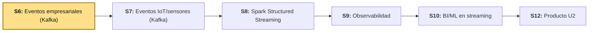
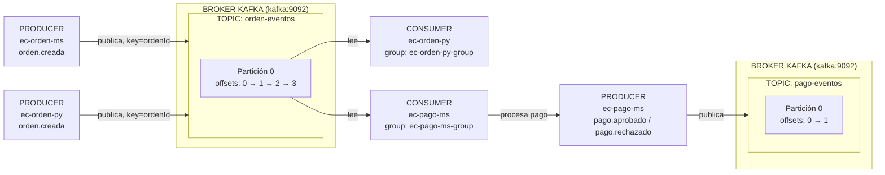

# S6 - Ingesta de Eventos Empresariales en Tiempo Real

## 1. Introducción

### 1.1 Presentación de la sesión

Hasta S5, todo el pipeline de `lambda26` fue **batch**: un archivo llega completo, Spark lo procesa de punta a punta, y termina. Esta sesión abre la Unidad II con un tipo de dato distinto — el **evento**: un mensaje pequeño, que llega uno a la vez, en cualquier momento, sin que nadie avise cuándo empieza ni cuándo termina el flujo. Antes de que Spark pueda procesar eventos en streaming (S8), tiene que existir algo que los reciba, los ordene y los entregue de forma confiable — ese componente es **Apache Kafka**, y esta sesión construye el primer flujo de eventos reales del proyecto: una orden de compra que se crea, y un pago que se procesa a partir de ella.

Esta sesión trabaja **eventos empresariales** (una orden, un pago) — un flujo de negocio normal, con volumen bajo y estructura conocida de antemano. **S7 aplica exactamente el mismo patrón de Kafka a un tipo de evento distinto: telemetría de sensores/IoT** — alta frecuencia, volumen mayor, esquema que puede variar. Ninguna herramienta cambia entre S6 y S7; lo que cambia es el productor y la naturaleza del evento — por eso esta sesión invierte el tiempo en dejar Kafka y el patrón productor-consumidor bien entendidos, no en el negocio de "órdenes" en sí.

### 1.2 Índice

1. Conceptos de Kafka: topic, producer, consumer, broker, partition, offset, consumer group, key.
2. Productor y consumidor manuales por consola.
3. Productor y consumidor en Python.
4. Microservicios Spring Boot como productor y consumidor reales.
5. Contrato de evento, documentado y versionable.

### 1.3 Propósito de aprendizaje

Al concluir la clase, estarás en condiciones de:

- **Publicar y consumir** eventos empresariales con Apache Kafka para un flujo de negocio real, documentando el contrato de cada evento, el tópico que lo transporta y su particionado, con evidencia verificable de publicación y consumo en al menos dos niveles: manual (consola/Python) y aplicado (microservicios).

### 1.4 Producto de sesión

Un flujo de eventos empresariales funcional: Kafka corriendo con Kafka UI, el tópico `orden-eventos` probado manualmente por consola y por un productor/consumidor en Python, y dos microservicios Spring Boot reales — `ec-orden-ms` (publica `orden.creada` al registrar una orden) y `ec-pago-ms` (consume `orden.creada`, procesa el pago y publica `pago.aprobado`/`pago.rechazado` en `pago-eventos`) — con el contrato de ambos eventos documentado.

### 1.5 Metodología

**Tabla 1. Metodología de la sesión**

| Actividades a Realizar en el Periodo | Orientaciones generales (Orientaciones Metodológicas) | Material de estudio recomendado |
|---|---|---|
| Revisión previa individual | Confirmar Docker Desktop funcionando; instalar Java 17 y Maven si aún no están instalados (`choco install temurin17 -y`, `choco install maven -y`). Trabajo individual, antes de clase. | Silabo Unidad II, este mismo documento (1.1-1.7). |
| Clase presencial | Construcción guiada de `kafka/` (broker + UI), prueba manual por consola, prueba con Python, y construcción de `ec-orden-ms`/`ec-pago-ms` como productor y consumidor reales. Trabajo individual, siguiendo al docente paso a paso; consulta inmediata ante un topic que no aparece o un consumer que no recibe nada. | Pasos 3.1 a 3.9 de esta guía. |
| Evaluación formativa | Revisión en clase de Kafka UI mostrando `orden-eventos` y `pago-eventos` con mensajes reales, y de los logs de ambos microservicios publicando/consumiendo. La evidencia se completa y sustenta de forma individual, fuera del aula, según los criterios mínimos de la sección 4.4. | Indicaciones de entrega (4.3), rúbrica de evaluación (4.6). |

### 1.6 Motivación de la sesión

#### 1.6.1 Caso: el pedido que se perdió entre dos sistemas

Una plataforma de comercio electrónico separa "registrar el pedido" de "procesar el pago" en dos aplicaciones distintas, para que un problema en una no tumbe a la otra. La primera versión los conecta con una llamada HTTP directa: el servicio de órdenes, apenas guarda el pedido, llama por REST al servicio de pagos. Funciona en las pruebas. En producción, un día el servicio de pagos está reiniciándose (un despliegue nuevo) justo cuando entra una ráfaga de pedidos — la llamada HTTP falla, y esos pedidos, o se pierden, o el servicio de órdenes también empieza a fallar en cadena (el mismo problema de acoplamiento síncrono que Circuit Breaker mitiga, pero no elimina: la orden y el pago siguen dependiendo de que ambos servicios estén arriba *al mismo tiempo*).

La solución no es un mejor manejo de errores en esa llamada — es no depender de que los dos servicios coincidan en el tiempo. El servicio de órdenes publica un evento ("orden creada") y sigue con lo suyo, sin esperar respuesta de nadie. El servicio de pagos lee ese evento cuando puede — un minuto después, o una hora después si estuvo caído — y lo procesa. Ningún pedido se pierde: Kafka lo retiene hasta que alguien lo consuma. Esta sesión construye exactamente ese patrón, con datos reales.

**Preguntas de análisis**

**Activación de conocimientos previos**

1. ¿Qué problema tiene conectar dos servicios con una llamada HTTP directa, si uno de los dos puede estar caído en el momento exacto en que el otro lo necesita?
2. ¿Por qué "guardar el evento en una cola y seguir" es distinto de "esperar la respuesta antes de continuar"?

**Comprensión de mensajería con Kafka**

1. Si dos consumidores distintos (por ejemplo, `ec-pago-ms` y un futuro servicio de notificaciones) necesitan leer el mismo evento `orden.creada`, ¿alcanza con un solo consumer, o cada uno necesita su propio consumer group? Relaciónalo con 2.1.
2. ¿Qué garantiza Kafka si `ec-pago-ms` está caído cuando `ec-orden-ms` publica un evento, y `ec-pago-ms` vuelve a levantarse cinco minutos después?

### 1.7 Ubicación en el curso

- Unidad: U2 - Sistema Big Data en tiempo real: ingesta, streaming, observabilidad y BI/ML.
- Producto del curso: Proyecto Sello: sistema Big Data distribuido end-to-end para procesamiento batch y streaming, analítica/ML, observabilidad y visualización BI para la toma de decisiones.
- Producto de unidad: pipeline en tiempo real con ingesta de eventos empresariales e IoT/sensores, procesamiento streaming con Spark, observabilidad/costos y salidas BI/ML distribuidas.
- Avance del producto en esta sesión: ingesta de eventos empresariales con Kafka, primer tramo del pipeline en tiempo real.

**Figura 1. Roadmap del producto de la Unidad II**



## 2. Explica

### 2.1 Conceptos de Kafka

**Tabla 2. Conceptos clave de Kafka**

| Concepto | Qué es |
|---|---|
| `topic` | Canal lógico donde se publican mensajes de un mismo tipo (ej. `orden-eventos`). |
| `producer` | Aplicación que envía eventos a un topic. |
| `consumer` | Aplicación que lee eventos desde un topic. |
| `broker` | Servidor Kafka que almacena y distribuye los eventos. |
| `partition` | División interna de un topic — permite que varios consumidores lean en paralelo. |
| `offset` | Posición de un evento dentro de una partición — Kafka no borra el evento al leerlo, solo avanza el offset del consumer. |
| `consumer group` | Grupo que coordina consumidores y recuerda hasta qué offset ya leyó cada uno. |
| `key` | Valor que Kafka usa para decidir en qué partición cae el evento — mensajes con la misma `key` siempre van a la misma partición, y por lo tanto se leen en orden entre sí. |

La `key` no tiene que ser una clave primaria relacional: puede ser `ordenId`, un `deviceId` (S7), un `correlationId` o un UUID generado por la aplicación — lo único que importa es que agrupe correctamente los eventos que deben mantenerse en orden entre sí.

**Figura 2. Flujo completo: `ec-orden-ms` publica, `ec-pago-ms` consume y vuelve a publicar**



`ec-pago-ms` y `ec-orden-py` leen del **mismo** topic (`orden-eventos`) sin competir entre sí porque cada uno tiene su propio *consumer group* (2.1, Tabla 2) — Kafka entrega una copia completa de los eventos a cada consumer group, no reparte los eventos como si fuera una sola cola compartida.

**Error frecuente**: pensar que leer un evento lo elimina del topic, igual que sacar un mensaje de una cola tradicional. Kafka retiene los eventos según su política de retención (por tiempo o tamaño, no cubierta en esta sesión) — leer solo avanza el offset del consumer group que lo leyó; otro consumer group puede leer el mismo evento desde el principio.

### 2.2 Arquitectura de la práctica

Esta sesión trabaja únicamente con estos componentes, dentro de `lambda26`:

- `kafka/` — el broker y su interfaz web.
- `uso-rapido/ec-orden-py` — productor/consumidor en Python, para verificar el flujo sin depender de Java.
- `uso-ms-sb/ec-orden-ms` — microservicio Spring Boot, productor real.
- `uso-ms-sb/ec-pago-ms` — microservicio Spring Boot, consumidor y productor real.

```text
ec-orden-ms → orden-eventos → ec-pago-ms → pago-eventos
```

En la práctica manual (3.2) solo existe `orden-eventos`. El topic `pago-eventos` aparece recién cuando `ec-pago-ms` publica su primer resultado de pago (3.9).

### 2.3 Observabilidad y diagnóstico

Revisar Kafka UI (topics, particiones, mensajes, consumer groups y su *lag*), logs de `ec-orden-ms` (líneas `component=producer`) y logs de `ec-pago-ms` (líneas `component=consumer`/`component=processor`/`component=producer`) — cada línea de log declara explícitamente `service`, `component`, `topic` y `status`, precisamente para que un evento se pueda rastrear de un extremo al otro sin adivinar.

## 3. Aplica: actividad práctica guiada

Tiempo: 3h.

**Actividad:** construcción guiada del flujo de eventos empresariales de `lambda26`: Kafka, prueba manual, prueba en Python, y los microservicios `ec-orden-ms`/`ec-pago-ms` como productor y consumidor reales (Producto de la sesión en 1.4).

**Propósito de la actividad:** dejar Kafka operativo y validado en tres niveles de práctica — consola, Python, microservicios — de forma que el patrón productor-consumidor quede claro antes de repetirlo en S7 con otro tipo de evento.

**Orientaciones metodológicas:** en el laboratorio, el docente guía la construcción paso a paso frente a la clase; los estudiantes replican cada paso en su propia laptop, verificando el resultado en Kafka UI antes de avanzar al siguiente.

**Actividades para realizar:**

- **3.1** Levantar Kafka.
- **3.2** Probar Kafka por consola (producer/consumer manuales).
- **3.3** Verificar con Kafka UI.
- **3.4** Probar con Python (productor y consumidor rápidos).
- **3.5** Crear `ec-orden-ms` como productor.
- **3.6** Levantar y probar `ec-orden-ms`.
- **3.7** Crear `ec-pago-ms` como consumidor y productor.
- **3.8** Levantar y probar `ec-pago-ms`.
- **3.9** Documentar el contrato de ambos eventos.

### 3.1 Levantar Kafka

**Producto del paso:** Kafka, Kafka UI y el exportador de métricas corriendo en DEV.

Crea:

```text
kafka/compose.yml
```

```yaml
name: lambda26-kafka

services:
  kafka:
    image: apache/kafka:3.8.0
    container_name: lambda26-kafka
    restart: unless-stopped
    ports:
      - "49092:9092"
    environment:
      KAFKA_NODE_ID: 1
      KAFKA_PROCESS_ROLES: broker,controller
      KAFKA_LISTENERS: PLAINTEXT://0.0.0.0:9092,CONTROLLER://0.0.0.0:9093
      KAFKA_ADVERTISED_LISTENERS: PLAINTEXT://kafka:9092
      KAFKA_CONTROLLER_LISTENER_NAMES: CONTROLLER
      KAFKA_LISTENER_SECURITY_PROTOCOL_MAP: CONTROLLER:PLAINTEXT,PLAINTEXT:PLAINTEXT
      KAFKA_CONTROLLER_QUORUM_VOTERS: 1@kafka:9093
      KAFKA_OFFSETS_TOPIC_REPLICATION_FACTOR: 1
      KAFKA_AUTO_CREATE_TOPICS_ENABLE: "false"

  kafka-ui:
    image: provectuslabs/kafka-ui:latest
    container_name: lambda26-kafka-ui
    restart: unless-stopped
    ports:
      - "48085:8080"
    environment:
      KAFKA_CLUSTERS_0_NAME: lambda26
      KAFKA_CLUSTERS_0_BOOTSTRAPSERVERS: kafka:9092
    depends_on:
      - kafka

  kafka-exporter:
    image: danielqsj/kafka-exporter:latest
    container_name: lambda26-kafka-exporter
    restart: unless-stopped
    command: ["--kafka.server=kafka:9092"]
    ports:
      - "49308:9308"
    depends_on:
      - kafka
```

`KAFKA_AUTO_CREATE_TOPICS_ENABLE: "false"` es intencional: cada topic se crea de forma explícita (3.2), con las particiones que decides — no aparece solo la primera vez que alguien publica en un nombre nuevo, un error común que oculta un typo en el nombre del topic detrás de un topic "fantasma" con una sola partición por defecto.

Levanta:

```powershell
docker compose -f kafka/compose.yml up -d
docker compose -f kafka/compose.yml ps
```

Servicios esperados: `lambda26-kafka`, `lambda26-kafka-ui`, `lambda26-kafka-exporter`.

### 3.2 Probar Kafka por consola

**Producto del paso:** topic `orden-eventos` creado y probado con un producer y un consumer manuales.

Entra al contenedor:

```powershell
docker compose -f kafka/compose.yml exec kafka bash
```

Crea el topic:

```bash
/opt/kafka/bin/kafka-topics.sh --create \
  --topic orden-eventos \
  --bootstrap-server kafka:9092 \
  --partitions 1 \
  --replication-factor 1
```

Lista los topics:

```bash
/opt/kafka/bin/kafka-topics.sh --list --bootstrap-server kafka:9092
```

Resultado esperado:

```text
orden-eventos
```

**Terminal 1** (consumer):

```powershell
docker compose -f kafka/compose.yml exec kafka bash
```

```bash
/opt/kafka/bin/kafka-console-consumer.sh \
  --topic orden-eventos \
  --bootstrap-server kafka:9092 \
  --from-beginning
```

**Terminal 2** (producer):

```powershell
docker compose -f kafka/compose.yml exec kafka bash
```

```bash
/opt/kafka/bin/kafka-console-producer.sh \
  --topic orden-eventos \
  --bootstrap-server kafka:9092
```

Escribe:

```text
hola kafka
```

El consumer de la Terminal 1 debe mostrar ese mismo texto de inmediato.

### 3.3 Verificar con Kafka UI

**Producto del paso:** confirmación visual del topic, sus mensajes y sus offsets.

Abre `http://localhost:48085` y verifica:

- El clúster `lambda26` aparece conectado.
- El topic `orden-eventos` existe, con 1 partición.
- El mensaje manual de 3.2 aparece en la pestaña de mensajes, con columnas `partition` y `offset`.

### 3.4 Probar con Python

**Producto del paso:** confirmación de que el flujo funciona con un cliente distinto al de consola, incluida la estructura JSON del evento.

Crea `uso-rapido/ec-orden-py/producer_ordenes.py` y `uso-rapido/ec-orden-py/consumer_ordenes.py` (usa la librería `kafka-python` o `confluent-kafka`, según lo que el equipo docente tenga disponible en el ambiente). El evento publicado por el productor Python debe seguir exactamente este formato — es el mismo contrato que usará `ec-orden-ms` en Java (3.9):

```json
{
  "tipoEvento": "orden.creada",
  "ordenId": 321,
  "total": 180.0,
  "estado": "PENDIENTE",
  "origen": "python",
  "timestamp": 1713350000000
}
```

Levanta el contenedor de utilidades Python (o ejecuta los scripts directamente si el entorno ya tiene Python instalado con las librerías necesarias):

```powershell
docker compose -f uso-rapido/ec-orden-py/compose.yml up -d --build
docker compose -f uso-rapido/ec-orden-py/compose.yml exec ec-orden-py python /app/consumer_ordenes.py
```

En otra terminal:

```powershell
docker compose -f uso-rapido/ec-orden-py/compose.yml exec ec-orden-py python /app/producer_ordenes.py
```

El consumer debe imprimir `topic`, `partition`, `offset`, `origen`, `estado`, `total` y `payload` completo. Si llega el mensaje manual de texto plano de 3.2 (no es JSON), el consumer no debe caerse: debe marcarlo como `invalid` y mostrar `rawPayload` — un consumer real recibe de todo, no solo lo que él mismo publicó.

**Error frecuente**: un consumer que asume que todo mensaje en el topic es JSON válido con la forma esperada, y lanza una excepción no controlada apenas llega algo distinto — un solo mensaje malformado no debería tumbar un consumer que va a correr indefinidamente.

### 3.5 Crear `ec-orden-ms` como productor

**Producto del paso:** proyecto Spring Boot `ec-orden-ms` creado, con Kafka, JPA y PostgreSQL.

**Tabla 3. Configuración de `ec-orden-ms` en Spring Initializr**

| Campo | Valor |
|---|---|
| Project | Maven Project |
| Spring Boot | **3.3.x** (rama estable con Spring for Apache Kafka) |
| Language | Java |
| Group Id | `com.upeu` |
| Artifact Id | `ec-orden-ms` |
| Package name | `com.upeu.ecorden` |
| Java | 17 |
| Dependencias | Spring Web, Spring for Apache Kafka, Spring Data JPA, PostgreSQL Driver, Lombok |
| Ubicación sugerida | `uso-ms-sb/ec-orden-ms` |

**`uso-ms-sb/ec-orden-ms/compose-dev.yml`:**

```yaml
name: lambda26-ec-orden-ms-dev

services:
  postgres-ec-orden-ms-dev:
    image: postgres:16-alpine
    container_name: lambda26-postgres-ec-orden-ms-dev
    restart: unless-stopped
    environment:
      POSTGRES_DB: db_ec_orden_ms
      POSTGRES_USER: ecom
      POSTGRES_PASSWORD: ecom
    ports:
      - "49021:5432"
    volumes:
      - ec_orden_ms_dev_data:/var/lib/postgresql/data

volumes:
  ec_orden_ms_dev_data:
```

**`uso-ms-sb/ec-orden-ms/src/main/resources/application.yml`:**

```yaml
server:
  port: 49021

spring:
  application:
    name: ec-orden-ms
  datasource:
    url: jdbc:postgresql://localhost:49021/db_ec_orden_ms
    username: ecom
    password: ecom
    driver-class-name: org.postgresql.Driver
  jpa:
    hibernate:
      ddl-auto: update
    show-sql: true
  kafka:
    bootstrap-servers: localhost:49092
    producer:
      key-serializer: org.apache.kafka.common.serialization.StringSerializer
      value-serializer: org.springframework.kafka.support.serializer.JsonSerializer
```

`ddl-auto: update` (no `validate`, a diferencia del criterio usado en los proyectos de LP2/DIST) es intencional aquí: este microservicio es una herramienta de laboratorio para generar eventos, no el producto evaluado de esta sesión — no justifica el peso de una migración Flyway completa solo para una tabla.

Crea la entidad:

```text
uso-ms-sb/ec-orden-ms/src/main/java/com/upeu/ecorden/Orden.java
```

```java
package com.upeu.ecorden;

import jakarta.persistence.*;
import lombok.*;
import java.math.BigDecimal;

@Entity
@Table(name = "ordenes")
@Getter
@Setter
@NoArgsConstructor
@AllArgsConstructor
@Builder
public class Orden {

    @Id
    @GeneratedValue(strategy = GenerationType.IDENTITY)
    private Long id;

    @Column(nullable = false)
    private Long usuarioId;

    @Column(nullable = false)
    private BigDecimal total;

    @Column(nullable = false)
    @Builder.Default
    private String estado = "PENDIENTE";
}
```

Crea el repositorio:

```text
uso-ms-sb/ec-orden-ms/src/main/java/com/upeu/ecorden/OrdenRepository.java
```

```java
package com.upeu.ecorden;

import org.springframework.data.jpa.repository.JpaRepository;

public interface OrdenRepository extends JpaRepository<Orden, Long> {
}
```

Crea el productor:

```text
uso-ms-sb/ec-orden-ms/src/main/java/com/upeu/ecorden/OrdenEventProducer.java
```

```java
package com.upeu.ecorden;

import lombok.RequiredArgsConstructor;
import lombok.extern.slf4j.Slf4j;
import org.springframework.kafka.core.KafkaTemplate;
import org.springframework.stereotype.Component;
import java.util.LinkedHashMap;
import java.util.Map;

@Component
@RequiredArgsConstructor
@Slf4j
public class OrdenEventProducer {

    private static final String TOPIC = "orden-eventos";

    private final KafkaTemplate<String, Object> kafkaTemplate;

    public void publicarOrdenCreada(Orden orden) {
        Map<String, Object> evento = new LinkedHashMap<>();
        evento.put("tipoEvento", "orden.creada");
        evento.put("ordenId", orden.getId());
        evento.put("total", orden.getTotal());
        evento.put("estado", orden.getEstado());
        evento.put("origen", "ec-orden-ms");
        evento.put("timestamp", System.currentTimeMillis());

        kafkaTemplate.send(TOPIC, String.valueOf(orden.getId()), evento);
        log.info("service=ec-orden-ms component=producer topic={} eventType=orden.creada status=published", TOPIC);
    }
}
```

`kafkaTemplate.send(TOPIC, String.valueOf(orden.getId()), evento)` usa `ordenId` como `key` (2.1) — así, si algún día un mismo pedido genera más de un evento (por ejemplo, `orden.creada` y una futura `orden.cancelada`), Kafka los mantiene en la misma partición y en orden entre sí.

Crea el servicio y el controlador:

```text
uso-ms-sb/ec-orden-ms/src/main/java/com/upeu/ecorden/OrdenService.java
uso-ms-sb/ec-orden-ms/src/main/java/com/upeu/ecorden/OrdenController.java
```

```java
package com.upeu.ecorden;

import lombok.RequiredArgsConstructor;
import org.springframework.stereotype.Service;
import org.springframework.transaction.annotation.Transactional;

@Service
@RequiredArgsConstructor
public class OrdenService {

    private final OrdenRepository ordenRepository;
    private final OrdenEventProducer ordenEventProducer;

    @Transactional
    public Orden crear(Orden orden) {
        Orden guardada = ordenRepository.save(orden);
        ordenEventProducer.publicarOrdenCreada(guardada);
        return guardada;
    }
}
```

```java
package com.upeu.ecorden;

import lombok.RequiredArgsConstructor;
import org.springframework.web.bind.annotation.*;

@RestController
@RequiredArgsConstructor
public class OrdenController {

    private final OrdenService ordenService;

    @PostMapping("/ordenes")
    public Orden crear(@RequestBody Orden orden) {
        return ordenService.crear(orden);
    }
}
```

La orden se guarda en PostgreSQL y se publica en Kafka **dentro de la misma transacción de negocio** (`@Transactional` en `crear()`) — pero son dos sistemas distintos (base de datos relacional y broker de mensajería) que no comparten una transacción real entre sí; si el envío a Kafka fallara después de guardar en PostgreSQL, la orden quedaría guardada sin evento publicado. Resolver esa inconsistencia (patrón *Outbox*) queda fuera del alcance de esta sesión — aquí el objetivo es dejar el flujo feliz funcionando y visible.

### 3.6 Levantar y probar `ec-orden-ms`

**Producto del paso:** primera orden real publicando un evento verificable en Kafka UI.

```powershell
docker compose -f uso-ms-sb/ec-orden-ms/compose-dev.yml up -d
docker compose -f uso-ms-sb/ec-orden-ms/compose-dev.yml ps
```

```powershell
docker exec -it lambda26-postgres-ec-orden-ms-dev psql -U ecom -d db_ec_orden_ms -c "\dt"
```

```powershell
cd uso-ms-sb/ec-orden-ms
mvn spring-boot:run
```

Crea una orden:

```powershell
Invoke-RestMethod -Method Post -Uri "http://localhost:49021/ordenes" `
  -ContentType "application/json" `
  -Body '{"usuarioId":1,"total":100}'
```

Verifica en consola (`Ctrl+C` no es necesario, revisa el log de la terminal donde corre `mvn spring-boot:run`):

```text
service=ec-orden-ms component=producer topic=orden-eventos eventType=orden.creada status=published
```

Verifica en Kafka UI (3.3) que `orden-eventos` ahora tiene un mensaje con `tipoEvento: orden.creada` y `origen: ec-orden-ms`.

### 3.7 Crear `ec-pago-ms` como consumidor y productor

**Producto del paso:** proyecto Spring Boot `ec-pago-ms` que consume `orden-eventos` y publica el resultado del pago en `pago-eventos`.

Repite 3.5 con `Artifact Id: ec-pago-ms`, `Package name: com.upeu.ecpago`, en `uso-ms-sb/ec-pago-ms`, con su propia base de datos `db_ec_pago_ms` en el puerto `49022`.

Entidad `Pago`:

```text
uso-ms-sb/ec-pago-ms/src/main/java/com/upeu/ecpago/Pago.java
```

```java
package com.upeu.ecpago;

import jakarta.persistence.*;
import lombok.*;
import java.math.BigDecimal;

@Entity
@Table(name = "pagos")
@Getter
@Setter
@NoArgsConstructor
@AllArgsConstructor
@Builder
public class Pago {

    @Id
    @GeneratedValue(strategy = GenerationType.IDENTITY)
    private Long id;

    @Column(nullable = false)
    private Long ordenId;

    @Column(nullable = false)
    private BigDecimal monto;

    @Column(nullable = false)
    private String estado;
}
```

```text
uso-ms-sb/ec-pago-ms/src/main/java/com/upeu/ecpago/PagoRepository.java
```

```java
package com.upeu.ecpago;

import org.springframework.data.jpa.repository.JpaRepository;

public interface PagoRepository extends JpaRepository<Pago, Long> {
}
```

El consumidor de `orden-eventos`, el "procesador" de pago (una regla simple: montos menores a 1000 se aprueban, para tener un caso de `pago.rechazado` reproducible) y el productor de `pago-eventos`:

```text
uso-ms-sb/ec-pago-ms/src/main/java/com/upeu/ecpago/OrdenEventListener.java
```

```java
package com.upeu.ecpago;

import lombok.RequiredArgsConstructor;
import lombok.extern.slf4j.Slf4j;
import org.springframework.kafka.annotation.KafkaListener;
import org.springframework.kafka.core.KafkaTemplate;
import org.springframework.stereotype.Component;
import java.math.BigDecimal;
import java.util.LinkedHashMap;
import java.util.Map;

@Component
@RequiredArgsConstructor
@Slf4j
public class OrdenEventListener {

    private static final String TOPIC_ORDEN = "orden-eventos";
    private static final String TOPIC_PAGO = "pago-eventos";
    private static final BigDecimal LIMITE_APROBACION = BigDecimal.valueOf(1000);

    private final PagoRepository pagoRepository;
    private final KafkaTemplate<String, Object> kafkaTemplate;

    @KafkaListener(topics = TOPIC_ORDEN, groupId = "ec-pago-ms-group")
    public void consumirOrdenCreada(Map<String, Object> evento) {
        log.info("service=ec-pago-ms component=consumer topic={} eventType=orden.creada status=consumed", TOPIC_ORDEN);

        Long ordenId = Long.valueOf(evento.get("ordenId").toString());
        BigDecimal total = new BigDecimal(evento.get("total").toString());

        String estadoPago = total.compareTo(LIMITE_APROBACION) < 0 ? "APROBADO" : "RECHAZADO";

        Pago pago = pagoRepository.save(Pago.builder()
                .ordenId(ordenId)
                .monto(total)
                .estado(estadoPago)
                .build());

        log.info("service=ec-pago-ms component=processor ordenId={} estadoPago={} status=processed", ordenId, estadoPago);

        publicarResultadoPago(pago);
    }

    private void publicarResultadoPago(Pago pago) {
        String tipoEvento = "APROBADO".equals(pago.getEstado()) ? "pago.aprobado" : "pago.rechazado";

        Map<String, Object> evento = new LinkedHashMap<>();
        evento.put("tipoEvento", tipoEvento);
        evento.put("ordenId", pago.getOrdenId());
        evento.put("monto", pago.getMonto());
        evento.put("estado", pago.getEstado());
        evento.put("origen", "ec-pago-ms");
        evento.put("timestamp", System.currentTimeMillis());

        kafkaTemplate.send(TOPIC_PAGO, String.valueOf(pago.getOrdenId()), evento);
        log.info("service=ec-pago-ms component=producer topic={} eventType={} status=published", TOPIC_PAGO, tipoEvento);
    }
}
```

Agrega, en `application.yml` de `ec-pago-ms`, la configuración de consumer (junto al bloque `producer` ya usado en `ec-orden-ms`):

```yaml
spring:
  kafka:
    bootstrap-servers: localhost:49092
    consumer:
      group-id: ec-pago-ms-group
      key-deserializer: org.apache.kafka.common.serialization.StringDeserializer
      value-deserializer: org.springframework.kafka.support.serializer.JsonDeserializer
      properties:
        spring.json.trusted.packages: "*"
    producer:
      key-serializer: org.apache.kafka.common.serialization.StringSerializer
      value-serializer: org.springframework.kafka.support.serializer.JsonSerializer
```

**Error frecuente**: olvidar `spring.json.trusted.packages`. Sin esa propiedad, `JsonDeserializer` rechaza el mensaje con `Trusted packages` en el error, aunque el JSON esté perfectamente bien formado — la deserialización JSON de Spring Kafka bloquea por seguridad cualquier paquete Java no declarado explícitamente como confiable.

### 3.8 Levantar y probar `ec-pago-ms`

**Producto del paso:** flujo completo — una orden nueva termina en un pago procesado y publicado.

```powershell
docker compose -f uso-ms-sb/ec-pago-ms/compose-dev.yml up -d
cd uso-ms-sb/ec-pago-ms
mvn spring-boot:run
```

Con `ec-orden-ms` (3.6) todavía corriendo, crea otra orden para disparar el flujo completo:

```powershell
Invoke-RestMethod -Method Post -Uri "http://localhost:49021/ordenes" `
  -ContentType "application/json" `
  -Body '{"usuarioId":2,"total":150}'
```

Verifica en el log de `ec-pago-ms`:

```text
service=ec-pago-ms component=consumer topic=orden-eventos eventType=orden.creada status=consumed
service=ec-pago-ms component=processor ordenId=<id-generado> estadoPago=APROBADO status=processed
service=ec-pago-ms component=producer topic=pago-eventos eventType=pago.aprobado status=published
```

Verifica los datos:

```powershell
docker exec -it lambda26-postgres-ec-pago-ms-dev psql -U ecom -d db_ec_pago_ms -c "SELECT * FROM pagos;"
```

Verifica en Kafka UI: el topic `pago-eventos` ahora existe, con el mensaje `pago.aprobado`, y el consumer group `ec-pago-ms-group` visible en la pestaña `Consumers`, con su *lag* en `orden-eventos` (idealmente en `0`, si ya consumió todo lo publicado).

Repite con un total mayor o igual a `1000` para forzar el caso `pago.rechazado` — el mismo código, la misma regla, un resultado distinto según el dato real.

### 3.9 Documentar el contrato de ambos eventos

**Producto del paso:** contrato de evento documentado — el criterio de aceptación que el propio sílabo exige para esta sesión.

**Tabla 4. Contrato del evento `orden.creada`**

| Campo | Valor |
|---|---|
| Topic | `orden-eventos` |
| Particiones | 1 |
| Key | `ordenId` (como texto) |
| Productores | `ec-orden-ms`, `ec-orden-py` |
| Consumidores | `ec-pago-ms`, `ec-orden-py` |

```json
{
  "tipoEvento": "orden.creada",
  "ordenId": 1,
  "total": 100.0,
  "estado": "PENDIENTE",
  "origen": "ec-orden-ms",
  "timestamp": 1713350000000
}
```

**Tabla 5. Contrato del evento de pago**

| Campo | Valor |
|---|---|
| Topic | `pago-eventos` |
| Particiones | 1 |
| Key | `ordenId` (como texto) |
| Productor | `ec-pago-ms` |

```json
{
  "tipoEvento": "pago.aprobado",
  "ordenId": 1,
  "monto": 100.0,
  "estado": "APROBADO",
  "origen": "ec-pago-ms",
  "timestamp": 1713350000000
}
```

`tipoEvento` es `pago.rechazado` cuando `estado` es `RECHAZADO` — mismo esquema, mismo topic, distinto valor.

**Por qué documentar el contrato, no solo construirlo:** quien construya un tercer consumidor de `orden-eventos` (por ejemplo, un servicio de notificaciones, más adelante) necesita saber exactamente qué campos esperar, sin tener que leer el código fuente de `ec-orden-ms` — el contrato es la interfaz real entre servicios que no comparten base de datos.

**Evidencia de aprendizaje:**

- Kafka, Kafka UI y el exportador de métricas corriendo.
- Topic `orden-eventos` probado por consola y por Python.
- `ec-orden-ms` publicando `orden.creada` con evidencia de log y de Kafka UI.
- `ec-pago-ms` consumiendo `orden-eventos` y publicando `pago.aprobado`/`pago.rechazado`, con evidencia de log, de Kafka UI y de la tabla `pagos`.
- Contrato de ambos eventos documentado (Tablas 4-5).

## 4. Crea: actividad autónoma

Tiempo: 3h fuera del aula.

### 4.1 Actividad

Extensión autónoma del flujo de eventos empresariales construido en clase, documentada en evidencia individual.

Completa y evidencia estas tareas:

1. Agregar un tercer evento de negocio propio (por ejemplo, `orden.cancelada`), publicado por `ec-orden-ms` o por un nuevo microservicio pequeño.
2. Documentar su contrato (mismo formato de las Tablas 4-5: topic, particiones, key, productores, consumidores, JSON de ejemplo).
3. Provocar y evidenciar un mensaje que no cumple el contrato (por ejemplo, sin el campo `ordenId`) llegando al consumer, y explicar cómo el consumer lo maneja sin caerse.
4. Verificar en Kafka UI el *lag* del consumer group antes y después de consumir una ráfaga de varios eventos seguidos.

### 4.2 Propósito

Que cada estudiante demuestre, de forma individual, que puede extender el patrón productor-consumidor a un evento nuevo sin acompañamiento del docente — la misma habilidad que S7 exige aplicar a eventos IoT/sensores.

### 4.3 Indicaciones

Entrega un PDF:

```text
S06_Equipo##_ApellidoNombre.pdf
```

#### 4.3.1 Estructura del informe

**Datos del estudiante**

- Nombre:
- Equipo:
- Sesión: S06 - Ingesta de Eventos Empresariales en Tiempo Real
- Rol o aporte realizado:
- Link de GitHub:

**Evidencia técnica**

1. Kafka UI con `orden-eventos` y `pago-eventos`, mensajes visibles.
2. Logs de `ec-orden-ms` publicando y de `ec-pago-ms` consumiendo/publicando.
3. Contrato del evento nuevo (4.1, punto 2).
4. Evidencia del mensaje malformado manejado sin caída del consumer.

**Reflexión técnica breve**

```text
¿Por qué separar "registrar la orden" de "procesar el pago" en dos
servicios que se comunican por eventos, en vez de una llamada HTTP
directa entre ellos, reduce el riesgo del caso descrito en 1.6.1?
```

### 4.4 Criterios mínimos de aceptación

- El archivo respeta el nombre solicitado.
- Kafka, Kafka UI y los dos microservicios evidenciados corriendo.
- Al menos un evento propio nuevo, con su contrato documentado en el mismo formato de la sesión.
- Evidencia de un mensaje malformado manejado sin caída del consumer.
- Reflexión técnica breve incluida.

### 4.5 Preguntas de defensa

1. ¿Por qué Kafka no borra un evento apenas un consumer lo lee?
2. ¿Qué pasa si `ec-pago-ms` está caído cuando `ec-orden-ms` publica un evento?
3. ¿Por qué `ordenId` es una buena `key` para el topic `orden-eventos`?
4. ¿Qué evidencia concreta demuestra que tu consumer group ya leyó todos los eventos pendientes?

### 4.6 Rúbrica de evaluación

**Tabla 6. Rúbrica de evaluación**

| Criterio | Peso (%) | A (20 pts) | B (15 pts) | C (10 pts) | D (5 pts) | Nivel obtenido |
|---|---:|---|---|---|---|---:|
| 1. Kafka operativo y probado | 25 | Kafka, Kafka UI y prueba manual/Python evidenciados con claridad. | Kafka operativo, prueba parcial. | Kafka operativo, sin prueba clara. | No evidencia Kafka funcionando. | |
| 2. Microservicios productor y consumidor | 25 | `ec-orden-ms`/`ec-pago-ms` funcionando de punta a punta, con logs y datos verificados. | Microservicios funcionales, evidencia parcial. | Uno de los dos incompleto o sin verificar. | No evidencia microservicios funcionando. | |
| 3. Contrato de evento documentado | 25 | Contrato completo y claro para ambos eventos, más el evento propio (4.1). | Contrato completo de los dos eventos de clase. | Contrato incompleto o impreciso. | No documenta ningún contrato. | |
| 4. Manejo de errores y reflexión | 25 | Evidencia mensaje malformado manejado y reflexión técnica sólida, conectada al caso 1.6.1. | Evidencia parcial de manejo de errores o reflexión genérica. | Uno de los dos ausente. | No presenta ninguno de los dos. | |

Nota final = suma de (`Peso` / 100 × `Puntos del nivel obtenido`) = ____ / 20.

## 5. Cierre

Tiempo: 10 min.

**Resumen breve:** hoy el proyecto dejó de ser puramente batch — Kafka retiene y entrega eventos empresariales entre dos servicios que no comparten base de datos ni tienen que estar arriba al mismo tiempo, con el contrato de cada evento documentado como la interfaz real entre ellos.

**Dinámica participativa:** cada estudiante comparte en una frase qué pasó cuando probó el caso `pago.rechazado` (monto ≥ 1000) — ¿el evento se publicó igual, con otro `tipoEvento`?

**Metacognición:** ¿en qué momento de hoy hubieras usado, sin pensarlo, una llamada HTTP directa entre `ec-orden-ms` y `ec-pago-ms` en vez de un evento — y por qué esa opción reintroduce el problema del caso 1.6.1?

**Proyección:** S7 reutiliza exactamente esta misma infraestructura de Kafka (el mismo `kafka/compose.yml`, el mismo Kafka UI) para un tipo de evento distinto — telemetría de sensores/IoT, con mayor frecuencia y volumen. Ningún concepto de esta sesión se descarta; se aplica a un productor distinto.

## Bibliografía

1. Kreps, J., Narkhede, N., & Rao, J. (2011). *Kafka: A Distributed Messaging System for Log Processing*. LinkedIn.
2. Apache Software Foundation. (2024). *Apache Kafka Documentation*. https://kafka.apache.org/documentation/
3. Spring Team. (2024). *Spring for Apache Kafka Reference Documentation*. https://docs.spring.io/spring-kafka/reference/
