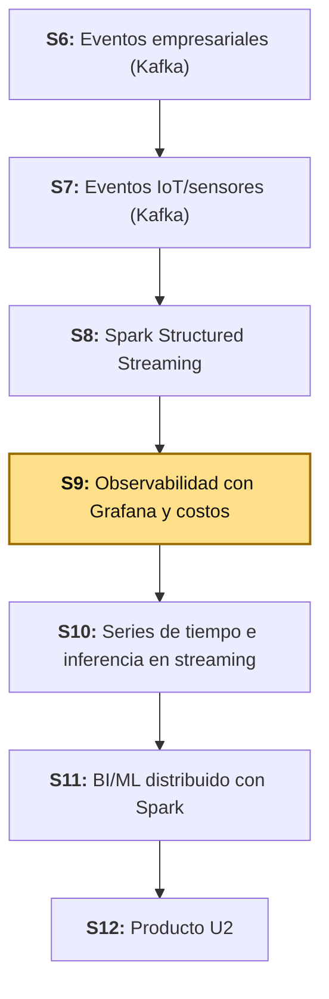
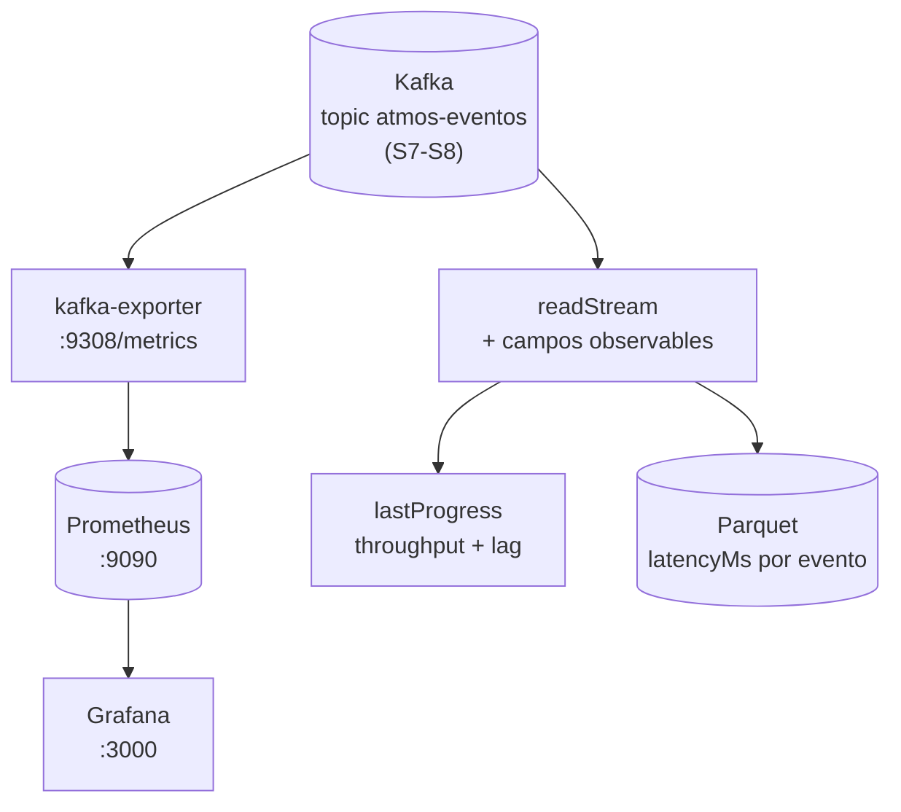

# S9 - Observabilidad con Grafana y costos

## 1. Introducción

Tiempo: 20 min.

### 1.1 Presentación de la sesión

S8 dejó un pipeline de Spark Structured Streaming corriendo sobre `atmos-eventos`: ventanas, watermarking, checkpointing, deduplicación. Pero nada de eso te dice, en este momento, si el pipeline está sano. ¿Está Kafka arriba? ¿Cuánto tarda un evento en pasar de `uso-atmos` a tu resultado? ¿Se está quedando atrás el consumidor? ¿Cuánto costaría mantener esto corriendo veinticuatro horas al día, siete días a la semana? Hoy se deja de mirar el pipeline *desde adentro* (el código que lo construye) y se empieza a mirarlo *desde afuera*: métricas, un tablero de Grafana, y una primera estimación de costos y umbrales de escalado — el tipo de pregunta que responde el equipo de operaciones, no el equipo que escribió el código.

### 1.2 Índice

1. Métricas de un pipeline de streaming: disponibilidad, latencia, throughput, *lag*.
2. Prometheus y Grafana: cómo se conectan a Kafka y a Spark.
3. Logging estructurado y métricas calculadas dentro de Spark.
4. Costos y umbrales de escalado en streaming.

### 1.3 Propósito de aprendizaje

Al concluir la clase, estarás en condiciones de:

- **Instrumentar** un pipeline de streaming con métricas reales de Prometheus y Grafana, y **explicar**, con evidencia propia (consultas PromQL, un tablero con paneles reales, y latencia calculada en Spark), qué tan saludable está el pipeline, qué umbrales de alerta tienen sentido, y qué costaría escalarlo.

### 1.4 Producto de sesión

Notebook `09_observabilidad_pipeline_grafana_costos.ipynb` corriendo sobre `atmos-eventos` (el mismo topic de S7-S8): lectura streaming con campos de observabilidad (`processedAt`, `latencyMs`, `isValid`), salida simultánea por consola y en Parquet, inspección real de `lastProgress` (throughput y *lag*), consultas a Prometheus sobre `kafka-exporter`, un tablero de Grafana con paneles reales, una tabla de latencia agregada por ventana de tiempo, alertas propuestas con umbrales concretos, y una estimación de costos con plan de escalado.

### 1.5 Metodología

**Tabla 1. Metodología de la sesión**

| Actividades a Realizar en el Periodo | Orientaciones generales (Orientaciones Metodológicas) | Material de estudio recomendado |
|---|---|---|
| Revisión previa individual | Confirmar que `kafka`, `kafka-exporter` y `uso-atmos` (S6-S8) siguen arrancando, y que el productor de sensores sigue publicando en `atmos-eventos`. Repasar brevemente el pipeline construido en S8. Trabajo individual, antes de clase. | Guía de S8 (3.1-3.6), este mismo documento (1.1-1.7). |
| Clase presencial | Construcción guiada del notebook `09-observabilidad-pipeline`: consultas Prometheus, tablero de Grafana, campos de observabilidad, salida dual (consola + Parquet), métricas de `lastProgress`, latencia por ventana y alertas propuestas, sobre datos reales llegando en vivo. Trabajo individual, siguiendo al docente paso a paso; consulta inmediata ante un target de Prometheus caído o un panel sin datos. | Pasos 3.1 a 3.11 de esta guía. |
| Evaluación formativa | Revisión en clase del tablero de Grafana con datos reales (Kafka arriba, *lag* del consumer group) y de la tabla de latencia calculada en Spark. La evidencia se completa y sustenta de forma individual, fuera del aula, según los criterios mínimos de la sección 4.4. | Indicaciones de entrega (4.3), rúbrica de evaluación (4.6). |

### 1.6 Motivación de la sesión

#### 1.6.1 Caso: el conductor que solo mira el tanque cuando el auto se apaga

Un conductor maneja sin mirar nunca el tablero: ni la aguja de gasolina, ni la temperatura del motor, ni la luz de aceite. Mientras el auto ande, no hay problema. El primer indicio de que algo anda mal es cuando el motor se apaga a mitad de la carretera — y para entonces ya es tarde para evitarlo, y ya no es una parada de dos minutos en un grifo, es una grúa.

Otro conductor sí mira el tablero, y además sabe leerlo: una aguja de gasolina en un cuarto de tanque no es una emergencia, es una señal de que faltan unos quince minutos para que sí lo sea. Puede decidir, con tiempo, si para ahora o sigue hasta el próximo grifo — y puede calcular, más o menos, cuánto le va a costar el viaje completo antes de arrancar.

Un pipeline de datos que corre sin métricas es el primer conductor: parece funcionar, hasta que deja de funcionar, y el primer aviso es un reclamo del equipo que depende de esos datos. Un pipeline con métricas, umbrales y una estimación de costos es el segundo: se sabe de antemano cuánto *lag* es normal, cuánto es alarma, y cuánto va a costar mantenerlo corriendo. Eso es lo que esta sesión construye.

**Preguntas de análisis**

**Activación de conocimientos previos**

1. ¿Alguna vez un sistema (una app, un servicio, tu propia PC) "se cayó" sin ningún aviso previo? ¿Qué hubiera cambiado si hubieras tenido una señal de alerta diez minutos antes?
2. En S8, ¿cómo te dabas cuenta de si el pipeline estaba funcionando bien? ¿Tenías que leer el código, o había algo que lo mostrara desde afuera?

**Comprensión de observabilidad, métricas y costos**

1. ¿Qué diferencia hay entre que un sistema "funcione" y que un sistema esté "observable" (que puedas saber, sin leer el código, cómo le está yendo)?
2. Si supieras que mantener un pipeline corriendo cuesta una cantidad fija por hora, ¿qué pregunta te harías antes de dejarlo corriendo todo el día?

### 1.7 Ubicación en el curso

- Unidad: U2 - Sistema Big Data en tiempo real: ingesta, streaming, observabilidad y BI/ML.
- Producto del curso: Proyecto Sello: sistema Big Data distribuido end-to-end para procesamiento batch y streaming, analítica/ML, observabilidad y visualización BI para la toma de decisiones.
- Producto de unidad: pipeline en tiempo real con ingesta de eventos empresariales e IoT/sensores, procesamiento streaming con Spark, observabilidad/costos y salidas BI/ML distribuidas.
- Avance del producto en esta sesión: instrumentación del pipeline de S8 con métricas reales (Prometheus, Grafana, latencia calculada en Spark), más una primera estimación de costos y umbrales de escalado — la pieza que faltaba para confiar en el pipeline sin tener que leer el código cada vez.

**Figura 1. Roadmap del producto de la Unidad II**



## 2. Explica

Tiempo: 30 min.

### 2.1 Arquitectura de la sesión

**Figura 2. De Kafka y Spark a métricas observables**



Lectura del diagrama: hay dos caminos de observabilidad, no uno solo. El de arriba (`Kafka → kafka-exporter → Prometheus → Grafana`) es infraestructura pura — no necesita que tu código de Spark esté corriendo para funcionar, mide el broker y los *consumer groups* desde afuera. El de abajo (`Kafka → readStream → Parquet`) es específico de tu aplicación — `latencyMs` es algo que solo Spark puede calcular, porque necesita comparar cuándo se publicó el evento contra cuándo Spark lo procesó. Ambos caminos son necesarios: el primero te dice si *la infraestructura* está sana, el segundo te dice si *tu pipeline* está siendo rápido.

### 2.2 Métricas de un pipeline de streaming: disponibilidad, latencia, throughput, *lag*

Cuatro preguntas resumen la salud de cualquier pipeline de streaming, y cada una se responde con una métrica distinta:

**Tabla 2. Cuatro preguntas, cuatro métricas**

| Pregunta | Métrica | Qué significa un valor alto |
|---|---|---|
| ¿Está arriba el sistema? | **Disponibilidad** | No aplica — es binario: arriba o caído. |
| ¿Cuánto tarda un evento en procesarse? | **Latencia** | El resultado llega tarde; mal para alertas en vivo. |
| ¿Cuántos eventos se procesan por segundo? | **Throughput** | Bueno si la latencia se mantiene baja; si no, hay saturación. |
| ¿Cuántos eventos quedan pendientes de consumir? | ***Lag*** | El consumidor no da abasto; crece sin control si no se revisa. |

Ninguna de las cuatro, sola, cuenta toda la historia: un sistema puede tener throughput alto y *lag* creciendo al mismo tiempo (está procesando mucho, pero llega más de lo que puede consumir). Por eso un tablero de observabilidad casi siempre combina varias de estas métricas, no una sola.

### 2.3 Prometheus y Grafana: arquitectura de *scraping*

Prometheus no recibe métricas — las va a buscar. Cada cierto intervalo (`scrape_interval`), Prometheus hace una petición HTTP a cada *target* configurado, en una ruta que por convención se llama `/metrics`, y guarda lo que esa ruta devuelve como una serie de tiempo. Un *exporter* es, entonces, un programa chico cuyo único trabajo es traducir las métricas internas de otro sistema (Kafka, en este caso) a ese formato de texto plano que Prometheus sabe leer.

**Tabla 3. Prometheus y Grafana, quién hace qué**

| Componente | Rol |
|---|---|
| *Exporter* (`kafka-exporter`) | Traduce el estado interno de Kafka (brokers, *consumer groups*, *lag*) al formato que Prometheus entiende. |
| Prometheus | Hace *scraping* periódico de cada *exporter*, guarda las series de tiempo, y responde consultas en **PromQL** (*Prometheus Query Language*, el lenguaje de consulta de Prometheus). |
| Grafana | No guarda datos propios: consulta a Prometheus (u otras fuentes) y dibuja el resultado en paneles — tablas, series de tiempo, valores únicos. |

La consecuencia práctica: si un *target* aparece `DOWN` en Prometheus, el problema casi siempre está en la red entre Prometheus y ese *exporter* (contenedor caído, puerto equivocado, red de Docker distinta) — no en Prometheus mismo.

### 2.4 Logging estructurado y métricas calculadas dentro de Spark

No todo lo que importa vive en Prometheus. `latencyMs` (cuánto tardó un evento específico en procesarse) es un cálculo que depende del `timestamp` que el propio evento trae en su JSON — eso es lógica de negocio, específica de `atmos-eventos`, y ningún *exporter* genérico de Kafka lo puede calcular por ti. Ese tipo de métrica se calcula **dentro** de la aplicación (en este caso, dentro del propio DataFrame de Spark) y se expone de otra forma: como columnas en la salida, como líneas de log estructurado (JSON, como ya vienes haciendo desde S7), o persistido para analizarlo después.

**Tabla 4. Dos tipos de métrica, dos lugares donde viven**

| Tipo | Ejemplo | Dónde se mide |
|---|---|---|
| Infraestructura | *Lag* de un *consumer group*, brokers arriba | Kafka / `kafka-exporter` → Prometheus |
| Aplicación | `latencyMs`, `isValid`, throughput de un micro-lote | Dentro de Spark (`lastProgress`, columnas calculadas) |

Spark además expone su propia métrica de progreso sin necesidad de ningún *exporter*: `query.lastProgress`, un diccionario con `numInputRows`, `inputRowsPerSecond`, `processedRowsPerSecond` y el *offset* de cada partición — el throughput y el *lag* del lado de Spark, en tiempo real, sin salir del notebook.

### 2.5 Costos y umbrales de escalado en streaming

Un pipeline de streaming no tiene un costo "de una vez" como un *script* batch que corre y termina — corre indefinidamente, así que su costo se acumula por tiempo: cómputo (CPU/RAM del clúster, corriendo veinticuatro horas al día), almacenamiento (lo que se persiste, como el Parquet de S8-S9, que crece sin parar salvo que se le ponga una política de retención) y, en un entorno real de nube, tráfico de red entre servicios.

**Tabla 5. Preguntas que debe responder una estimación de costos**

| Pregunta | Qué informa |
|---|---|
| ¿Cuánto cuesta una hora de cómputo al ritmo actual? | Costo base de mantener el pipeline corriendo. |
| ¿Cuánto crece el almacenamiento por día? | Costo de retener evidencia (Parquet) a largo plazo. |
| ¿A qué *lag* o latencia se vuelve necesario escalar? | Umbral de decisión: cuándo agregar más cómputo. |
| ¿Qué pasa si el volumen de eventos se duplica? | Plan de escalado: qué parte del pipeline se ajusta primero. |

Un **umbral** (*threshold*) es el valor de una métrica a partir del cual una situación normal pasa a ser una alerta — por ejemplo, un *lag* de 1 o 2 mensajes es ruido normal (S8 ya lo vio con datos reales); un *lag* que crece sostenido durante varios minutos es una señal real de que el consumidor no da abasto. Definir ese umbral *antes* de que ocurra el problema es, justamente, la diferencia entre el conductor que mira el tablero y el que no (1.6.1).

## 3. Aplica: actividad práctica guiada

Tiempo: 3h.

**Actividad:** construir el notebook `09_observabilidad_pipeline_grafana_costos.ipynb` sobre el entorno `lambda26`, instrumentando el pipeline de S8 con campos de observabilidad, un tablero de Grafana real y una estimación de costos, con datos reales llegando en vivo.

**Propósito de la actividad:** dejar evidencia ejecutable de que puedes responder, con datos reales y no con una lectura del código, si el pipeline está sano, qué tan rápido procesa, y cuánto costaría mantenerlo corriendo — la diferencia entre construir un pipeline y poder operarlo.

**Orientaciones metodológicas:** en clase, el docente guía la construcción del notebook paso a paso, alternando explicación breve y ejecución; los estudiantes replican cada celda en su propio entorno, con el productor de sensores de S7 corriendo en vivo — los paneles de Grafana y las consultas de `lastProgress` solo tienen sentido con datos reales llegando, no con un dataset estático.

**Actividades para realizar:**

- **3.1** Reanudar el entorno y levantar observabilidad (Prometheus + Grafana) unida a la red de Kafka.
- **3.2** Prometheus: verificar *targets* y correr consultas PromQL reales.
- **3.3** Grafana: armar un tablero con paneles reales.
- **3.4** Crear el notebook y la `SparkSession`, con el conector de Kafka.
- **3.5** Leer el topic y calcular los campos de observabilidad (`isValid`, `processedAt`, `latencyMs`).
- **3.6** Ver los eventos en consola, con sus campos de observabilidad.
- **3.7** Revisar throughput y *lag* con `lastProgress`.
- **3.8** Persistir la evidencia observable en Parquet.
- **3.9** Analizar la latencia agregada por ventana de tiempo.
- **3.10** Alertas propuestas y umbrales.
- **3.11** Estimación de costos y plan de escalado.

### 3.1 Reanudar el entorno y levantar observabilidad

**Producto del paso:** Kafka, `kafka-exporter`, Kafka UI y el productor de sensores de S7 corriendo, más Prometheus y Grafana unidos a la red de Kafka.

Este notebook reutiliza exactamente el mismo entorno de S8. Antes de continuar, en una terminal (fuera del notebook):

```bash
cd kafka
docker compose up -d
cd ../uso-atmos
docker compose up -d
docker exec -it lambda26-uso-atmos python /app/consumer_sensores.py
```

Sin `-d`: el consumidor arranca pegado a esta terminal para que veas en vivo que los eventos siguen llegando bien formados antes de levantar el resto. En cuanto veas pasar algunas líneas con `"status": "consumed"`, detenlo con `Ctrl+C` — ya cumplió su función. Abre una **pestaña nueva** de terminal para el productor:

```bash
cd uso-atmos
docker exec -it lambda26-uso-atmos python /app/producer_sensores.py
```

El productor corre sin `-d`, pegado a esta terminal — déjalo abierto y visible toda la sesión, igual que en S8. Abre una **tercera pestaña** para el resto de los comandos de este paso.

`kafka-exporter` ya viene definido en `kafka/compose.yml` desde S6 — el `docker compose up -d` de arriba ya lo levantó. Verifícalo:

```bash
docker ps --filter "name=lambda26-kafka-exporter"
```

Ahora crea la carpeta `obs/` (todavía no existe en este repo) con Prometheus y Grafana:

**`obs/compose.yml`:**

```yaml
name: lambda26-obs

services:
  prometheus:
    image: prom/prometheus:v3.14.0
    container_name: lambda26-prometheus
    restart: unless-stopped
    ports:
      - "49090:9090"
    volumes:
      - ./prometheus/prometheus.yml:/etc/prometheus/prometheus.yml:ro
      - lambda26_prometheus_data:/prometheus
    networks:
      - lambda26-kafka-net

  grafana:
    image: grafana/grafana:11.4.0
    container_name: lambda26-grafana
    restart: unless-stopped
    ports:
      - "43000:3000"
    environment:
      GF_SECURITY_ADMIN_USER: admin
      GF_SECURITY_ADMIN_PASSWORD: admin
    volumes:
      - ./grafana/provisioning:/etc/grafana/provisioning:ro
      - lambda26_grafana_data:/var/lib/grafana
    depends_on:
      - prometheus
    networks:
      - lambda26-kafka-net

volumes:
  lambda26_prometheus_data:
  lambda26_grafana_data:

networks:
  lambda26-kafka-net:
    external: true
    name: lambda26-kafka-net
```

**`obs/prometheus/prometheus.yml`:**

```yaml
global:
  scrape_interval: 15s
  evaluation_interval: 15s

scrape_configs:
  - job_name: prometheus
    static_configs:
      - targets:
          - localhost:9090

  - job_name: kafka-exporter
    metrics_path: /metrics
    static_configs:
      - targets:
          - kafka-exporter:9308
```

**`obs/grafana/provisioning/datasources/datasources.yml`:**

```yaml
apiVersion: 1

datasources:
  - name: Prometheus
    type: prometheus
    access: proxy
    url: http://prometheus:9090
    isDefault: true
```

Súbelo:

```bash
cd ../obs
docker compose up -d
```

**Error frecuente**: si Grafana no encuentra el *datasource* de Prometheus, confirma que el contenedor `lambda26-prometheus` esté corriendo (`docker ps`) y que la URL del *datasource* sea `http://prometheus:9090` — el nombre del servicio Docker, no `localhost` (desde adentro del contenedor de Grafana, `localhost` es el propio Grafana, no Prometheus).

Antes de tocar el notebook: el camino de arriba de la Figura 2 (`Kafka → kafka-exporter → Prometheus → Grafana`) no depende de Spark para nada — ya tiene datos reales desde que terminaste 3.1. Se verifica y se arma primero, para que el tablero de Grafana no se sienta como algo que depende de que el notebook esté corriendo.

### 3.2 Prometheus: verificar *targets* y correr consultas PromQL reales

**Producto del paso:** confirmación real, en la interfaz de Prometheus, de que `kafka-exporter` está siendo monitoreado, y al menos una consulta PromQL devolviendo datos reales del clúster.

Abre `http://localhost:49090` y revisa **Status → Targets**: `prometheus` y `kafka-exporter` deben aparecer en estado `UP`.

Corre estas consultas (pestaña **Graph**, botón **Execute**):

```promql
kafka_brokers
up{job="kafka-exporter"}
kafka_broker_info
kafka_consumergroup_lag{consumergroup="uso-atmos-group"}
```

**Tabla 6. Interpretación rápida de cada consulta**

| Consulta | Valor esperado | Qué significa si falla |
|---|---|---|
| `kafka_brokers` | `1` | `kafka-exporter` no detecta ningún broker Kafka. |
| `up{job="kafka-exporter"}` | `1` | El *exporter* está caído, o Prometheus no lo alcanza por red. |
| `kafka_consumergroup_lag{consumergroup="uso-atmos-group"}` | Cerca de `0`, con picos cortos | Un valor alto y sostenido significa que el consumidor de S7 no da abasto. |

**Error frecuente**: `kafka_consumergroup_lag` no devuelve nada si el `consumer_sensores.py` de S7 no ha corrido todavía con ese *topic* — el grupo `uso-atmos-group` recién existe en Kafka después de que un consumidor se conecta con ese `group_id`. Corre el consumidor de S7 (`docker exec -it lambda26-uso-atmos python /app/consumer_sensores.py`) unos segundos, y vuelve a consultar.

### 3.3 Grafana: armar un tablero con paneles reales

**Producto del paso:** un tablero de Grafana con al menos cuatro paneles mostrando datos reales del clúster.

Abre `http://localhost:43000` con `admin` / `admin`. El *datasource* **Prometheus** ya viene provisto (3.1) — no hace falta crearlo a mano.

**Tabla 7. Paneles mínimos del tablero**

| Panel | Consulta | Visualización |
|---|---|---|
| Kafka Brokers | `kafka_brokers` | Stat |
| Kafka Exporter Up | `up{job="kafka-exporter"}` | Stat |
| Kafka Broker Info | `kafka_broker_info` | Table |
| Consumer Lag | `kafka_consumergroup_lag` | Time series |

Si es la primera vez que armas un *dashboard* en Grafana, los cuatro paneles se crean con el mismo flujo, repetido cuatro veces:

1. **Dashboards** (menú izquierdo) → **New** → **New dashboard**.
2. **+ Add visualization**.
3. Elige el *datasource* **Prometheus** cuando lo pida (aparece apenas un segundo, al crear el primer panel).
4. En la pestaña **Query**, pega la consulta PromQL de la fila correspondiente de la Tabla 7 (ej. `kafka_brokers`) en el campo de la consulta (**Metric**/*code mode* — si ves un *builder* visual en vez de un campo de texto, haz clic en **Code** a la derecha de la consulta para pegarla tal cual).
5. En el panel derecho, cambia **Visualization** al tipo que indica la tabla (**Stat**, **Table** o **Time series**).
6. Arriba, reemplaza **Panel Title** por el nombre de la fila (ej. "Kafka Brokers").
7. **Back to dashboard** (arriba a la derecha) — vuelve al *dashboard*, con el panel ya agregado.
8. Repite del paso 2 al 7 para los otros tres paneles (ya no vuelve a pedir el *datasource*, solo en el primero).
9. Cuando tengas los cuatro, **Save dashboard** (ícono de disco, arriba) → nómbralo `S9 - Observabilidad del pipeline` → **Save**.

Arrastra las esquinas de cada panel para acomodarlos en una sola fila o grilla — el orden y tamaño no afectan la evaluación, solo que los cuatro sean visibles sin desplazarte.

En el panel **Consumer Lag**, Grafana dibuja una línea por cada `consumergroup` detectado. Una línea plana en `0` es la señal sana — un pico corto que vuelve a `0` es normal (llegó un evento, el consumidor se atrasó un instante y lo alcanzó); un valor que crece y se mantiene alto es la señal real de un consumidor que no da abasto.

**Error frecuente**: si **+ Add visualization** no ofrece Prometheus como *datasource*, o el panel queda en blanco con "No data", confirma primero en `http://localhost:43000/connections/datasources` que el *datasource* **Prometheus** aparece y que su *health check* (**Save & test**, dentro del propio *datasource*) da verde — si no, revisa 3.1 (el contenedor `lambda26-prometheus` debe estar arriba y la URL del *datasource* debe ser `http://prometheus:9090`, no `localhost`).

### 3.4 Crear el notebook y la `SparkSession`, con el conector de Kafka

**Producto del paso:** notebook `09_observabilidad_pipeline_grafana_costos.ipynb` con una `SparkSession` capaz de leer y escribir Kafka — el mismo arranque que ya hiciste en S8.

```python
from pyspark.sql import SparkSession

spark = (
    SparkSession.builder
    .appName("sesion9-observabilidad")
    .master("local[*]")
    .config("spark.jars.packages", "org.apache.spark:spark-sql-kafka-0-10_2.13:4.2.0")
    .config("spark.sql.shuffle.partitions", "3")
    .config("spark.ui.port", "4040")
    .getOrCreate()
)
spark.sparkContext.setLogLevel("ERROR")
spark
```

### 3.5 Leer el topic y calcular los campos de observabilidad

**Producto del paso:** un DataFrame con los campos de `atmos-eventos` ya tipados, más tres columnas nuevas que no existían en S8: `isValid`, `processedAt` y `latencyMs`.

```python
from pyspark.sql.functions import col, from_json, current_timestamp, unix_millis
from pyspark.sql.types import StructType, StringType, DoubleType, LongType

esquema_evento = (
    StructType()
    .add("tipoEvento", StringType())
    .add("sensorId", StringType())
    .add("temperatura", DoubleType())
    .add("humedad", DoubleType())
    .add("presion", DoubleType())
    .add("origen", StringType())
    .add("timestamp", LongType())
)

crudo = (
    spark.readStream.format("kafka")
    .option("kafka.bootstrap.servers", "kafka:9092")
    .option("subscribe", "atmos-eventos")
    .option("startingOffsets", "latest")
    .load()
)

eventos = (
    crudo.select(
        col("topic"), col("partition"), col("offset"),
        col("timestamp").alias("kafkaTimestamp"),
        col("value").cast("string").alias("json_str"),
    )
    .select(
        "topic", "partition", "offset", "kafkaTimestamp",
        from_json(col("json_str"), esquema_evento).alias("e"),
    )
    .select("topic", "partition", "offset", "kafkaTimestamp", "e.*")
)

observables = (
    eventos
    .withColumn(
        "isValid",
        col("tipoEvento").isNotNull()
        & col("sensorId").isNotNull()
        & col("temperatura").isNotNull()
        & col("timestamp").isNotNull(),
    )
    .withColumn("processedAt", unix_millis(current_timestamp()))
    .withColumn("latencyMs", col("processedAt") - col("timestamp"))
)
observables.printSchema()
```

`kafkaTimestamp` (metadata de Kafka: cuándo el *broker* recibió el mensaje) es distinto de `timestamp` (un campo del propio evento: cuándo el sensor midió, igual que en S8). `processedAt` es el momento en que *esta celda de Spark* procesó el evento — y `latencyMs` es la diferencia entre ambos: cuánto tardó un evento en viajar de `producer_sensores.py`, por Kafka, hasta este punto del pipeline. `isValid` reusa la misma idea de contrato mínimo que ya viste en S7 (`consumer_sensores.py`), pero calculada en Spark en vez de en Python simple.

### 3.6 Ver los eventos en consola, con sus campos de observabilidad

**Producto del paso:** la salida de consola de S8, ahora con `isValid`, `processedAt` y `latencyMs` visibles fila por fila.

```python
# Momento 1: arrancar la consulta
consulta = (
    observables.writeStream
    .outputMode("append")
    .format("console")
    .option("truncate", "false")
    .trigger(processingTime="5 seconds")
    .start()
)
```

Déjala corriendo — **no la detengas todavía**. Vas a usarla en 3.7 para revisar `lastProgress`, y en 3.8 vas a arrancar una segunda consulta que persiste en Parquet al mismo tiempo. Las vas a detener juntas al final de 3.8.

### 3.7 Revisar throughput y *lag* con `lastProgress`

**Producto del paso:** una lectura real de `consulta.lastProgress`, con el throughput del último micro-lote y el *offset* de cada partición de Kafka.

```python
import json

progreso = consulta.lastProgress

if progreso is None:
    print("Todavia no hay micro-lote procesado. Espera unos segundos y corre esta celda de nuevo.")
else:
    fuente = progreso["sources"][0]
    metricas = fuente.get("metrics", {})
    estado = "idle" if progreso["numInputRows"] == 0 else "processed"

    log = {
        "service": "spark-streaming",
        "component": "observabilidad",
        "topic": "atmos-eventos",
        "batchId": progreso["batchId"],
        "numInputRows": progreso["numInputRows"],
        "inputRowsPerSecond": progreso["inputRowsPerSecond"],
        "processedRowsPerSecond": progreso["processedRowsPerSecond"],
        "avgOffsetsBehindLatest": metricas.get("avgOffsetsBehindLatest"),
        "maxOffsetsBehindLatest": metricas.get("maxOffsetsBehindLatest"),
        "status": estado,
    }
    print(json.dumps(log, indent=2))
```

`numInputRows` es cuántos eventos trajo el último micro-lote; `inputRowsPerSecond`/`processedRowsPerSecond` son la velocidad de entrada y de procesamiento — si `processedRowsPerSecond` es mayor que `inputRowsPerSecond`, Spark está procesando más rápido de lo que llegan los datos, que es la situación sana. `avgOffsetsBehindLatest` y `maxOffsetsBehindLatest` son el *lag* visto desde el lado de Spark: cuánto *offset* de Kafka le falta por leer a esta consulta en este momento. Si `numInputRows` sale `0`, no es un error — significa que ese micro-lote en particular no encontró eventos nuevos (`status: "idle"`).

**Evidencia alternativa — Spark UI:** abre `http://localhost:4040` y entra a `Structured Streaming → Streaming Query Statistics`. Ahí ves los mismos números (`Input Rate`, `Process Rate`, `Batch Duration`) de forma gráfica, sin tener que leer `lastProgress` a mano.

### 3.8 Persistir la evidencia observable en Parquet

**Producto del paso:** los eventos con sus campos de observabilidad aterrizando en disco, al mismo tiempo que la consulta de consola de 3.6 sigue corriendo.

```python
# Momento 1: arrancar el stream a Parquet (la consulta de 3.6 sigue corriendo en paralelo)
ARTIFACTS = "./artifacts/atmos_eventos_observabilidad"
CHECKPOINT_PARQUET = "./artifacts/chk_observabilidad"

consulta2 = (
    observables.writeStream
    .outputMode("append")
    .format("parquet")
    .option("path", ARTIFACTS)
    .option("checkpointLocation", CHECKPOINT_PARQUET)
    .trigger(processingTime="5 seconds")
    .start()
)
```

Nota el nombre `consulta2`, no `consulta`: la consulta de 3.6 sigue viva en la variable `consulta`, y si esta nueva reusara ese mismo nombre, perderías la única referencia que te permite detenerla más tarde.

Mientras corre, puedes leer lo que ya escribió sin detenerla — este paso es **opcional**:

```python
# Momento 2 (opcional): leer lo guardado (se puede repetir, el stream sigue corriendo)
guardado = spark.read.parquet(ARTIFACTS)
total = guardado.count()
print("filas guardadas:", total)
guardado.select("sensorId", "latencyMs", "isValid").show(10, truncate=False)
```

Cuando ya viste suficiente, detén **las dos consultas juntas** — la de consola de 3.6 y la de Parquet de este paso:

```python
# Momento 3: detener ambas consultas (la de consola de 3.6 y la de Parquet de 3.8)
consulta.stop()
consulta2.stop()
```

**Error frecuente**: si el log muestra líneas `ERROR WriteToDataSourceV2Exec`, `TaskKilledException` o `Aborting task` al llamar `.stop()`, es el mismo ruido benigno que ya viste en S8 — Spark cancelando una tarea a mitad de un micro-lote, no una falla real.

### 3.9 Analizar la latencia agregada por ventana de tiempo

**Producto del paso:** una tabla con la latencia promedio, mínima y máxima por minuto, calculada sobre la evidencia real guardada en 3.8.

```python
from pyspark.sql.functions import window, avg, min as spark_min, max as spark_max, count

guardado = spark.read.parquet(ARTIFACTS)

latencia_por_minuto = (
    guardado.groupBy(window(col("kafkaTimestamp"), "1 minute"))
    .agg(
        count("*").alias("numEventos"),
        avg("latencyMs").alias("avgLatencyMs"),
        spark_min("latencyMs").alias("minLatencyMs"),
        spark_max("latencyMs").alias("maxLatencyMs"),
    )
    .select(
        col("window.start").alias("inicioVentana"),
        col("window.end").alias("finVentana"),
        "numEventos", "avgLatencyMs", "minLatencyMs", "maxLatencyMs",
    )
    .orderBy("inicioVentana")
)
latencia_por_minuto.show(20, truncate=False)
```

Esta es una lectura **batch** sobre el Parquet (no streaming): agrupa por `window(kafkaTimestamp, "1 minute")`, la misma función `window()` de S8, pero sobre datos ya persistidos en vez de un stream en vivo. El resultado es la base real para decidir el umbral de latencia de 3.10 — no un número inventado.

**Por qué `minLatencyMs` y `maxLatencyMs` pueden variar mucho dentro de la misma ventana, con el sistema sano.** Dos números fijan este comportamiento, en archivos distintos:

- `SENSOR_INTERVAL_MS` (`uso-atmos/app/producer_sensores.py`, S7), **3000 ms** por defecto: cada cuánto el productor manda una ronda de los 3 sensores.
- `trigger(processingTime="5 seconds")` (3.6 y 3.8 de esta sesión), **5000 ms**: cada cuánto Spark revisa si hay eventos nuevos y arma un micro-lote.

3 y 5 no comparten múltiplo hasta 15 (su mínimo común múltiplo) — así que la espera de un evento hasta el próximo disparo de Spark no es constante, cicla entre un máximo cercano a 5s (un evento que llegó justo después del último disparo) y un mínimo cercano a 0s (uno que llegó justo antes del siguiente), repitiéndose cada 15 segundos. Eso es precisamente lo que terminas viendo en `minLatencyMs`/`maxLatencyMs`: no es un problema de rendimiento ni una señal de alerta, es la consecuencia aritmética de que el intervalo del productor y el *trigger* de Spark no son múltiplos entre sí. Si alguna vez fijaras ambos al mismo valor (por ejemplo, los dos a 3s), ese ciclo desaparecería y la latencia quedaría mucho más pareja entre eventos — a cambio de micro-lotes más frecuentes (más *overhead* por cada uno, el mismo *trade-off* de 2.4).

### 3.10 Alertas propuestas y umbrales

**Producto del paso:** una tabla de alertas propuestas, con umbrales basados en los datos reales que obtuviste en 3.2 y 3.9.

**Tabla 8. Alertas propuestas**

| Situación | Regla propuesta | Dónde se evalúa |
|---|---|---|
| Kafka no visible | `kafka_brokers < 1` | Prometheus / Grafana |
| *Exporter* caído | `up{job="kafka-exporter"} == 0` | Prometheus / Grafana |
| *Lag* alto sostenido | `kafka_consumergroup_lag > 100` | Prometheus / Grafana |
| Latencia alta sensible | `avgLatencyMs > 100` (por minuto) | Notebook Spark / Parquet |
| Latencia alta crítica | `avgLatencyMs > 1000` (por minuto) | Notebook Spark / Parquet |

Para esta práctica, las alertas se entregan como propuesta documentada, con los umbrales justificados por los datos reales de 3.2/3.9 — **no hace falta configurarlas en Grafana Alerting para cumplir el producto de la sesión.**

**Si quieres ir más allá, así se configura una de verdad** (ejemplo con la fila *Lag alto sostenido*):

1. **Alerting → Alert rules → New alert rule**.
2. **1. Enter alert rule name**: un nombre que identifique la situación de la Tabla 8 (ej. `Lag alto sostenido`).
3. **2. Define query and alert condition**:
   - *Datasource* **Prometheus**, modo **Code**. Pega la consulta con el umbral incluido: `kafka_consumergroup_lag > 100` (para probarlo rápido sin esperar a que el *lag* real suba, bájalo temporalmente a `> 1` o `> 10`, y vuelve a `100` antes de entregar). Deja `Type: Instant` tal cual viene por defecto.
   - En la expresión **B (Reduce)**: `Function: Last`, `Mode: Strict` — toma el valor más reciente, y distingue "sin datos" de "lag es 0" (relevante por el Error frecuente de 3.2). Puede aparecer un aviso ("*Reduce operation is not needed*") porque una consulta `Instant` ya devuelve un único valor por serie — es solo un aviso, no bloquea nada; si prefieres evitarlo, puedes borrar esta expresión y conectar `C` directo a `A`.
   - En la expresión **C (Threshold)**, marcada como *Alert condition*: `Input: B`, `IS ABOVE 0` — como la consulta de `A` ya viene filtrada por `> 100`, cualquier resultado que llegue hasta acá ya cumple la condición real; comparar contra `0` solo confirma que *existe* un resultado.
   - **Rule type: Grafana-managed** (no `Data source-managed` — tu `prometheus.yml` no tiene Alertmanager propio configurado).
4. **3. Set evaluation behavior**: en **Folder**, elige una carpeta existente o crea una nueva. En **Evaluation group and interval**, como todavía no existe ningún grupo en esta instalación de Grafana, el campo no te deja elegir nada — clic en **+ New evaluation group**: ponle un nombre descriptivo (ej. `lag`, no tiene que ser único por regla, agrupa reglas que se evalúan juntas) y **Evaluation interval: 1m** (el `Evaluate every` de la Tabla 8), después **Create**. De vuelta en el formulario, fija **`Pending period: 2m`** (no el `1m` por defecto) — para no disparar con un pico de un solo minuto, el mismo criterio que ya viste con `kafka_consumergroup_lag` en 3.2. Abre **"Configure no data and error handling"** y confirma que `No Data` quede en su opción por defecto (ni `Alerting` ni `Normal` automático) — así un *consumer group* que todavía no existe no dispara una falsa alerta.
5. **4. Configure labels and notifications**: las *labels* son opcionales (sirven para organizar muchas reglas, no hace falta ninguna acá). En *Notifications*, elige **Select contact point** y usa el *contact point* por defecto de Grafana (`grafana-default-email`) — no hay servidor de correo configurado en `obs/`, así que no va a enviar nada real; solo es necesario para poder guardar.
6. **5. Configure notification message** (todo opcional): escribe un **Summary** corto (ej. "El *consumer group* `uso-atmos-group` tiene más de 100 mensajes pendientes") y usa **Link dashboard and panel** para apuntar al panel **Consumer Lag** de tu tablero (3.3) — así la alerta queda conectada al mismo gráfico donde verificaste el disparo.
7. **Save rule and exit**.

Para confirmar que funciona: con el umbral bajado (`> 1` o `> 10`), mira **Alerting → Alert rules** — tu regla pasa de `Normal` a `Pending` y, pasado el `Pending period`, a `Firing`. Compáralo con el panel **Consumer Lag** del mismo momento: debe mostrar el mismo valor que cruzó el umbral. Cuando confirmes que el mecanismo funciona, sube el umbral de vuelta a `100` y documenta ambos — la prueba con el valor bajo, y el valor real con el que lo dejas.

**Qué hace falta para que la alerta se envíe de verdad, y una regla más simple para probar esto sin tanta espera.**

Que la regla pase a `Firing` **no** significa que llegue un correo o un mensaje a algún lado — eso depende del *contact point* (sección 4), y el que usaste (`grafana-default-email`) no tiene ningún servidor SMTP real configurado detrás en `obs/`. Para que una notificación *salga* de Grafana de verdad, haría falta un *contact point* real: un *webhook* (el más simple de configurar sin cuenta externa, apunta a cualquier URL que reciba el POST) o SMTP de verdad — ninguno de los dos está en el alcance de esta sesión. Lo que sí es evidencia suficiente para el producto de esta sesión es el **cambio de estado dentro de Grafana**: `Normal → Pending → Firing`, visible en **Alerting → Alert rules** y en el panel afectado, con la hora coincidiendo entre ambos.

Si `kafka_consumergroup_lag > 100` te resulta lento de provocar de verdad (necesitas que se acumule un backlog real, sin bajar el umbral), hay una situación de la Tabla 8 mucho más simple e inmediata: ***Exporter* caído** (`up{job="kafka-exporter"} == 0`). A diferencia del *lag*, que depende de volumen acumulado, `up` es un metadato del propio Prometheus — dice si el último *scrape* a ese *target* tuvo éxito o no, sin importar qué datos devuelva. Provocarla de verdad, sin inventar nada:

```bash
docker stop lambda26-kafka-exporter
```

Espera lo que tarde el próximo *scrape* de Prometheus (hasta `scrape_interval: 15s`, 3.1) más el intervalo de evaluación (`1m`) — en menos de un par de minutos la regla pasa a `Pending` y, si dejas el *Pending period* corto (`None` o `1m` alcanza aquí: a diferencia del *lag*, un *exporter* caído no es un pico pasajero que te interese ignorar), a `Firing`. Confírmalo también en el panel **Kafka Exporter Up** de tu tablero (3.3): debe caer a `0` al mismo tiempo. Para devolver todo a su estado normal:

```bash
docker start lambda26-kafka-exporter
```

### 3.11 Estimación de costos y plan de escalado

**Producto del paso:** una estimación de costos basada en lo que de verdad mediste, y un plan de escalado con al menos dos umbrales de decisión.

Con los datos reales de 3.7 (throughput) y 3.9 (latencia), completa esta tabla:

**Tabla 9. Plantilla de estimación de costos**

| Variable | Valor medido en esta sesión | Supuesto para estimar costo |
|---|---|---|
| Eventos por segundo (pico) | *(de 3.7, `inputRowsPerSecond`)* | — |
| Latencia promedio por minuto | *(de 3.9, `avgLatencyMs`)* | — |
| Crecimiento del Parquet por hora | *(cuenta filas de 3.8 en dos momentos distintos y compara)* | Costo de almacenamiento ∝ tamaño retenido |
| Costo de cómputo por hora | — | Según el proveedor/instancia que elijas documentar |

**Montos de referencia, para calibrar tu propia estimación** (AWS, us-east-1, octubre 2026 — verifica el precio vigente antes de entregar, estos cambian con el tiempo):

- **Cómputo:** una instancia pequeña tipo `t3.medium` (2 vCPU, 4 GB RAM — similar a lo que usa este pipeline) cuesta **≈ US$ 0.0416/hora** bajo demanda, unos **≈ US$ 30/mes** si la dejas corriendo 24/7 (Amazon Web Services, 2026a).
- **Almacenamiento:** S3 Standard cuesta **≈ US$ 0.023 por GB-mes** (Amazon Web Services, 2026b). Con eso, convierte tu propio "crecimiento del Parquet por hora" (la fila de arriba) a GB/mes y multiplica — ej.: si tu Parquet crece 50 MB/hora, son ≈ 36 GB/mes ≈ **US$ 0.83/mes** solo de almacenamiento.

Son solo dos de los componentes del costo real (falta tráfico de red saliente, por ejemplo) — alcanza para que tu estimación tenga un ancla real en vez de ser un número inventado, no para ser una cotización completa.

**Cómo estimar el costo mensual del pipeline completo** (no solo una fila suelta de la tabla), si tuvieras que llevarlo a la nube:

1. **Lista qué correría 24/7 en producción** — no todo lo de tu `docker compose` local califica. Kafka UI y el propio Jupyter de `pyspark` son herramientas de *desarrollo*: sirven para construir y depurar, no se dejan corriendo indefinidamente en un entorno real. Lo que sí corre siempre: el *broker* de Kafka, el script de inferencia/observabilidad en *streaming* (S8-S9, el que nunca termina), y `obs/` (Prometheus + Grafana).
2. **Agrupa por instancia.** `kafka-exporter` es liviano y puede compartir la máquina del *broker*; Prometheus y Grafana pueden compartir otra. Con el volumen de este laboratorio (3 sensores, ≈1 evento/segundo), tres instancias pequeñas alcanzan: una para Kafka, una para el *script* de *streaming*, una para `obs/`.
3. **Multiplica cómputo:** 3 instancias × US$ 0.0416/hora × 730 horas/mes ≈ **US$ 91/mes**.
4. **Súmale almacenamiento:** tu propio crecimiento de Parquet (fila de la Tabla 9) más las métricas de Prometheus (crecen más lento, pero también acumulan) al precio de S3 Standard — con el ejemplo de 50 MB/hora de arriba, ≈ US$ 1/mes más.
5. **Total de este laboratorio, a modo de ejemplo:** ≈ **US$ 92/mes** solo de infraestructura base — sin tráfico de red ni el tiempo de quien lo mantiene. Repite este mismo cálculo con *tus* valores medidos (no los de este ejemplo) para la tabla de arriba.

A partir de esa tabla, responde por escrito: ¿a qué *lag* o latencia promedio decidirías agregar más cómputo (más particiones de Kafka, más paralelismo en Spark)? ¿Qué parte del pipeline escalarías primero si el volumen de eventos se duplicara — el broker, el consumidor, o la escritura a Parquet? No hay una única respuesta correcta: lo que se evalúa es que la decisión esté justificada con los números que mediste, no con una suposición.

**Evidencia de aprendizaje:**

- Lectura streaming de `atmos-eventos` con campos de observabilidad (`isValid`, `processedAt`, `latencyMs`) calculados en Spark.
- Salida simultánea por consola y en Parquet, con `lastProgress` real mostrando throughput y *lag* del lado de Spark.
- *Targets* de Prometheus confirmados `UP`, con al menos cuatro consultas PromQL reales.
- Tablero de Grafana con al menos cuatro paneles mostrando datos reales del clúster.
- Tabla de latencia agregada por ventana de tiempo, calculada sobre evidencia real.
- Alertas propuestas con umbrales basados en los datos medidos, no inventados.
- Estimación de costos anclada en precios de referencia reales (no inventados), y plan de escalado con al menos dos umbrales de decisión justificados.

## 4. Crea: actividad autónoma

Tiempo: 3h fuera del aula.

### 4.1 Actividad

Aplicación de la instrumentación de esta sesión a una fuente de eventos del **Proyecto Sello** propio del equipo, con datos **reales**, no simulados.

Completa y evidencia estas tareas:

1. Sobre tu propio topic de Kafka (el de S6/S7, o uno nuevo), construye la lectura en modo streaming con campos de observabilidad (`isValid`, `processedAt`, `latencyMs`), igual que 3.5.
2. Levanta Prometheus y Grafana sobre tu propia red de Kafka, y confirma al menos dos *targets* `UP`.
3. Arma un tablero de Grafana con al menos tres paneles reales sobre tu propio pipeline.
4. Calcula la latencia agregada por ventana de tiempo sobre tu propia evidencia persistida, igual que 3.9.
5. Propón al menos tres alertas con umbrales justificados por tus propios datos, igual que 3.10.
6. Completa la plantilla de estimación de costos y plan de escalado (3.11) con los valores reales de tu propio pipeline.

### 4.2 Propósito

Que cada estudiante demuestre, con datos reales de su propio Proyecto Sello — no simulados —, que puede instrumentar un pipeline de streaming con métricas de infraestructura (Prometheus/Grafana) y de aplicación (latencia calculada en Spark), y tomar decisiones de escalado justificadas con esos datos, dejando lista la capa de observabilidad que S10-S11 van a dar por sentada.

### 4.3 Indicaciones

Entrega un PDF con el siguiente nombre:

```text
S09_Equipo##_ApellidoNombre.pdf
```

Cada captura de pantalla del informe debe mostrar, sin recortar, el reloj del sistema (fecha y hora) y tu usuario o foto de perfil (Windows, VS Code o navegador) visibles en pantalla — es lo que permite verificar que la evidencia es tuya y que corresponde al momento real de tu trabajo.

#### 4.3.1 Estructura del informe

**Datos del estudiante**

- Nombre:
- Equipo:
- Sesión: S09 - Observabilidad con Grafana y costos
- Rol o aporte realizado:
- Link de GitHub:

**Evidencia técnica**

Incluye capturas o extractos con una breve explicación debajo de cada uno, organizados en los mismos 4 bloques de la rúbrica (4.6):

1. *Campos de observabilidad y `lastProgress`*
    - Captura de la consulta de consola con `isValid`/`processedAt`/`latencyMs` visibles, y de `lastProgress` mostrando throughput real.
2. *Prometheus y Grafana*
    - Captura de **Status → Targets** con `kafka-exporter` en `UP`, y del tablero de Grafana con tus paneles.
3. *Latencia agregada y alertas*
    - Captura de la tabla de latencia por ventana de tiempo, y de tu tabla de alertas propuestas.
4. *Costos y escalado*
    - Captura de tu plantilla de estimación de costos completa, con los valores reales medidos.

**Error o hallazgo**

Describe un error real: un *target* de Prometheus que apareció `DOWN` y por qué, un panel de Grafana sin datos al principio, o un *lag* que no bajaba de un valor esperado.

**Reflexión técnica breve**

Responde en 5 a 8 líneas:

```text
¿Por qué no alcanza con que un pipeline "funcione" — qué le agrega
la observabilidad que el código por sí solo no te puede decir, y
qué umbral concreto definiste hoy que antes de esta sesión no
habrías sabido justificar con datos?
```

### 4.4 Criterios mínimos de aceptación

- El archivo respeta el nombre solicitado.
- Lectura streaming con campos de observabilidad sobre datos reales del proyecto propio.
- Al menos dos *targets* de Prometheus confirmados `UP`.
- Tablero de Grafana con al menos tres paneles reales.
- Tabla de latencia agregada por ventana de tiempo, con datos reales.
- Al menos tres alertas propuestas, con umbrales justificados por los datos medidos.
- Plantilla de estimación de costos y plan de escalado completa, con valores reales.
- Cada captura de la evidencia técnica muestra el reloj del sistema y el usuario/perfil visible, sin recortar.
- Las fechas y horas de las capturas son coherentes con el historial de commits de su repositorio en GitHub.
- Incluye un error o hallazgo técnico diagnosticado.
- Incluye la reflexión técnica breve solicitada.

### 4.5 Preguntas de defensa

1. ¿Qué diferencia hay entre una métrica de infraestructura (como el *lag* de Kafka) y una métrica de aplicación (como `latencyMs`), y por qué ninguna de las dos alcanza sola?
2. ¿Qué significa que un *target* de Prometheus aparezca `DOWN`, y dónde buscarías primero el problema?
3. ¿Por qué `kafka_consumergroup_lag` puede no devolver datos aunque Kafka esté funcionando bien?
4. ¿Cómo decidiste el umbral de tus alertas propuestas — con qué dato real lo justificaste?
5. Si tu pipeline tuviera que procesar el doble de eventos por segundo, ¿qué parte escalarías primero, y por qué?
6. ¿Qué pasaría con tu estimación de costos si decides retener el Parquet para siempre, sin ninguna política de limpieza?

### 4.6 Rúbrica de evaluación

**Tabla 10. Rúbrica de evaluación**

| Criterio | Peso (%) | A (20 pts) | B (15 pts) | C (10 pts) | D (5 pts) | Nivel obtenido |
|---|---:|---|---|---|---|---:|
| 1. Campos de observabilidad y `lastProgress`* | 25 | Lectura streaming con `isValid`/`processedAt`/`latencyMs` funcionando, y `lastProgress` real interpretado correctamente. | Funcional, con alguno de los campos sin interpretar bien. | Campos calculados pero sin evidencia de `lastProgress`. | No implementa los campos de observabilidad. | |
| 2. Prometheus y Grafana* | 25 | *Targets* `UP` confirmados y tablero con paneles reales mostrando datos del proyecto propio. | Funcional, con algún panel sin datos reales. | Solo Prometheus o solo Grafana funcionando, no ambos. | No presenta evidencia de Prometheus ni Grafana. | |
| 3. Latencia agregada y alertas* | 25 | Tabla de latencia por ventana con datos reales, y alertas con umbrales justificados por esos datos. | Uno de los dos presente y correcto, el otro incompleto. | Ambos parciales o con umbrales sin justificar. | No presenta ninguno de los dos. | |
| 4. Costos y escalado* | 25 | Plantilla de costos completa con valores reales, y plan de escalado justificado con datos propios. | Plantilla completa, plan de escalado sin justificar con datos. | Plantilla parcial. | No presenta estimación de costos. | |

\* Agregado manual.

Nota final = suma de (`Peso` / 100 × `Puntos del nivel obtenido`) = ____ / 20.

Para usar la rúbrica con IA, solicita:

```text
Evalúa el PDF usando la rúbrica de la sesión.
Para cada criterio selecciona el nivel obtenido usando la escala A=20, B=15, C=10, D=5 puntos.
Justifica brevemente cada nivel asignado.
Verifica que cada captura muestre reloj del sistema y usuario/perfil visible, y que las fechas sean coherentes con el historial de commits de GitHub. Si falta esta evidencia o hay inconsistencias, indícalo explícitamente antes de calificar.
Calcula la nota final con la fórmula: suma de (Peso/100 × Puntos del nivel obtenido), directamente sobre 20.
Indica 2 fortalezas y 2 recomendaciones.
```

## 5. Cierre

Tiempo: 5 min.

**Resumen breve:** hoy el pipeline de S8 dejó de ser una caja negra: se le agregaron campos de observabilidad calculados en Spark (`isValid`, `processedAt`, `latencyMs`), se conectó Kafka a Prometheus a través de `kafka-exporter`, se armó un tablero real en Grafana, se calculó latencia agregada por ventana de tiempo sobre evidencia persistida, y se propusieron alertas y una estimación de costos basadas en datos reales, no en suposiciones.

**Dinámica participativa:** en una ronda rápida, cada estudiante comparte en una frase el umbral de alerta que definió para su propio *lag* o latencia, y por qué eligió ese número y no otro.

**Metacognición:** ¿qué te costó más entender hoy: la diferencia entre métricas de infraestructura y de aplicación, o cómo traducir un número medido en una decisión de costo/escalado?

**Proyección:** S10 reutiliza el mismo pipeline de lectura streaming de S8-S9, pero en vez de calcular latencia le aplica un modelo de series de tiempo sobre `atmos-eventos`. S11 toma esas predicciones y las visualiza en un tablero de BI junto con los KPIs del flujo de eventos — el mismo Grafana que hoy mostró *lag* y brokers, mostrando mañana una predicción.

## Bibliografía

1. Apache Software Foundation. (2024). *Structured Streaming Programming Guide*. Apache Spark Documentation. https://spark.apache.org/docs/latest/structured-streaming-programming-guide.html
2. Prometheus Authors. (2024). *Prometheus Documentation*. https://prometheus.io/docs/
3. Grafana Labs. (2024). *Grafana Documentation*. https://grafana.com/docs/grafana/latest/
4. Qin, D. (2024). *kafka_exporter*. GitHub. https://github.com/danielqsj/kafka_exporter
5. Amazon Web Services. (2026a). *Amazon EC2 On-Demand Pricing*. https://aws.amazon.com/ec2/pricing/on-demand/
6. Amazon Web Services. (2026b). *Amazon S3 Pricing*. https://aws.amazon.com/s3/pricing/
