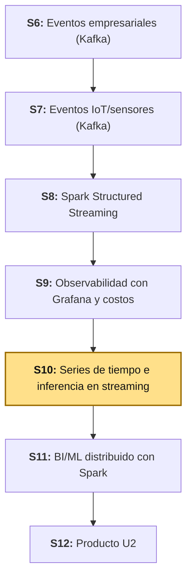
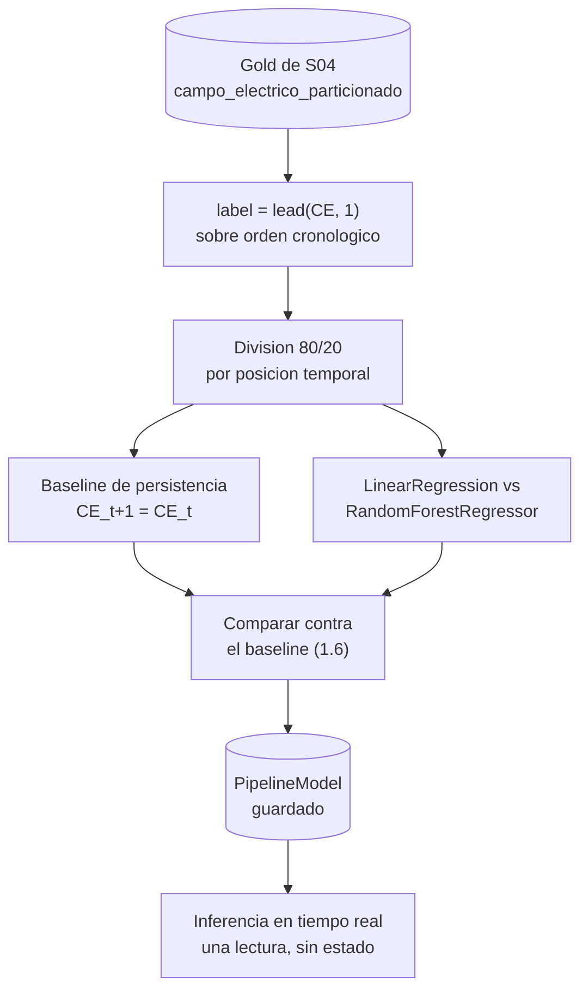

# S10 - Series de tiempo e inferencia en streaming

## 1. Introducción

Tiempo: 20 min.

### 1.1 Presentación de la sesión

S04 dejó una pregunta pendiente a propósito. Esa sesión entrenó un modelo que explica `CE` a partir de otras siete variables **en el mismo instante** — una foto, no un pronóstico — y cerró anunciando que el historial de `CE` prediciendo su propio futuro, con inferencia en tiempo real, quedaba para esta sesión, una vez que existiera la infraestructura de streaming (S6-S9). Esa infraestructura ya existe. Hoy se construye lo que S04 dejó pendiente: un modelo que predice `CE` del minuto siguiente a partir del minuto actual, sobre el mismo Data Lake Gold de S04, y ese mismo modelo aplicado en vivo sobre lecturas que llegan por Kafka.

El porqué de comparar contra un baseline antes de confiar en cualquier modelo —incluso uno que "suena" más sofisticado— se desarrolla en 1.6, con un caso real que resultó sorprendentemente parecido al de hoy.

### 1.2 Índice

1. Series de tiempo como problema supervisado: `label` desde el futuro de la propia variable.
2. Baseline de persistencia y por qué compararlo primero.
3. Comparación de modelos con división cronológica (continuación de S04).
4. Inferencia en tiempo real sin estado: una sola lectura basta.

### 1.3 Propósito de aprendizaje

Al concluir la clase, estarás en condiciones de:

- **Construir y entrenar** un modelo de regresión de series de tiempo sobre datos reales, **compararlo contra un baseline de persistencia y contra otro algoritmo**, y **aplicarlo en tiempo real** sobre eventos de Kafka, reportando con evidencia si la complejidad adicional del modelo se justificó o no.

### 1.4 Producto de sesión

Notebook `10_series_tiempo_inferencia_streaming.ipynb` que reutiliza el Data Lake Gold de S04 (`campo_electrico_particionado/`): dataset supervisado construido con `lead("CE", 1)` sobre el orden cronológico, división 80/20 por posición temporal (no aleatoria), baseline de persistencia evaluado primero, `LinearRegression` y `RandomForestRegressor` entrenados y comparados contra ese baseline con RMSE/MAE/R², `PipelineModel` ganador guardado y recargado, y ese mismo modelo aplicado en tiempo real sobre un nuevo productor Kafka (`campo-electrico-eventos`) vía `foreachBatch`, sin ventanas ni estado — una sola lectura es suficiente para predecir.

### 1.5 Metodología

**Tabla 1. Metodología de la sesión**

| Actividades a Realizar en el Periodo | Orientaciones generales (Orientaciones Metodológicas) | Material de estudio recomendado |
|---|---|---|
| Revisión previa individual | Confirmar que `campo_electrico_particionado/` (el Gold de S04) sigue existiendo, y repasar la Tabla 7 de esa guía ("misma salida Gold, dos preguntas distintas"). Trabajo individual, antes de clase. | Guía de S04 (3.3.2, Tabla 7), este mismo documento (1.1-1.7). |
| Clase presencial | Construcción guiada del notebook `10_series_tiempo_inferencia_streaming.ipynb`: dataset supervisado, baseline, modelado comparado, guardado del modelo, e inferencia en tiempo real sobre un nuevo productor Kafka. Trabajo individual, siguiendo al docente paso a paso; consulta inmediata ante dudas. | Pasos 3.1 a 3.7 de esta guía. |
| Evaluación formativa | Revisión en clase de la tabla comparativa de modelos contra el baseline y de al menos una predicción en tiempo real. La evidencia se completa y sustenta de forma individual, fuera del aula, según los criterios mínimos de la sección 4.4. | Indicaciones de entrega (4.3), rúbrica de evaluación (4.6). |

### 1.6 Motivación de la sesión

#### 1.6.1 Caso: la competencia M4 y los modelos de Machine Learning que perdieron contra un promedio

En 2018, Spyros Makridakis organizó la cuarta edición de la competencia de pronóstico más grande hasta entonces: 100,000 series de tiempo reales, 61 métodos distintos compitiendo, desde estadística clásica hasta Machine Learning puro. El resultado, publicado en 2020, sorprendió a buena parte de la comunidad: de los seis métodos de Machine Learning puro que participaron (dos usados como referencia y cuatro enviados por equipos), **ninguno superó al benchmark de combinación de modelos estadísticos (`Comb`), y solo uno logró superar a `Naïve2`** — un método que, en esencia, solo repite el último valor observado, ajustado por estacionalidad. Métodos sofisticados, entrenados con más variables y más capacidad de cómputo, perdieron contra una regla casi trivial.

Fuente: Makridakis, S., Spiliotis, E., & Assimakopoulos, V. (2020). *The M4 Competition: 100,000 time series and 61 forecasting methods*. International Journal of Forecasting, 36(1), 54-74.

La lección no fue "el Machine Learning no sirve para series de tiempo" — los métodos híbridos (que combinaban ML con modelos estadísticos) sí ganaron la competencia. La lección fue que **ningún modelo, por sofisticado que sea, se reporta sin antes compararlo contra la alternativa más simple posible** — y que esa alternativa simple, en series de tiempo, casi siempre es la persistencia: asumir que el valor de mañana se parece al de hoy. Esta sesión formaliza exactamente ese hábito: antes de entrenar nada, hoy mides qué tan bueno es no hacer nada sofisticado.

**Preguntas de análisis**

**Activación de conocimientos previos**

1. Antes de leer la causa, ¿por qué crees que un modelo de Machine Learning, con más variables y más capacidad de ajuste, podría perder contra una regla tan simple como "mañana será parecido a hoy"?

**Comprensión del baseline de persistencia**

1. Según el caso, ¿qué hubiera evitado que un equipo reportara un modelo de ML sin darse cuenta de que perdía contra `Naïve2`?
2. ¿Por qué comparar contra persistencia es especialmente importante en series de tiempo, y no tanto en el problema de regresión de S04 (donde cada fila es independiente)?

### 1.7 Ubicación en el curso

- Unidad: U2 - Sistema Big Data en tiempo real: ingesta, streaming, observabilidad y BI/ML.
- Producto del curso: Proyecto Sello: sistema Big Data distribuido end-to-end para procesamiento batch y streaming, analítica/ML, observabilidad y visualización BI para la toma de decisiones.
- Producto de unidad: pipeline en tiempo real con ingesta de eventos empresariales e IoT/sensores, procesamiento streaming con Spark, observabilidad/costos y salidas BI/ML distribuidas.
- Avance del producto en esta sesión: el modelo de series de tiempo que S04 dejó pendiente, entrenado, comparado contra un baseline y contra otro algoritmo, y aplicado en tiempo real — la pieza que S11 va a visualizar junto a los KPIs del flujo de eventos.

**Figura 1. Roadmap del producto de la Unidad II**



## 2. Explica

Tiempo: 35 min.

### 2.1 Arquitectura de la sesión

**Figura 2. Del Gold de S04 al modelo aplicado en vivo**



A diferencia de S09 (donde la inferencia necesitaba agregar varios eventos por ventana de un minuto antes de predecir), acá el modelo entrenado consume exactamente las mismas 8 columnas que ya vienen en cada evento — ninguna requiere historial ni agregación. Eso es lo que hace posible el último bloque del diagrama sin mantener estado entre lecturas (2.6).

### 2.2 Series de tiempo como problema supervisado: `label` desde el futuro de la propia variable

S04 (2.3, Tabla 3) ya había anticipado la diferencia: en regresión, el objetivo es la variable en el mismo instante que los predictores; en series de tiempo, el objetivo es la variable **en un instante futuro**. Hoy esa diferencia deja de ser teoría.

`lead(columna, n)` es una función de ventana análoga a `lag()` (que trae una fila *anterior*), pero hacia adelante: trae, en la fila actual, el valor de `columna` que aparece `n` filas después, según el orden definido en la ventana.

```python
from pyspark.sql.window import Window
from pyspark.sql import functions as F

orden_temporal = Window.orderBy("DateTime")
dataset_ml = df_gold.withColumn("label", F.lead("CE", 1).over(orden_temporal))
```

La última fila de la tabla no tiene una "fila siguiente" de la cual traer `label` — queda `NULL`, y `na.drop()` la descarta junto con cualquier predictor nulo. Con 92,847 filas en el Gold de S04, el dataset supervisado queda en 92,846: exactamente una menos.

### 2.3 Baseline de persistencia y por qué compararlo primero

Después del caso de 1.6, este paso no es opcional ni decorativo: es la primera línea que se calcula, antes de entrenar cualquier modelo. En Spark, "entrenar" la persistencia no requiere ningún estimador — es una transformación directa:

```python
test_persistencia = test.withColumn("prediction", F.col("CE"))
```

Esa única línea es, literalmente, el modelo `Naïve2` del caso de 1.6: predecir que el futuro se parece al presente. Cualquier modelo entrenado después tiene que justificar su complejidad superando esto — no basta con que "tenga buen R²" en términos absolutos.

### 2.4 Comparación de modelos con división cronológica (continuación de S04)

El entrenamiento reutiliza exactamente el mismo patrón de S04 (2.3-2.6): `VectorAssembler` ensambla las 8 variables en `features`, `LinearRegression` ya estandariza internamente (sin necesidad de `StandardScaler`), y `RandomForestRegressor` se entrena sin escalar porque sus árboles dividen por umbrales. La única diferencia técnica real frente a S04 es la división: `randomSplit` queda descartado (fuga de información hacia el pasado, S04 Tabla 7) a favor de la misma división cronológica por `row_number()` que ya viste si trabajaste la guía de S09.

**Tabla 2. Misma mecánica de S04, dos columnas distintas de la Tabla 2 original**

| | S04 — Regresión | S10 — Series de tiempo |
|---|---|---|
| `label` | `CE` en el mismo instante `t` | `CE` en el instante futuro `t+1` |
| División train/test | Aleatoria (`randomSplit`) | Cronológica (`row_number()` + corte por posición) |
| Candidato obligatorio | Ninguno más allá de los algoritmos elegidos | Baseline de persistencia (2.3) |
| Criterio de éxito | Mejor RMSE/R²/MAE entre configuraciones | Mejor RMSE/R²/MAE **y que le gane al baseline** |

### 2.5 Evaluación honesta: cuando el modelo "gana" por muy poco, o no gana

RMSE, MAE y R² se calculan exactamente igual que en S04 (`RegressionEvaluator`). Lo que cambia es la pregunta que responden: ya no es "¿cuál algoritmo es mejor entre sí?", sino "¿algún algoritmo le gana a no-hacer-nada-sofisticado?". Una mejora de RMSE del 0.68% frente al baseline no es el mismo tipo de resultado que una mejora del 30% — ambas son "una mejora", pero solo una justifica claramente la complejidad de mantener un modelo entrenado en producción. Reportar ese margen explícitamente (no solo "mi modelo ganó") es lo que el caso de 1.6 pide.

### 2.6 Inferencia en tiempo real sin estado: una sola lectura basta

**Tabla 3. Qué necesita cada sesión para predecir, al momento de inferir**

| Sesión | Qué entra al modelo en producción | Estado necesario entre lecturas |
|---|---|---|
| S09 (observabilidad) | Métricas agregadas de una ventana de 1 minuto completa | Sí — hay que esperar a que la ventana cierre y agregar varios eventos |
| S10 (hoy) | Las 8 variables de **una sola lectura actual** | Ninguno — cada evento nuevo se transforma solo, sin esperar ni acumular nada |

Esto no es una simplificación arbitraria de esta guía — es una consecuencia directa de cómo se construyó `label` en 2.2: el modelo aprendió a predecir el minuto siguiente **a partir del estado actual**, no a partir de una secuencia de minutos anteriores. Por eso la inferencia en streaming de 3.7 es, en el fondo, el mismo `PipelineModel.transform()` que ya usaste en 3.5 — solo que la fuente ahora es un `readStream` de Kafka en vez de un DataFrame estático.

## 3. Aplica: actividad práctica guiada

Tiempo: 3h.

**Actividad:** construir el notebook `10_series_tiempo_inferencia_streaming.ipynb` sobre el entorno `lambda26` (`uso-pyspark`), entrenando un modelo de series de tiempo sobre el Gold de S04, comparándolo contra un baseline de persistencia y contra un segundo algoritmo, y aplicando el modelo ganador en tiempo real sobre un nuevo productor Kafka.

**Propósito de la actividad:** dejar evidencia ejecutable de que puedes construir un dataset supervisado de series de tiempo a partir de datos reales, evaluarlo con honestidad frente a un baseline simple (1.6), y operacionalizar el modelo ganador aplicándolo sobre eventos que llegan en vivo — sin confundir "entrenar" con "aplicar".

**Orientaciones metodológicas:** en clase, el docente guía la construcción del notebook paso a paso, alternando explicación breve y ejecución; los estudiantes replican cada celda en su propio entorno, verificando cada resultado antes de avanzar al siguiente paso.

**Actividades para realizar** (estructura CRISP-DM de S04, más un séptimo paso nuevo para la inferencia en tiempo real):

**3.1 Fase 1 — Business Understanding**

- **3.1.1** Crear el notebook y la `SparkSession`.
- **3.1.2** Definir el objetivo y el alcance de la comparación.

**3.2 Fase 2 — Data Understanding**

- **3.2.1** Cargar el Gold de S04.

**3.3 Fase 3 — Data Preparation**

- **3.3.1** Construir `label` con `lead("CE", 1)`.
- **3.3.2** Dividir cronológicamente en entrenamiento y prueba.

**3.4 Fase 4 — Modeling**

- **3.4.1** Calcular el baseline de persistencia.
- **3.4.2** Entrenar y evaluar `LinearRegression`.
- **3.4.3** Entrenar y evaluar `RandomForestRegressor`.

**3.5 Fase 5 — Evaluation**

- **3.5.1** Comparar los tres candidatos contra el baseline.
- **3.5.2** Seleccionar el modelo ganador y validar si el resultado es aceptable.

**3.6 Fase 6 — Deployment**

- **3.6.1** Guardar y recargar el `PipelineModel` ganador.

**3.7 Inferencia en tiempo real**

- **3.7.1** Levantar el nuevo productor Kafka (`campo-electrico-eventos`).
- **3.7.2** Leer el stream, aplicar el modelo y guardar las predicciones.

### 3.1 Fase 1 — Business Understanding

#### 3.1.1 Crear el notebook y la `SparkSession`

**Producto del paso:** notebook `10_series_tiempo_inferencia_streaming.ipynb` con una `SparkSession` capaz de leer Parquet y, más adelante, Kafka.

```python
from pyspark.sql import SparkSession

spark = (
    SparkSession.builder
    .appName("sesion10-series-tiempo-inferencia")
    .master("local[*]")
    .config("spark.jars.packages", "org.apache.spark:spark-sql-kafka-0-10_2.13:4.2.0")
    .config("spark.sql.shuffle.partitions", "8")
    .getOrCreate()
)
spark.sparkContext.setLogLevel("WARN")
spark
```

El conector de Kafka se declara aquí mismo, igual que en S8, aunque no haga falta hasta 3.7 — así no hay que reiniciar la `SparkSession` a mitad de sesión.

#### 3.1.2 Definir el objetivo y el alcance de la comparación

**Producto del paso:** una celda markdown que documenta, dentro del propio notebook, qué se predice y contra qué se compara.

```markdown
## Fase 1 — Business Understanding

**Objetivo:** estimar `CE` en el minuto siguiente (`CE_t+1`) a partir de las 8 variables
físicas medidas en el minuto actual, reutilizando el Gold de S04.

**Alcance:** comparar un baseline de persistencia, una regresión lineal y un Random Forest,
con división cronológica, reportando RMSE/MAE/R² contra el baseline — y aplicar el modelo
ganador en tiempo real sobre un nuevo productor Kafka.
```

### 3.2 Fase 2 — Data Understanding

#### 3.2.1 Cargar el Gold de S04

**Producto del paso:** `df_gold`, el mismo Data Lake Gold que cerró S04 — sin nulos, sin el código de error de `CM`, sin `DateTime` duplicada.

```python
RUTA_GOLD_S04 = "../s04-ml-distribuido-regresion/artifacts/campo_electrico_particionado"
VARIABLES_8 = ["CE", "CM", "TempOut", "OutHum", "WindSpeed", "Bar", "SolarRad", "UVIndex"]

df_gold = spark.read.parquet(RUTA_GOLD_S04)
print(f"Filas del Gold de S04: {df_gold.count():,}")
df_gold.orderBy("DateTime").show(5)
```

En una corrida real: **92,847** filas — el mismo conteo con el que cerró S04. Nada de la integración ni de la calidad de datos se repite hoy; si este conteo no coincide, revisa primero que S04 terminó de escribir su Gold correctamente antes de seguir.

### 3.3 Fase 3 — Data Preparation

#### 3.3.1 Construir `label` con `lead("CE", 1)`

**Producto del paso:** `dataset_ml`, el dataset supervisado completo (2.2).

```python
from pyspark.sql import functions as F
from pyspark.sql.window import Window

orden_temporal = Window.orderBy("DateTime")

dataset_ml = (
    df_gold
    .withColumn("label", F.lead("CE", 1).over(orden_temporal))
    .select("DateTime", *VARIABLES_8, "label")
    .na.drop()
)

print(f"Filas del Gold: {df_gold.count():,}")
print(f"Filas del dataset supervisado: {dataset_ml.count():,}")
dataset_ml.show(5)
```

En una corrida real: **92,846** filas — una menos que el Gold, por la última fila sin "minuto siguiente" del que tomar `label` (2.2).

**Advertencia esperada, no error**: `WindowExec: No Partition Defined for Window operation!` — Spark avisa que `Window.orderBy("DateTime")` sin `partitionBy` mueve todos los datos a una sola partición. Para el volumen de esta sesión (menos de 100,000 filas) no representa un problema real de rendimiento; es el mismo aviso que ya viste en S09 si trabajaste esa guía.

#### 3.3.2 Dividir cronológicamente en entrenamiento y prueba

**Producto del paso:** `train`/`test`, división 80/20 por posición temporal — nunca aleatoria (2.4, Tabla 2).

```python
numerado = dataset_ml.withColumn("numeroFila", F.row_number().over(orden_temporal))
total_filas = numerado.count()
corte = int(total_filas * 0.80)

train = numerado.filter(F.col("numeroFila") <= corte).drop("numeroFila")
test = numerado.filter(F.col("numeroFila") > corte).drop("numeroFila")

fecha_max_train = train.agg(F.max("DateTime")).first()[0]
fecha_min_test = test.agg(F.min("DateTime")).first()[0]
if fecha_max_train >= fecha_min_test:
    raise ValueError("La division temporal no respeta el orden cronologico.")

print(f"Entrenamiento: {train.count():,} filas (hasta {fecha_max_train})")
print(f"Prueba: {test.count():,} filas (desde {fecha_min_test})")
```

En una corrida real: **74,276** filas de entrenamiento, **18,570** de prueba — el 80/20 esperado sobre 92,846, sin ningún minuto de prueba anterior al último minuto de entrenamiento.

### 3.4 Fase 4 — Modeling

#### 3.4.1 Calcular el baseline de persistencia

**Producto del paso:** las tres métricas del baseline (2.3) — el número que cualquier modelo entrenado después tiene que superar.

```python
from pyspark.ml.evaluation import RegressionEvaluator

evaluador_rmse = RegressionEvaluator(labelCol="label", predictionCol="prediction", metricName="rmse")
evaluador_mae = RegressionEvaluator(labelCol="label", predictionCol="prediction", metricName="mae")
evaluador_r2 = RegressionEvaluator(labelCol="label", predictionCol="prediction", metricName="r2")

def evaluar(predicciones, nombre):
    resultado = {
        "Modelo": nombre,
        "RMSE": evaluador_rmse.evaluate(predicciones),
        "MAE": evaluador_mae.evaluate(predicciones),
        "R2": evaluador_r2.evaluate(predicciones),
    }
    print(f"{nombre}: RMSE={resultado['RMSE']:.4f}  MAE={resultado['MAE']:.4f}  R2={resultado['R2']:.4f}")
    return resultado

test_persistencia = test.withColumn("prediction", F.col("CE"))
resultado_persistencia = evaluar(test_persistencia, "Persistencia (CE_t+1 = CE_t)")
```

**Tabla 4. Baseline real de persistencia**

| Métrica | Valor |
|---|---|
| RMSE | 0.2087 |
| MAE | 0.1316 |
| R² | 0.9461 |

Un R² de `0.9461` en un baseline que no entrena nada puede sorprender — pero es consistente con el dominio: `CE` cambia poco de un minuto a otro (2.2), así que "asumir que no cambia" ya explica la mayor parte de su variabilidad. Guarda estos tres números: son la vara con la que se miden los dos modelos siguientes, no un resultado secundario.

#### 3.4.2 Entrenar y evaluar `LinearRegression`

**Producto del paso:** `modelo_lr` entrenado y evaluado contra `test`, con sus coeficientes visibles (mismo patrón de S04, 2.4).

```python
from pyspark.ml.feature import VectorAssembler
from pyspark.ml.regression import LinearRegression

ensamblador = VectorAssembler(inputCols=VARIABLES_8, outputCol="features")
train_ml = ensamblador.transform(train)
test_ml = ensamblador.transform(test)

lr = LinearRegression(featuresCol="features", labelCol="label")
modelo_lr = lr.fit(train_ml)

print("Coeficientes (orden de VARIABLES_8):", modelo_lr.coefficients)
print("Intercepto:", modelo_lr.intercept)

predicciones_lr = modelo_lr.transform(test_ml)
resultado_lr = evaluar(predicciones_lr, "LinearRegression")
```

En una corrida real: `RMSE=0.2073  MAE=0.1325  R2=0.9468`. El coeficiente de `CE` (`0.9791`) domina por completo la ecuación — el resto de las 7 variables quedan con coeficientes casi en cero (el mayor de los otros, `TempOut`, es `0.0026`). En otras palabras: el modelo "descubrió" por sí solo, a partir de los datos, casi exactamente lo mismo que el baseline de persistencia asume de entrada.

#### 3.4.3 Entrenar y evaluar `RandomForestRegressor`

**Producto del paso:** `modelo_rf` entrenado y evaluado, con `featureImportances` (mismo patrón de S04, 3.4.4-3.4.6).

```python
from pyspark.ml.regression import RandomForestRegressor

rf = RandomForestRegressor(featuresCol="features", labelCol="label", numTrees=50, maxDepth=8, seed=42)
modelo_rf = rf.fit(train_ml)

predicciones_rf = modelo_rf.transform(test_ml)
resultado_rf = evaluar(predicciones_rf, "RandomForestRegressor")

importancias = sorted(zip(VARIABLES_8, modelo_rf.featureImportances.toArray()), key=lambda par: -par[1])
for variable, importancia in importancias:
    print(f"{variable:10s} {importancia:.4f}")
```

En una corrida real: `RMSE=0.2528  MAE=0.1692  R2=0.9209` — **peor que el baseline de persistencia en las tres métricas**. `CE` concentra el `0.8704` de la importancia total; el resto de las 7 variables se reparten apenas el `0.13` restante. A diferencia de S04 (donde Random Forest ganó claramente porque la relación real no era lineal), acá la relación entre `CE_t` y `CE_t+1` es, de fondo, casi una identidad — y forzar un modelo no lineal sobre una relación que ya es casi lineal no aportó nada; le costó precisión.

### 3.5 Fase 5 — Evaluation

#### 3.5.1 Comparar los tres candidatos contra el baseline

**Producto del paso:** una sola tabla con los tres candidatos y cuánto mejora (o empeora) cada uno frente al baseline — el mismo hábito del caso de 1.6.

```python
import pandas as pd

comparacion = pd.DataFrame([resultado_persistencia, resultado_lr, resultado_rf])
comparacion["MejoraRMSE_vs_persistencia_%"] = (
    100 * (resultado_persistencia["RMSE"] - comparacion["RMSE"]) / resultado_persistencia["RMSE"]
)
comparacion
```

**Tabla 5. Comparación real contra el baseline**

| Modelo | RMSE | MAE | R² | Mejora RMSE vs. persistencia |
|---|---|---|---|---:|
| Persistencia (`CE_t+1 = CE_t`) | 0.2087 | 0.1316 | 0.9461 | 0.00% |
| **LinearRegression** | **0.2073** | 0.1325 | **0.9468** | **+0.68%** |
| RandomForestRegressor | 0.2528 | 0.1692 | 0.9209 | -21.15% |

Exactamente el patrón del caso de 1.6: el método "sofisticado" (Random Forest) perdió contra la persistencia, y el que sí ganó lo hizo por un margen minúsculo (`0.68%` de RMSE, con un MAE incluso levemente peor). Ninguno de los dos resultados es un error del notebook — es la lectura honesta de qué tan predecible es `CE` de un minuto a otro con la información disponible.

#### 3.5.2 Seleccionar el modelo ganador y validar si el resultado es aceptable

**Producto del paso:** el modelo ganador señalado explícitamente, con una lectura honesta de si vale la pena mantenerlo en producción.

Con la Tabla 5, **LinearRegression queda seleccionado** — es el único que superó al baseline, aunque sea por un margen pequeño. La lectura de negocio: una mejora de `0.68%` en RMSE probablemente no justifica, por sí sola, el costo de mantener un pipeline de entrenamiento y despliegue en producción — pero sí vale la pena guardarlo y exponerlo en tiempo real (3.7), con el entendimiento explícito de que su valor real está más en la infraestructura que se construye alrededor (inferencia en streaming, reentrenamiento futuro) que en la ganancia de precisión de hoy. Negarse a reportar esa conclusión incómoda sería repetir, en pequeño, el mismo error de no comparar contra un baseline del caso de 1.6.

### 3.6 Fase 6 — Deployment

#### 3.6.1 Guardar y recargar el `PipelineModel` ganador

**Producto del paso:** el modelo de 3.5.2 guardado como `Pipeline` completo (`VectorAssembler` + `LinearRegression`), recargado y verificado.

```python
from pyspark.ml import Pipeline, PipelineModel

RUTA_MODELO = "./artifacts/models/modelo_ce_lr"

pipeline_ganador = Pipeline(stages=[
    VectorAssembler(inputCols=VARIABLES_8, outputCol="features"),
    LinearRegression(featuresCol="features", labelCol="label"),
])
modelo_final = pipeline_ganador.fit(train)
modelo_final.write().overwrite().save(RUTA_MODELO)

modelo_cargado = PipelineModel.load(RUTA_MODELO)
print("Modelo guardado y recargado en:", RUTA_MODELO)
modelo_cargado.transform(test).select(*VARIABLES_8, "label", "prediction").show(5)
```

Guardar el `Pipeline` completo —no solo el estimador `LinearRegression`— es lo que permite que 3.7 aplique el modelo sobre una fila nueva sin repetir el ensamblado a mano: `VectorAssembler` ya quedó dentro del artefacto guardado.

**Error frecuente**: guardar el modelo entrenado solo sobre `train_ml` (con `features` ya ensamblado, 3.4.2) en vez de reentrenar un `Pipeline` nuevo sobre `train` (sin ensamblar). Si guardas el primero, `modelo_cargado.transform()` fallará sobre datos nuevos que todavía no tienen la columna `features` — el `Pipeline` existe precisamente para evitar ese acoplamiento.

### 3.7 Inferencia en tiempo real

#### 3.7.1 Levantar el nuevo productor Kafka (`campo-electrico-eventos`)

**Producto del paso:** un nuevo productor Kafka, emitiendo lecturas sintéticas de las 8 variables físicas, calibradas sobre las estadísticas reales del Gold de S04.

Crea `uso-campo-electrico/` junto a `uso-atmos/` (mismo patrón exacto de S7): un `Dockerfile`, un `compose.yml` que se conecta a la red `lambda26-kafka-net` ya existente, y el productor.

```dockerfile
# uso-campo-electrico/Dockerfile
FROM python:3.11-slim

ENV PYTHONUNBUFFERED=1

WORKDIR /app

COPY app/requirements.txt .
RUN pip install --no-cache-dir -r requirements.txt

CMD ["sleep", "infinity"]
```

```yaml
# uso-campo-electrico/compose.yml
name: lambda26-uso-campo-electrico

services:
  uso-campo-electrico:
    build: .
    container_name: lambda26-uso-campo-electrico
    volumes:
      - ./app:/app
    working_dir: /app
    command: sleep infinity
    networks:
      - lambda26-kafka-net

networks:
  lambda26-kafka-net:
    external: true
    name: lambda26-kafka-net
```

```text
# uso-campo-electrico/app/requirements.txt
kafka-python==2.0.2
```

El productor sigue la misma caminata aleatoria acotada de `uso-atmos` (S7) — cada lectura avanza un poco desde la anterior, no es un número independiente. Los rangos y el paso máximo de cada variable están calibrados sobre el mínimo/máximo real observado en el Gold de S04 (3.2.1):

```python
# uso-campo-electrico/app/producer_campo_electrico.py
import json
import os
import random
import time

from kafka import KafkaProducer

TOPIC_CAMPO_ELECTRICO = os.getenv("KAFKA_TOPIC_CAMPO_ELECTRICO", "campo-electrico-eventos")
BOOTSTRAP_SERVERS = os.getenv("KAFKA_BOOTSTRAP_SERVERS", "kafka:9092")
INTERVAL_MS = int(os.getenv("ESTACION_INTERVAL_MS", "3000"))
ESTACION_IDS = os.getenv("ESTACION_IDS", "estacion-ns-01").split(",")

# Rangos reales observados en el Gold de S04 (campo_electrico_particionado,
# 92,847 mediciones): min/max por variable.
RANGOS = {
    "CE": (-6.74, 2.85),
    "CM": (24020.0, 24498.4),
    "TempOut": (11.8, 27.2),
    "OutHum": (61.0, 92.0),
    "WindSpeed": (0.0, 17.7),
    "Bar": (945.3, 953.7),
    "SolarRad": (0.0, 770.0),
    "UVIndex": (0.0, 6.3),
}
PASO_MAXIMO = {
    "CE": 0.08, "CM": 1.5, "TempOut": 0.1, "OutHum": 0.4,
    "WindSpeed": 0.3, "Bar": 0.1, "SolarRad": 8.0, "UVIndex": 0.15,
}

producer = KafkaProducer(
    bootstrap_servers=BOOTSTRAP_SERVERS,
    key_serializer=lambda key: key.encode("utf-8"),
    value_serializer=lambda value: json.dumps(value).encode("utf-8"),
)

estado = {
    estacion_id: {variable: round(random.uniform(*rango), 2) for variable, rango in RANGOS.items()}
    for estacion_id in ESTACION_IDS
}


def siguiente_valor(valor_actual, variable):
    minimo, maximo = RANGOS[variable]
    paso = PASO_MAXIMO[variable]
    nuevo = valor_actual + random.uniform(-paso, paso)
    return round(min(max(nuevo, minimo), maximo), 2)


while True:
    for estacion_id in ESTACION_IDS:
        lectura = estado[estacion_id]
        for variable in RANGOS:
            lectura[variable] = siguiente_valor(lectura[variable], variable)

        data = {
            "tipoEvento": "estacion.lectura",
            "estacionId": estacion_id,
            **lectura,
            "origen": "uso-campo-electrico",
            "timestamp": int(time.time() * 1000),
        }
        producer.send(TOPIC_CAMPO_ELECTRICO, key=estacion_id, value=data).get(timeout=10)
        print(json.dumps({"service": "uso-campo-electrico", "estacionId": estacion_id, "status": "published"}))

    time.sleep(INTERVAL_MS / 1000)
```

Levántalo y córrelo:

```bash
cd uso-campo-electrico
docker compose up -d
docker exec -it lambda26-uso-campo-electrico python producer_campo_electrico.py
```

**Error frecuente**: la primera lectura puede fallar con `NotLeaderForPartitionError`. El topic `campo-electrico-eventos` todavía no existe en Kafka la primera vez que el productor intenta publicar — Kafka lo crea automáticamente, pero la elección de líder de partición tarda una fracción de segundo más que el primer intento de envío. Vuelve a correr el comando: la segunda vez el topic ya existe y publica sin error. No es necesario crear el topic a mano de antemano.

#### 3.7.2 Leer el stream, aplicar el modelo y guardar las predicciones

**Producto del paso:** predicciones en tiempo real, una por cada lectura que llega, sin ninguna agregación por ventana (2.6).

```python
from pyspark.sql.types import StructType, StringType, DoubleType, LongType

esquema_evento = (
    StructType()
    .add("tipoEvento", StringType())
    .add("estacionId", StringType())
    .add("CE", DoubleType())
    .add("CM", DoubleType())
    .add("TempOut", DoubleType())
    .add("OutHum", DoubleType())
    .add("WindSpeed", DoubleType())
    .add("Bar", DoubleType())
    .add("SolarRad", DoubleType())
    .add("UVIndex", DoubleType())
    .add("origen", StringType())
    .add("timestamp", LongType())
)

crudo = (
    spark.readStream.format("kafka")
    .option("kafka.bootstrap.servers", "kafka:9092")
    .option("subscribe", "campo-electrico-eventos")
    .option("startingOffsets", "latest")
    .load()
)

eventos = (
    crudo.select(F.col("value").cast("string").alias("json_str"))
    .select(F.from_json(F.col("json_str"), esquema_evento).alias("e"))
    .select("e.*")
)

predicciones_stream = modelo_cargado.transform(eventos)
```

Nota lo que falta frente a S09: no hay `withWatermark`, no hay `groupBy(window(...))`. El modelo transforma cada fila tal como llega — exactamente lo mismo que hizo `modelo_cargado.transform(test)` en 3.6.1, solo que la fuente ahora es un stream.

```python
RUTA_PREDICCIONES_STREAM = "./artifacts/predicciones_stream"
CHECKPOINT_STREAM = "./artifacts/chk_predicciones_stream"

def guardar_predicciones_microlote(df_microlote, id_lote):
    filas = df_microlote.count()
    if filas == 0:
        print(f"Micro-lote {id_lote}: sin filas")
        return
    df_microlote.select(
        F.lit(id_lote).alias("batchId"), "estacionId", "timestamp", "CE",
        F.col("prediction").alias("prediccionSiguienteCE"),
    ).write.mode("append").parquet(RUTA_PREDICCIONES_STREAM)
    print(f"Micro-lote {id_lote}: {filas} predicciones guardadas")

# Momento 1: arrancar la consulta
consulta_predicciones = (
    predicciones_stream.writeStream
    .foreachBatch(guardar_predicciones_microlote)
    .option("checkpointLocation", CHECKPOINT_STREAM)
    .start()
)
```

**Error frecuente**: el primer micro-lote suele imprimir `Micro-lote 0: sin filas`. No es un error — Spark dispara el primer micro-lote apenas la suscripción al topic queda lista, casi siempre antes de que el productor haya emitido su primera lectura desde ese instante. Los siguientes micro-lotes sí traen filas, uno por cada lectura publicada.

Déjala correr un par de minutos mientras el productor sigue emitiendo. Cuando se haya visto suficiente, detenla:

```python
# Momento 2: detener la consulta
consulta_predicciones.stop()

spark.read.parquet(RUTA_PREDICCIONES_STREAM).orderBy(F.desc("batchId")).show(20, truncate=False)
```

**Error frecuente**: al llamar `.stop()` mientras un micro-lote todavía está escribiendo, la consola puede mostrar un `java.lang.InterruptedException` con un `ERROR FileFormatWriter: Aborting job...`. Es la consecuencia esperada de interrumpir una escritura en curso, no una pérdida de datos — los micro-lotes que ya terminaron de escribirse antes del `.stop()` quedan completos en el Parquet, como confirma la celda siguiente.

En una corrida real, con el productor emitiendo cada 3 segundos:

**Tabla 6. Predicciones reales en tiempo real**

| batchId | CE (real) | Predicción de `CE` siguiente |
|---:|---:|---:|
| 1 | -6.16 | -6.0766 |
| 2 | -6.14 | -6.0574 |
| 3 | -6.16 | -6.0772 |
| 4 | -6.20 | -6.1160 |
| 5 | -6.19 | -6.1060 |
| 6 | -6.22 | -6.1354 |

La predicción sigue de cerca al valor real desplazado — coherente con el coeficiente dominante de `CE` (`0.9791`, 3.4.2) encontrado durante el entrenamiento: el modelo aprendió, en esencia, "el próximo minuto se parece mucho al actual, con un ajuste pequeño".

**Evidencia de aprendizaje:**

- Dataset supervisado construido con `lead("CE", 1)` sobre el Gold de S04, con división cronológica verificada.
- Baseline de persistencia calculado y reportado antes de entrenar cualquier modelo.
- `LinearRegression` y `RandomForestRegressor` entrenados, evaluados y comparados contra el baseline — con el resultado honesto de cuál ganó y por cuánto margen.
- `PipelineModel` ganador guardado, recargado y verificado.
- Nuevo productor Kafka (`uso-campo-electrico`) funcionando, con lecturas calibradas sobre datos reales.
- Inferencia en tiempo real funcionando sin estado, con al menos una predicción real capturada.

## 4. Crea: actividad autónoma

Tiempo: 3h fuera del aula.

### 4.1 Actividad

Replicación autónoma de la construcción de un modelo de series de tiempo y su inferencia en tiempo real, sobre datos del Proyecto Sello del equipo.

Completa y evidencia estas tareas:

1. Sobre una fuente numérica propia de tu Proyecto Sello, construir `label` con `lead()` sobre el orden cronológico (equivalente a 3.3.1).
2. Dividir cronológicamente en entrenamiento y prueba (equivalente a 3.3.2).
3. Calcular un baseline de persistencia antes de entrenar cualquier modelo (equivalente a 3.4.1).
4. Entrenar y comparar al menos dos algoritmos de MLlib contra ese baseline, reportando RMSE/MAE/R² (equivalente a 3.4.2-3.5.1).
5. Seleccionar el modelo ganador con una lectura honesta de si justifica su complejidad frente al baseline (equivalente a 3.5.2).
6. Guardar y recargar el `PipelineModel` ganador (equivalente a 3.6.1).
7. Aplicar el modelo en tiempo real sobre tu propio stream de Kafka, con al menos una predicción real capturada (equivalente a 3.7).

### 4.2 Propósito

Que cada estudiante demuestre, con datos reales de su propio Proyecto Sello, que puede construir y evaluar honestamente un modelo de series de tiempo —incluyendo el caso en que la complejidad adicional no se justifica— y aplicarlo en producción sobre datos que llegan en vivo, sin mantener estado innecesario.

### 4.3 Indicaciones

Entrega un PDF con el siguiente nombre:

```text
S10_Equipo##_ApellidoNombre.pdf
```

Cada captura de pantalla del informe debe mostrar, sin recortar, el reloj del sistema (fecha y hora) y tu usuario o foto de perfil (Windows, VS Code o navegador) visibles en pantalla — es lo que permite verificar que la evidencia es tuya y que corresponde al momento real de tu trabajo.

#### 4.3.1 Estructura del informe

**Datos del estudiante**

- Nombre:
- Equipo:
- Sesión: S10 - Series de tiempo e inferencia en streaming
- Rol o aporte realizado:
- Link de GitHub:

**Evidencia técnica**

Incluye capturas o extractos con una breve explicación debajo de cada uno, organizados en los mismos 4 bloques de la rúbrica (4.6):

1. *Dataset supervisado y baseline*
    - `label` construido con `lead()`, división cronológica verificada, baseline de persistencia calculado (equivalente a 3.3-3.4.1).
2. *Modelado comparado contra el baseline*
    - Al menos dos algoritmos entrenados y evaluados, tabla comparativa contra el baseline (equivalente a 3.4.2-3.5.1).
3. *Selección honesta y despliegue*
    - Modelo ganador seleccionado con su justificación (o la ausencia de ella), guardado y recargado (equivalente a 3.5.2-3.6.1).
4. *Inferencia en tiempo real*
    - Productor Kafka propio funcionando, predicciones en tiempo real capturadas sin estado (equivalente a 3.7).

**Error o hallazgo**

Describe un error real: un `PipelineModel` guardado sin el `VectorAssembler` que falló al recargarlo, una comparación donde el modelo "sofisticado" perdió contra el baseline, o un micro-lote vacío que no era un error.

**Reflexión técnica breve**

Responde en 5 a 8 líneas:

```text
En tu comparación, ¿algún modelo le ganó al baseline de persistencia?
¿Por cuánto margen, y ese margen justifica mantener un modelo entrenado
en producción? Relaciona tu respuesta con el caso de la competencia M4 (1.6).
```

### 4.4 Criterios mínimos de aceptación

- El archivo respeta el nombre solicitado.
- `label` construido con `lead()` sobre una fuente propia, con división cronológica verificada (sin fuga de información).
- Baseline de persistencia calculado y reportado antes de cualquier modelo entrenado.
- Al menos dos algoritmos de MLlib comparados contra el baseline con RMSE, MAE y R².
- Selección del modelo ganador justificada con honestidad (incluso si ningún modelo superó al baseline).
- `PipelineModel` guardado y recargado, con evidencia de que predice igual después de recargarlo.
- Productor Kafka propio funcionando y al menos una predicción en tiempo real capturada, sin agregación por ventana.
- Cada captura de la evidencia técnica muestra el reloj del sistema y el usuario/perfil visible, sin recortar.
- Las fechas y horas de las capturas son coherentes con el historial de commits de su repositorio en GitHub.
- Incluye un error o hallazgo técnico diagnosticado.
- Incluye la reflexión técnica breve solicitada.

### 4.5 Preguntas de defensa

1. ¿Por qué `lead()` y no `lag()` para construir el `label` de esta sesión?
2. ¿Qué le pasaría a tu modelo si usaras `randomSplit` en vez de la división cronológica?
3. Si tu modelo ganador apenas superó al baseline por un margen pequeño, ¿qué decisión de negocio tomarías: desplegarlo igual, seguir iterando, o no desplegarlo? Justifica.
4. ¿Por qué el `Pipeline` que guardaste no necesita mantener ningún historial de lecturas anteriores para predecir en tiempo real?
5. ¿Qué pasaría si tu productor en tiempo real enviara un evento con una variable faltante respecto a las que el modelo espera?
6. Relaciona el resultado de tu Random Forest (o el algoritmo no lineal que hayas usado) con el caso de la competencia M4 — ¿por qué un modelo más complejo no siempre gana?

### 4.6 Rúbrica de evaluación

**Tabla 7. Rúbrica de evaluación**

| Criterio | Peso (%) | A (20 pts) | B (15 pts) | C (10 pts) | D (5 pts) | Nivel obtenido |
|---|---:|---|---|---|---|---:|
| 1. Dataset supervisado y baseline* | 25 | `label` correcto, división cronológica verificada, baseline de persistencia calculado y reportado. | Correcto, con algún detalle de verificación faltante. | Dataset o baseline incompletos. | No construye el dataset supervisado ni el baseline. | |
| 2. Modelado comparado contra el baseline* | 25 | Dos o más algoritmos entrenados, evaluados con RMSE/MAE/R² y comparados explícitamente contra el baseline. | Modelos entrenados y evaluados, comparación contra el baseline superficial. | Modelos entrenados sin comparación clara contra el baseline. | No presenta modelos entrenados. | |
| 3. Selección honesta y despliegue* | 25 | Selección justificada con honestidad (incluso si ningún modelo ganó), modelo guardado y recargado correctamente. | Selección y despliegue correctos, justificación poco desarrollada. | Selección sin justificar, o despliegue incompleto. | No guarda ni selecciona un modelo. | |
| 4. Inferencia en tiempo real* | 25 | Productor propio funcionando, predicciones en tiempo real capturadas sin agregación por ventana. | Inferencia funcional, con alguna detención o evidencia incompleta. | Inferencia parcialmente funcional. | No presenta inferencia en tiempo real. | |

\* Agregado manual.

Nota final = suma de (`Peso` / 100 × `Puntos del nivel obtenido`) = ____ / 20.

Para usar la rúbrica con IA, solicita:

```text
Evalúa el PDF usando la rúbrica de la sesión.
Para cada criterio selecciona el nivel obtenido usando la escala A=20, B=15, C=10, D=5 puntos.
Justifica brevemente cada nivel asignado.
Verifica que cada captura muestre reloj del sistema y usuario/perfil visible, y que las fechas sean coherentes con el historial de commits de GitHub. Si falta esta evidencia o hay inconsistencias, indícalo explícitamente antes de calificar.
Calcula la nota final con la fórmula: suma de (Peso/100 × Puntos del nivel obtenido), directamente sobre 20.
Indica 2 fortalezas y 2 recomendaciones.
```

## 5. Cierre

Tiempo: 5 min.

**Resumen breve:** hoy se cerró lo que S04 dejó pendiente a propósito — la misma familia de datos (`CE` y sus 7 variables acompañantes), ahora como problema de series de tiempo: `label` construido con `lead()` sobre el orden cronológico, un baseline de persistencia calculado antes que cualquier modelo, dos algoritmos entrenados y comparados honestamente contra ese baseline (con un resultado que, como en la competencia M4, no favoreció al modelo más sofisticado), el ganador guardado como `PipelineModel`, y ese mismo modelo aplicado en tiempo real sobre un nuevo productor Kafka — sin ventanas ni estado, porque cada lectura ya trae todo lo que el modelo necesita.

**Dinámica participativa:** en una ronda rápida, cada estudiante comparte si algún modelo le ganó a su baseline de persistencia, y por cuánto margen.

**Metacognición:** ¿qué te costó más entender hoy: por qué una división cronológica es obligatoria en series de tiempo, o aceptar que el modelo "ganador" apenas mejoró sobre no hacer nada sofisticado?

**Proyección:** S11 toma las predicciones de hoy (`predicciones_stream`) y las visualiza en el mismo tablero de Grafana de S9, junto a los KPIs del flujo de eventos en streaming — la primera vez que el BI de este curso muestra una predicción, no solo una métrica del presente.

## Bibliografía

1. Makridakis, S., Spiliotis, E., & Assimakopoulos, V. (2020). *The M4 Competition: 100,000 time series and 61 forecasting methods*. International Journal of Forecasting, 36(1), 54-74.
2. Apache Software Foundation. (2024). *Structured Streaming Programming Guide*. Apache Spark Documentation. https://spark.apache.org/docs/latest/structured-streaming-programming-guide.html
3. Apache Software Foundation. (2024). *PySpark API reference: pyspark.ml*. https://spark.apache.org/docs/latest/api/python/reference/pyspark.ml.html
4. Apache Software Foundation. (2024). *PySpark API reference: pyspark.sql.functions* [`lead`, `lag`, `row_number`]. https://spark.apache.org/docs/latest/api/python/reference/pyspark.sql/functions.html
